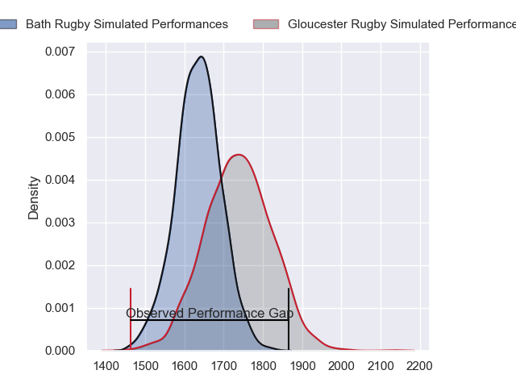
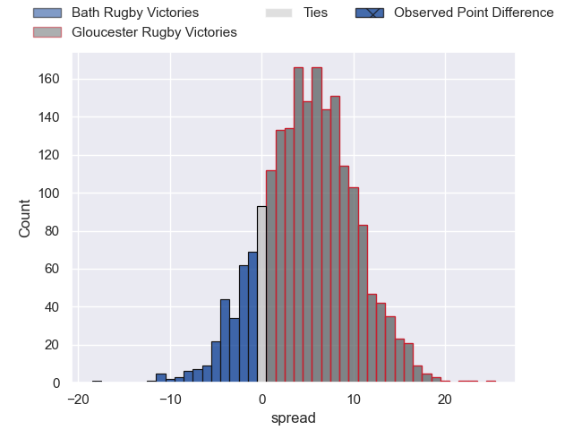
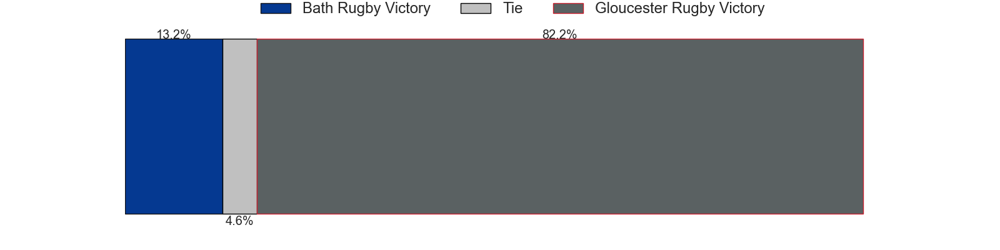
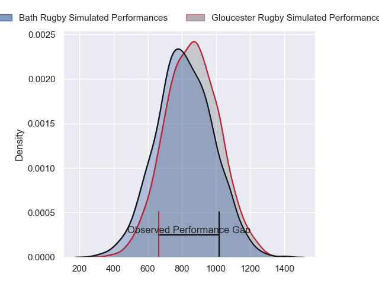
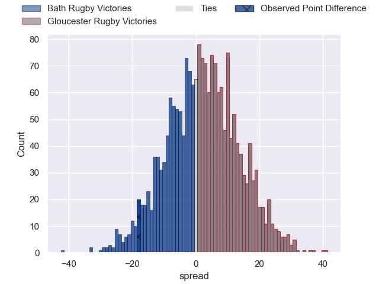
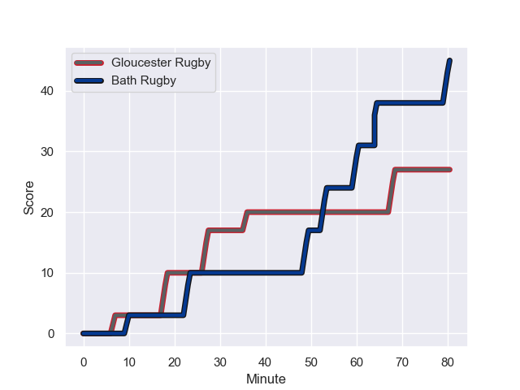
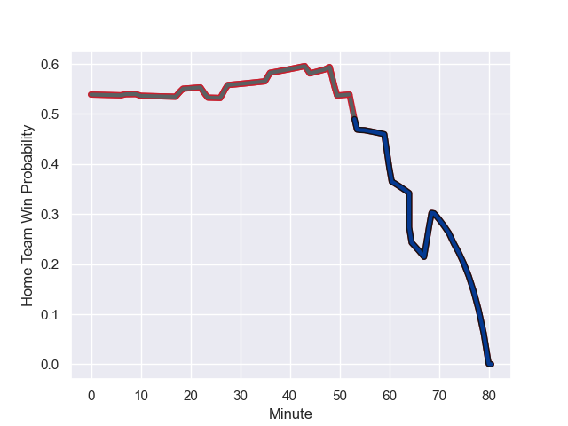

---  
layout: page  
title: Bath Rugby at Gloucester Rugby; 45-27  
date: 2023-11-10 18:00:00 -0500  
categories: "Gallagher Premiership 2023" match review  
---
# Bath Rugby at Gloucester Rugby; 45-27

# Club Level Predictions

The first set of predictions treats a club as the smallest object, as the club develops its members, organizes a gameplan, and deploys its players as needed for each match. This club model has a prediction of 0.642, which translates to predicting Gloucester Rugby to win by 5.2.

Each club has a rating and a rating deviation (similar to a Glicko rating), and expected performances can be generated. This allows for simulated matches and spreads like the ones below.
## Projected Performances - Club Model

## Projected Spreads - Club Model

## Projected Results - Club Model

# Player Level Predictions - Version 2

Treating teams instead as an entity made up of the currently active players, I have ratings for each player in an altogether different system. These can be combined to form team ratings once teamsheets are announced, weighting starters a bit higher than the reserves. After the match is played, players can be weighted by their minutes on the field, allowing for an accurate measure of the team's composition. With these compiled team ratings, we can make predictions, measure inaccuracy, and update the individual player ratings.
## Prediction with Player Minutes: Gloucester Rugby by 1.7

Bath Rugby by 3.3 on a neutral field
## Prediction without Player Minutes: Gloucester Rugby by 3.7

Bath Rugby by 1.3 on a neutral pitch

## Projected Performances - Player Model

## Projected Spreads - Player Model

## Projected Results - Player Model

## Scores over Time

## Win Probability over Time

There were 13 large changes in win probability in this match

|   Away Minutes | Away Player       |   Away elo |   Number |   Home elo | Home Player         |   Home Minutes |
|---------------:|:------------------|-----------:|---------:|-----------:|:--------------------|---------------:|
|             69 | Beno Obano        |      46.66 |        1 |      34.93 | Mayco Vivas         |             53 |
|             69 | Tom Dunn          |      79.86 |        2 |      54.37 | George McGuigan     |             61 |
|             51 | Will Stuart       |      26.45 |        3 |      43.99 | Fraser Balmain      |             48 |
|             73 | Fergus Lee-Warner |      26.34 |        4 |      38.64 | Freddie Clarke      |             80 |
|             80 | Charlie Ewels     |      27.07 |        5 |      57.62 | Matias Alemanno     |             69 |
|             80 | Miles Reid        |      79.31 |        6 |      41.56 | Jack Clement        |             80 |
|             80 | Sam Underhill     |      59.95 |        7 |      41.78 | Lewis Ludlow        |             80 |
|             61 | Alfie Barbeary    |      42.88 |        8 |      78.49 | Albert Tuisue       |             53 |
|             79 | Ben Spencer       |      44.58 |        9 |      29.07 | Stephen Varney      |             80 |
|             80 | Finn Russell      |     131.97 |       10 |      49.49 | George Barton       |             80 |
|             80 | Will Muir         |       3.51 |       11 |      73.02 | Ollie Thorley       |             61 |
|             80 | Max Ojomoh        |      41.22 |       12 |      20.97 | Sebastien Atkinson  |             80 |
|             80 | Ollie Lawrence    |      56.18 |       13 |      69.39 | Chris Harris        |             55 |
|             80 | Joe Cokanasiga    |      79.12 |       14 |      45.17 | Jonny May           |             80 |
|             44 | Tom de Glanville  |      29.8  |       15 |      79.76 | Santiago Carreras   |             80 |
|             11 | Juan Schoeman     |      43.64 |       16 |      14.98 | Jamal Ford-Robinson |             27 |
|             11 | Niall Annett      |      41.54 |       17 |      48.31 | Santiago Socino     |             19 |
|             29 | Thomas du Toit    |      75.48 |       18 |      52.8  | Kirill Gotovtsev    |             32 |
|              7 | Josh McNally      |      73.1  |       19 |      51.77 | Ben Donnell         |             11 |
|             19 | Jaco Coetzee      |      45.27 |       20 |      38    | Freddie Thomas      |             27 |
|              1 | Tom Carr-Smith    |      46.65 |       21 |      83.53 | Louis Rees-Zammit   |             19 |
|             36 | Matt Gallagher    |      98.15 |       22 |      75.38 | Max Llewellyn       |             25 |

