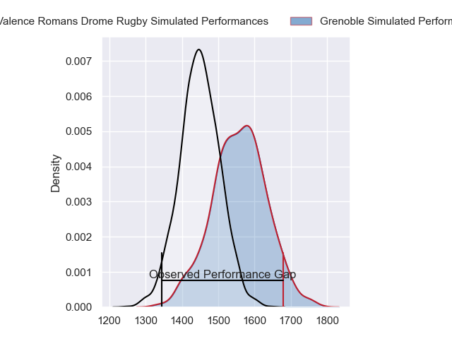
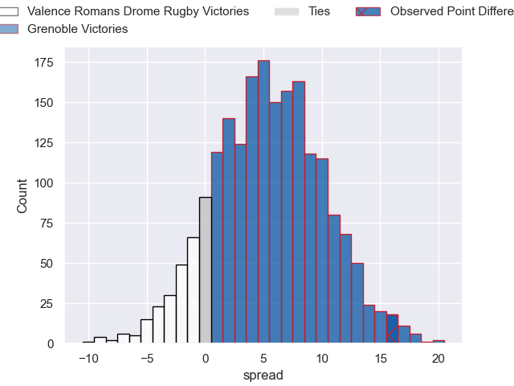
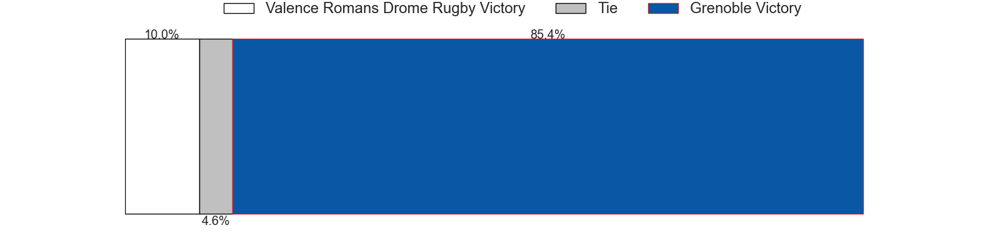
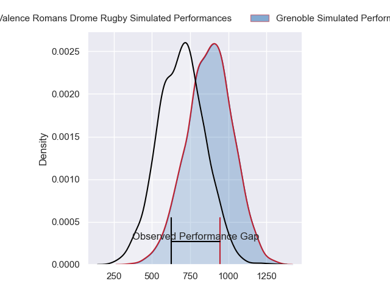
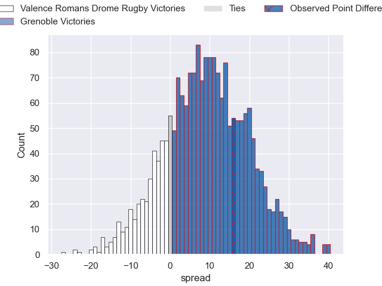
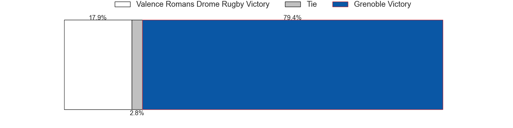
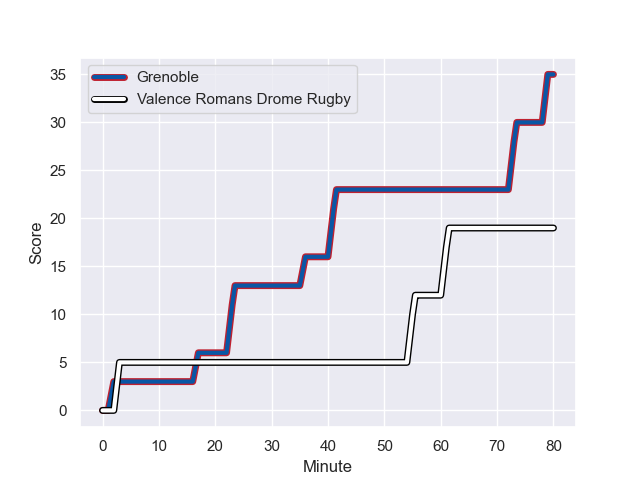
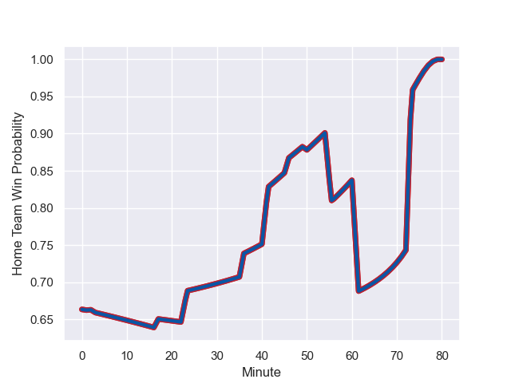

---  
layout: page  
title: Valence Romans Drome Rugby at Grenoble; 19-35  
date: 2023-11-10 18:00:00 -0500  
categories: "Pro D2 2023" match review  
---
# Valence Romans Drome Rugby at Grenoble; 19-35

# Club Level Predictions

The first set of predictions treats a club as the smallest object, as the club develops its members, organizes a gameplan, and deploys its players as needed for each match. This club model has a prediction of 0.65, which translates to predicting Grenoble to win by 5.5.

Each club has a rating and a rating deviation (similar to a Glicko rating), and expected performances can be generated. This allows for simulated matches and spreads like the ones below.
## Projected Performances - Club Model

## Projected Spreads - Club Model

## Projected Results - Club Model

# Player Level Predictions - Version 2

Treating teams instead as an entity made up of the currently active players, I have ratings for each player in an altogether different system. These can be combined to form team ratings once teamsheets are announced, weighting starters a bit higher than the reserves. After the match is played, players can be weighted by their minutes on the field, allowing for an accurate measure of the team's composition. With these compiled team ratings, we can make predictions, measure inaccuracy, and update the individual player ratings.
## Prediction with Player Minutes: Grenoble by 7.5

Grenoble by 2.6 on a neutral field
## Prediction without Player Minutes: Grenoble by 7.2

Grenoble by 2.3 on a neutral pitch

## Projected Performances - Player Model

## Projected Spreads - Player Model

## Projected Results - Player Model

## Scores over Time

## Win Probability over Time

There were 9 large changes in win probability in this match

|   Away Minutes | Away Player         |   Away elo |   Number |   Home elo | Home Player         |   Home Minutes |
|---------------:|:--------------------|-----------:|---------:|-----------:|:--------------------|---------------:|
|             50 | Anthony Aléo        |      40.39 |        1 |      54.92 | Zack Gauthier       |             50 |
|             60 | Cyril Deligny       |       6.35 |        2 |      50.25 | Bernabe Massa       |             55 |
|             80 | Kevin Goze          |      62.69 |        3 |      48.46 | Regis Montagne      |             55 |
|             80 | Ryan McCauley       |      32.2  |        4 |      78.97 | Jose Madeira        |             80 |
|             50 | Florian Goumat      |      54.42 |        5 |      48.85 | Pierce Phillips     |             55 |
|             55 | Éloi Massot         |      19.03 |        6 |      52.18 | Thibaut Martel      |             80 |
|             56 | Adrien Roux         |      46.78 |        7 |      34.93 | Steeve Blanc-Mappaz |             80 |
|             80 | Ioane Iashagashvili |      74.55 |        8 |      41.86 | Pio Muarua          |             55 |
|             46 | Tim Menzel          |      70.99 |        9 |      53.92 | Eric Escande        |             60 |
|             80 | Lucas Meret         |      30.6  |       10 |      60.1  | Sam Davies          |             80 |
|             80 | Adam Vargas         |      97.74 |       11 |      42.97 | Karim Qadiri        |             58 |
|             80 | Mathieu Guillomot   |      24.25 |       12 |      48.48 | Romain Trouilloud   |             57 |
|             80 | Isaac Te Tamaki     |      20.86 |       13 |      28.07 | Romain Fusier       |             80 |
|             80 | George Worth        |      29.23 |       14 |      54.56 | Wilfried Hulleu     |             80 |
|             46 | Charles Bouldoire   |      85.84 |       15 |      86.45 | Julien Farnoux      |             80 |
|             34 | Thomas Lhusero      |      68.11 |       16 |      31.78 | Eli Eglaine         |             30 |
|             34 | Jonathan Quinnez    |      39.34 |       17 |      43.86 | Vincent Vial        |             25 |
|             30 | Thembelani Bholi    |      56.7  |       18 |      52.49 | Georgi Javakhia     |             25 |
|             30 | Andrea Pontanier    |      52.49 |       19 |      22    | Barnabe Couilloud   |             20 |
|             25 | Axel Bruchet        |      26.71 |       20 |      45.72 | Erwan Dridi         |             22 |
|             24 | Charles Brayer      |      49.14 |       21 |      34.86 | Romain Barthelemy   |             23 |
|             20 | Brice Humbert       |      47.88 |       22 |      38.82 | Mathis Sarragallet  |             25 |
|            nan | nan                 |     nan    |       23 |      29.15 | Antonin Berruyer    |             25 |

