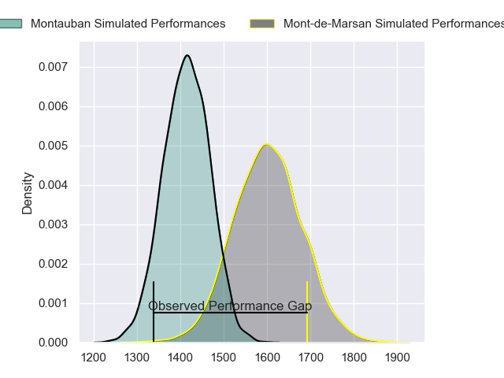
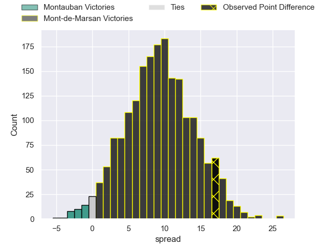
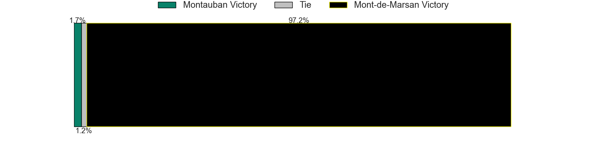
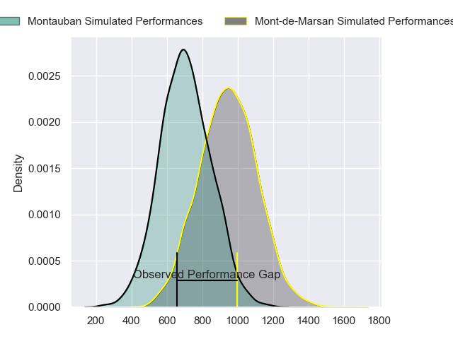
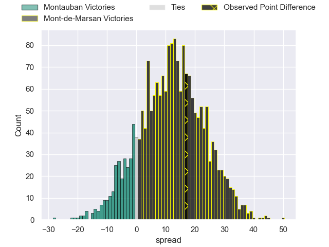
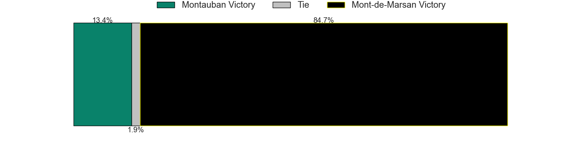
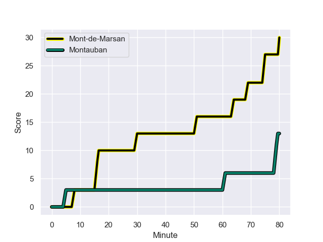
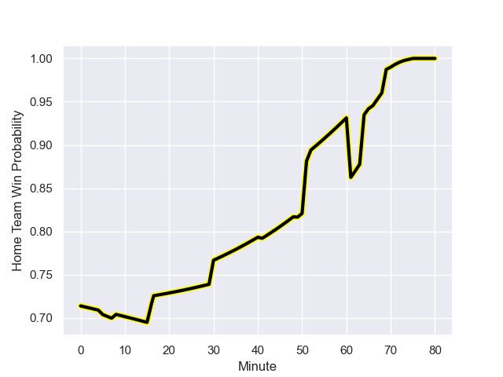

---  
layout: page  
title: Montauban at Mont-de-Marsan; 13-30  
date: 2023-11-10 18:00:00 -0500  
categories: "Pro D2 2023" match review  
---
# Montauban at Mont-de-Marsan; 13-30

# Club Level Predictions

The first set of predictions treats a club as the smallest object, as the club develops its members, organizes a gameplan, and deploys its players as needed for each match. This club model has a prediction of 0.742, which translates to predicting Mont-de-Marsan to win by 9.3.

Each club has a rating and a rating deviation (similar to a Glicko rating), and expected performances can be generated. This allows for simulated matches and spreads like the ones below.
## Projected Performances - Club Model

## Projected Spreads - Club Model

## Projected Results - Club Model

# Player Level Predictions - Version 2

Treating teams instead as an entity made up of the currently active players, I have ratings for each player in an altogether different system. These can be combined to form team ratings once teamsheets are announced, weighting starters a bit higher than the reserves. After the match is played, players can be weighted by their minutes on the field, allowing for an accurate measure of the team's composition. With these compiled team ratings, we can make predictions, measure inaccuracy, and update the individual player ratings.
## Prediction with Player Minutes: Mont-de-Marsan by 10.0

Mont-de-Marsan by 5.2 on a neutral field
## Prediction without Player Minutes: Mont-de-Marsan by 9.4

Mont-de-Marsan by 4.5 on a neutral pitch

## Projected Performances - Player Model

## Projected Spreads - Player Model

## Projected Results - Player Model

## Scores over Time

## Win Probability over Time

There were 5 large changes in win probability in this match

|   Away Minutes | Away Player         |   Away elo |   Number |   Home elo | Home Player           |   Home Minutes |
|---------------:|:--------------------|-----------:|---------:|-----------:|:----------------------|---------------:|
|             49 | Thomas Bue          |      49.04 |        1 |      45.51 | Thomas Bultel         |             41 |
|             49 | Badri Alkhazashvili |      34.42 |        2 |     102.81 | Torsten van Jaarsveld |             61 |
|             49 | Tietie Tuimauga     |      68.59 |        3 |      34.22 | Anthony Alves         |             61 |
|             80 | Frank Bradshaw      |      72.56 |        4 |      61.07 | Romain Durand         |             80 |
|             51 | Lewis Bean          |      49.71 |        5 |      31.52 | Myles Edwards         |             80 |
|             80 | Kyllian Ringuet     |      41.17 |        6 |      47.49 | Yann Brethous         |             66 |
|             52 | Otar Giorgadze      |      66.07 |        7 |      53.91 | Nicolas Garrault      |             80 |
|             80 | Tyrone Viiga        |      31.4  |        8 |      46.12 | Mike Faleafa          |             68 |
|             61 | Alexis Bernadet     |      66.38 |        9 |      46.4  | Baptiste Canut        |             66 |
|             80 | Thomas Fortunel     |      49.01 |       10 |      83.61 | Willie du Plessis     |             70 |
|             80 | Bastien Guillemin   |      39.1  |       11 |      59.29 | Eroni Sau             |             80 |
|             52 | Sevanaia Galala     |      75.8  |       12 |      52.28 | Patricio Fernandez    |             80 |
|             80 | Josua Vici          |      23.99 |       13 |      86.92 | Nacani Wakaya         |             66 |
|             80 | Raphael Sanchez     |      42.02 |       14 |      49.01 | Simao Broeiro Bento   |             80 |
|             49 | Thomas Larregain    |      27.36 |       15 |      47.74 | Théo Cortes           |             80 |
|             31 | Malino Vanai        |      21.19 |       16 |      36.94 | Jean-Luc Innocente    |             39 |
|             31 | Lucas Seyrolle      |      35.97 |       17 |      42.95 | Simon Labouyrie       |             19 |
|             31 | David Marotel       |      44.91 |       18 |      66.12 | Gheorghe Gajion       |             19 |
|             31 | Jérôme Bosviel      |      87.65 |       19 |      53.18 | Raphaël Robic         |             14 |
|             29 | Kevin Gimeno        |       9.76 |       20 |      49.27 | Kevin Viallard        |             14 |
|             28 | Quentin Witt        |      39.57 |       21 |      49.31 | Gatien Masse          |             14 |
|             28 | Maxime Mathy        |      36.46 |       22 |      46.65 | Jules Dussutour       |             12 |
|             19 | Yoan Cottin         |      62.4  |       23 |      46.66 | Yoann Laousse Azpiazu |             10 |

