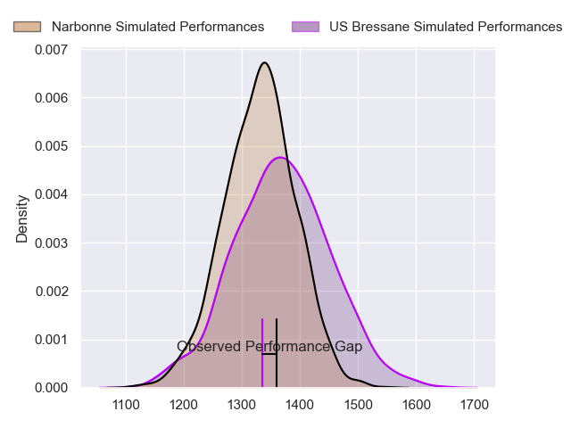
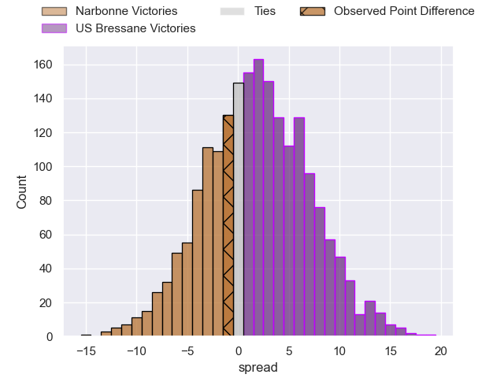
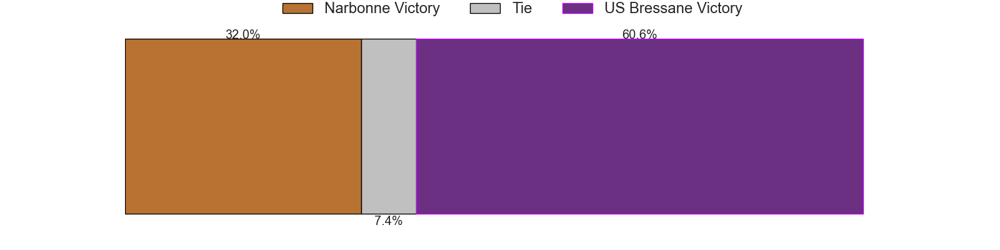
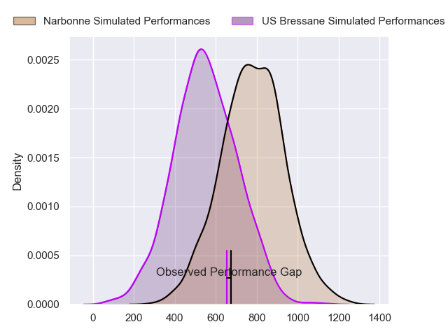
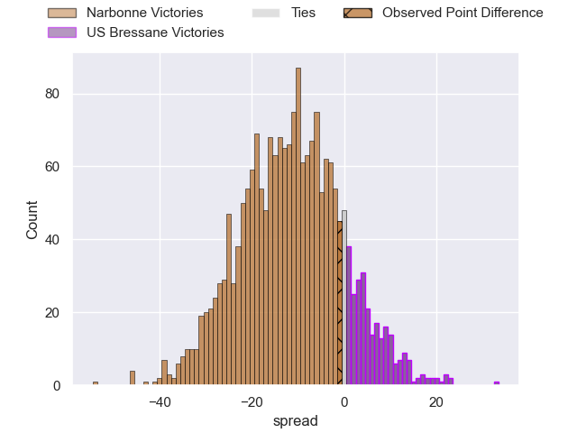
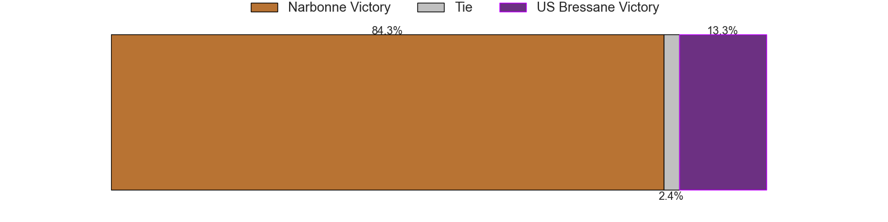
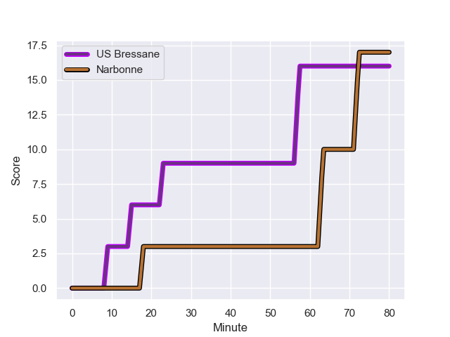
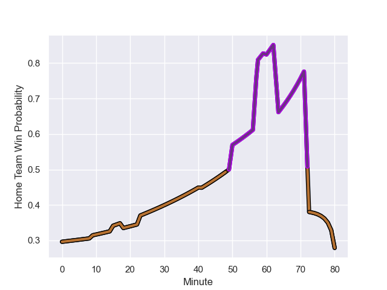

---  
layout: page  
title: Narbonne at US Bressane; 17-16  
date: 2023-11-10 18:00:00 -0500  
categories: "Nationale 2023" match review  
---
# Narbonne at US Bressane; 17-16

# Club Level Predictions

The first set of predictions treats a club as the smallest object, as the club develops its members, organizes a gameplan, and deploys its players as needed for each match. This club model has a prediction of 0.555, which translates to predicting US Bressane to win by 1.9.

Each club has a rating and a rating deviation (similar to a Glicko rating), and expected performances can be generated. This allows for simulated matches and spreads like the ones below.
## Projected Performances - Club Model

## Projected Spreads - Club Model

## Projected Results - Club Model

# Player Level Predictions - Version 2

Treating teams instead as an entity made up of the currently active players, I have ratings for each player in an altogether different system. These can be combined to form team ratings once teamsheets are announced, weighting starters a bit higher than the reserves. After the match is played, players can be weighted by their minutes on the field, allowing for an accurate measure of the team's composition. With these compiled team ratings, we can make predictions, measure inaccuracy, and update the individual player ratings.
## Prediction with Player Minutes: Narbonne by 9.5

Narbonne by 13.1 on a neutral field
## Prediction without Player Minutes: Narbonne by 9.1

Narbonne by 12.6 on a neutral pitch

## Projected Performances - Player Model

## Projected Spreads - Player Model

## Projected Results - Player Model

## Scores over Time

## Win Probability over Time

There were 9 large changes in win probability in this match

|   Away Minutes | Away Player            |   Away elo |   Number |   Home elo | Home Player               |   Home Minutes |
|---------------:|:-----------------------|-----------:|---------:|-----------:|:--------------------------|---------------:|
|             50 | Sylvain Abadie         |      34.61 |        1 |      41.11 | Vazha Kapanadze           |             41 |
|             50 | Mehdi Boundjema        |      58.47 |        2 |      47.94 | Clement Jullien           |             41 |
|             50 | John Roy Jenkinson     |      63.73 |        3 |      22.03 | Atonio Ulutuipalelei      |             60 |
|             80 | Marius Antonescu       |      53.86 |        4 |      21.46 | Louis Bruinsma            |             80 |
|             80 | Dennis Visser          |      35.08 |        5 |      30.47 | Josh Peters               |             80 |
|             50 | Luke Nakobukobua       |      68.97 |        6 |      42.71 | Nicolas Tachat            |             65 |
|             80 | Baptiste Abescat-Leroy |      44.54 |        7 |      35.74 | Loic Baradel              |             80 |
|             80 | Charles Malet          |      21.52 |        8 |      51.42 | Joseph Penitito           |             61 |
|             50 | Pierrick Nova          |      50.19 |        9 |      40.09 | Jeremy Valencot           |             61 |
|             73 | Gilles Bosch           |       8.1  |       10 |      50.67 | Fred Zeilinga             |             67 |
|             55 | Clément Clavières      |      65.1  |       11 |      27.38 | Élie De Fleurian          |             80 |
|             80 | Peter Betham           |     117.22 |       12 |      -0.32 | Parataiso Silafai-Lea'ana |             60 |
|             80 | Pierre Nueno           |      54.78 |       13 |      17.92 | Alexandre Badet           |             80 |
|             80 | Pierre-Hugo Ducom      |      41.7  |       14 |      26.1  | Thibaut Perrette          |             80 |
|             80 | James Kane             |      57.46 |       15 |      21.78 | Christian Lacombe         |             80 |
|             30 | Théo Castinel          |      54.17 |       16 |      32.58 | Quentin Drancourt         |             39 |
|             30 | Gabriel Atlan          |      47.44 |       17 |      33.62 | Louis Dasalmartini        |             39 |
|             30 | Levi Tikoipau          |      50.12 |       18 |      28.22 | Erich de Jager            |             20 |
|             30 | Thibault Clauzade      |      57.52 |       19 |      36.81 | Pierre Reynaud            |             15 |
|             30 | Josh Valentine         |      80.72 |       20 |      47.02 | Nail Ait Naceur           |             19 |
|              7 | Tom Chauvet            |      48.95 |       21 |      -8.15 | Nicolas Faure             |             19 |
|             25 | Étienne Ducom          |      38.54 |       22 |      47.74 | Benjamin Doy              |             13 |
|            nan | nan                    |     nan    |       23 |      28.43 | Maile Mamao               |             20 |

