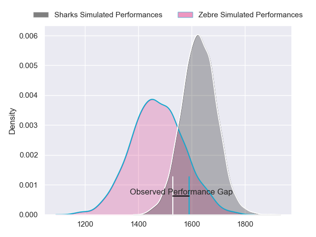
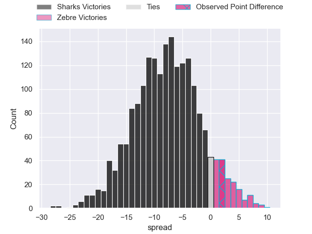
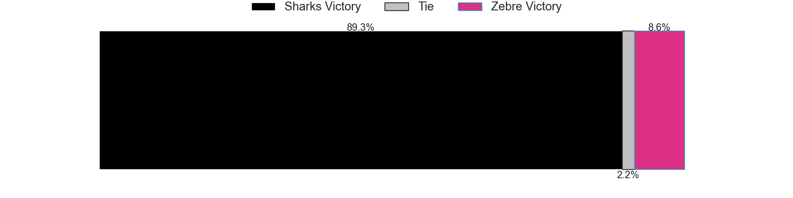
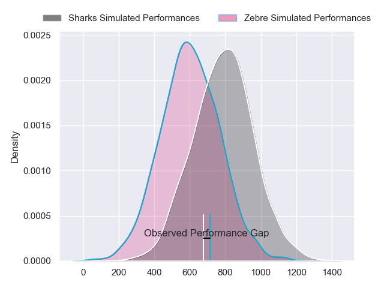
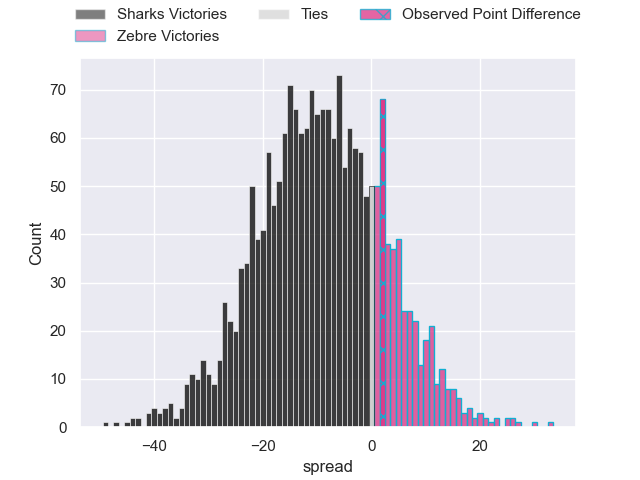
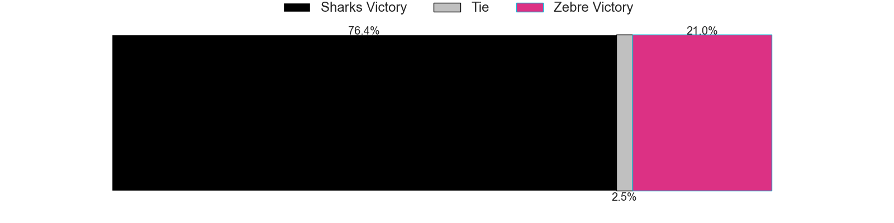
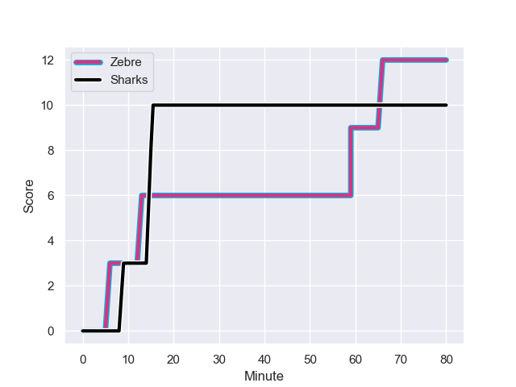
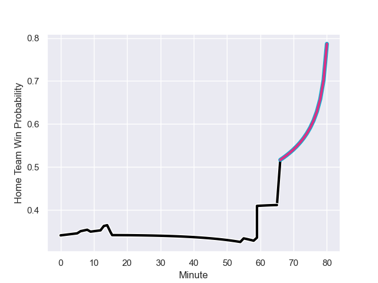

---  
layout: page  
title: Sharks at Zebre; 10-12  
date: 2023-11-10 18:00:00 -0500  
categories: "United Rugby Championship 2023" match review  
---
# Sharks at Zebre; 10-12

# Club Level Predictions

The first set of predictions treats a club as the smallest object, as the club develops its members, organizes a gameplan, and deploys its players as needed for each match. This club model has a prediction of 0.293, which translates to predicting Sharks to win by 7.8.

Each club has a rating and a rating deviation (similar to a Glicko rating), and expected performances can be generated. This allows for simulated matches and spreads like the ones below.
## Projected Performances - Club Model

## Projected Spreads - Club Model

## Projected Results - Club Model

# Player Level Predictions - Version 2

Treating teams instead as an entity made up of the currently active players, I have ratings for each player in an altogether different system. These can be combined to form team ratings once teamsheets are announced, weighting starters a bit higher than the reserves. After the match is played, players can be weighted by their minutes on the field, allowing for an accurate measure of the team's composition. With these compiled team ratings, we can make predictions, measure inaccuracy, and update the individual player ratings.
## Prediction with Player Minutes: Sharks by 7.3

Sharks by 11.0 on a neutral field
## Prediction without Player Minutes: Sharks by 8.1

Sharks by 11.8 on a neutral pitch

## Projected Performances - Player Model

## Projected Spreads - Player Model

## Projected Results - Player Model

## Scores over Time

## Win Probability over Time

There were 5 large changes in win probability in this match

|   Away Minutes | Away Player              |   Away elo |   Number |   Home elo | Home Player            |   Home Minutes |
|---------------:|:-------------------------|-----------:|---------:|-----------:|:-----------------------|---------------:|
|             70 | Ntuthuko Mchunu          |      41.54 |        1 |      44.57 | Danilo Fischetti       |             75 |
|             78 | Dylan Richardson         |      57.9  |        2 |      44.79 | Luca Bigi              |             55 |
|             62 | Coenie Oosthuizen        |     125.46 |        3 |      37.05 | Juan Manuel Pitinari   |             73 |
|             62 | Corne Rahl               |      37.93 |        4 |      10.69 | Dave Sisi              |             67 |
|             80 | Emile van Heerden        |      39.19 |        5 |      -5.2  | Leonard Krumov         |             80 |
|             80 | James Venter             |      51.9  |        6 |      23.05 | Luca Andreani          |             55 |
|             80 | Phepsi Buthelezi         |      45.81 |        7 |      12.1  | Iacopo Bianchi         |             53 |
|             80 | George Cronje            |      36.8  |        8 |      38.82 | Giovanni Licata        |             80 |
|             60 | Cameron Wright           |      20.37 |        9 |      25.25 | Gonzalo Jesus Garcia   |             59 |
|             70 | Boeta Chamberlain        |      49.26 |       10 |      22.99 | Tiff Eden              |             66 |
|             80 | Aphiwe Dyantyi           |      27.47 |       11 |      12.56 | Simone Gesi            |             80 |
|             67 | Rohan Janse van Rensburg |      64.38 |       12 |      47.95 | Enrico Lucchin         |             80 |
|             60 | Francois Venter          |      54.42 |       13 |      84.79 | Luca Morisi            |             80 |
|             80 | Werner Kok               |      54.29 |       14 |      13.47 | Jacopo Trulla          |             80 |
|             80 | Aphelele Fassi           |      78.75 |       15 |      70.1  | Geronimo Prisciantelli |             80 |
|             20 | Sikhumbuzo Notshe        |      77.84 |       16 |      37.48 | Giampietro Ribaldi     |             25 |
|             20 | Mthokozisi Mkhabela      |      40.8  |       17 |      50.48 | Davide Ruggeri         |             25 |
|             18 | Hyron Andrews            |      41.23 |       18 |      29.22 | Alessandro Fusco       |             21 |
|             18 | Hanro Jacobs             |      46.98 |       19 |      55.02 | Taina Fox-Matamua      |             27 |
|             13 | Marnus Potgieter         |      60.52 |       20 |      52.22 | Scott Gregory          |             14 |
|             10 | Khwezi Mona              |      48.45 |       21 |      65.46 | Matteo Canali          |             13 |
|             10 | Lionel Cronje            |      99.59 |       22 |      47.78 | Muhamed Hasa           |              7 |
|              2 | Daniel Viljoen Jooste    |      44.71 |       23 |      33.17 | Luca Rizzoli           |              5 |

