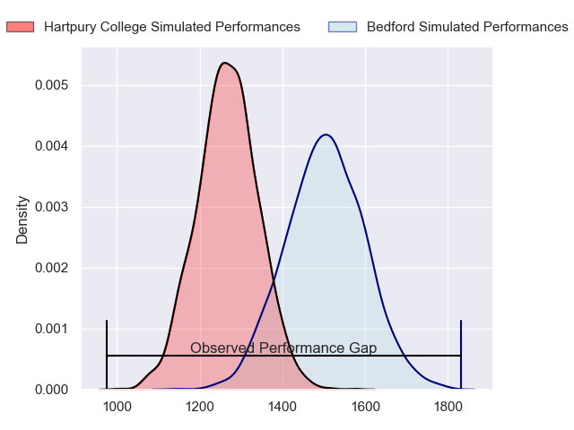
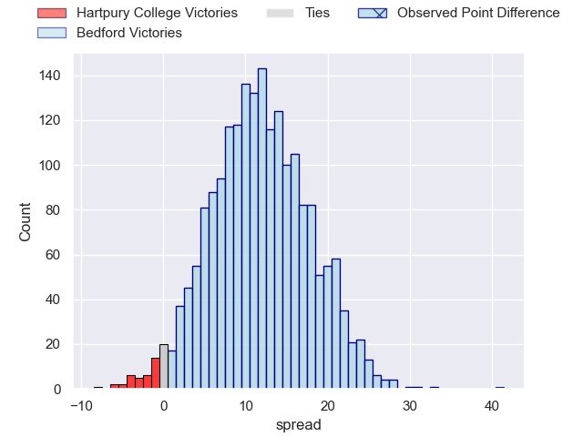
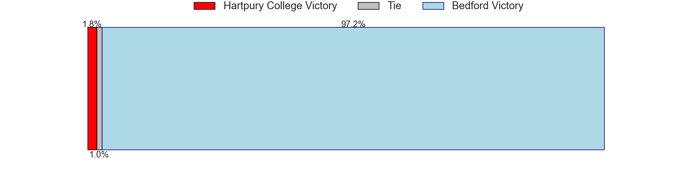
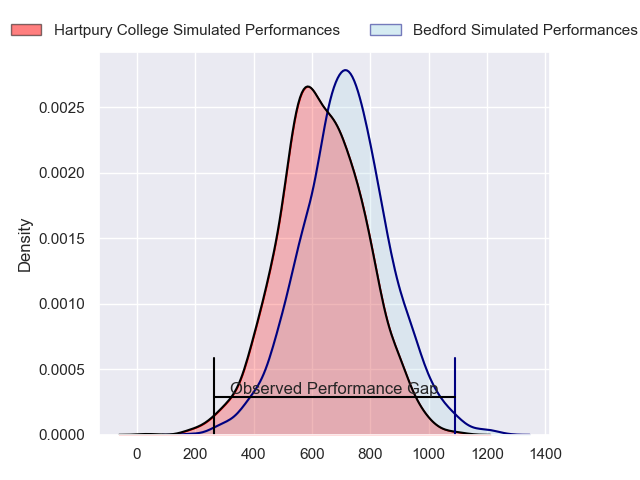
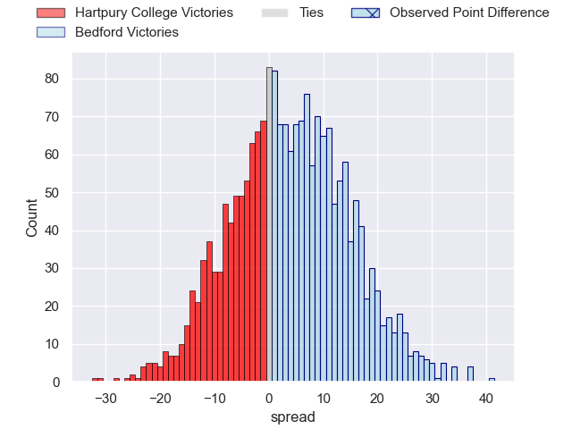
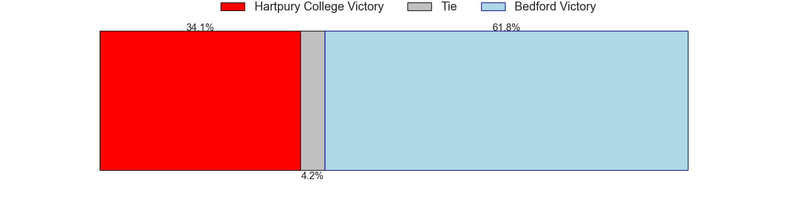
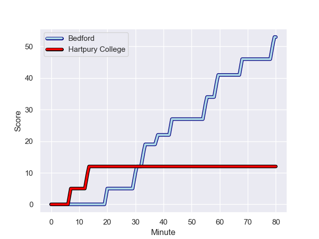
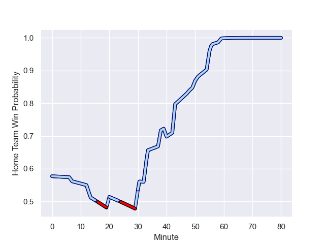

---  
layout: page  
title: Hartpury College at Bedford; 12-53  
date: 2023-11-11 18:00:00 -0500  
categories: "RFU Championship 2023" match review  
---
# Hartpury College at Bedford; 12-53

# Club Level Predictions

The first set of predictions treats a club as the smallest object, as the club develops its members, organizes a gameplan, and deploys its players as needed for each match. This club model has a prediction of 0.792, which translates to predicting Bedford to win by 11.9.

Each club has a rating and a rating deviation (similar to a Glicko rating), and expected performances can be generated. This allows for simulated matches and spreads like the ones below.
## Projected Performances - Club Model

## Projected Spreads - Club Model

## Projected Results - Club Model

# Player Level Predictions - Version 2

Treating teams instead as an entity made up of the currently active players, I have ratings for each player in an altogether different system. These can be combined to form team ratings once teamsheets are announced, weighting starters a bit higher than the reserves. After the match is played, players can be weighted by their minutes on the field, allowing for an accurate measure of the team's composition. With these compiled team ratings, we can make predictions, measure inaccuracy, and update the individual player ratings.
## Prediction with Player Minutes: Bedford by 3.4

Hartpury College by 0.0 on a neutral field
## Prediction without Player Minutes: Bedford by 3.0

Hartpury College by 0.4 on a neutral pitch

## Projected Performances - Player Model

## Projected Spreads - Player Model

## Projected Results - Player Model

## Scores over Time

## Win Probability over Time

There were 8 large changes in win probability in this match

|   Away Minutes | Away Player          |   Away elo |   Number |   Home elo | Home Player          |   Home Minutes |
|---------------:|:---------------------|-----------:|---------:|-----------:|:---------------------|---------------:|
|             50 | Archie McArthur      |      48.67 |        1 |      31.68 | Jamie Jack           |             48 |
|             61 | William Crane        |      40.45 |        2 |      42.18 | James Fish           |             60 |
|             40 | Joe Rees             |       4.97 |        3 |      64.45 | Oisin Heffernan      |             48 |
|             48 | Dale Lemon           |      48.01 |        4 |      28.17 | Jordan Onojaife      |             56 |
|             80 | Jack Davies          |      48.62 |        5 |      40.27 | Alex Woolford        |             80 |
|             80 | Samuel Lewis         |      19.22 |        6 |      17.22 | Luke Frost           |             80 |
|             40 | Harry Short          |      58.93 |        7 |      24.19 | Joe Howard           |             80 |
|             80 | Jarrad Hayler        |      52.34 |        8 |      12.85 | Cameron King         |             56 |
|             67 | Michael Austin       |      47.79 |        9 |      61.96 | Alex Day             |             60 |
|             51 | Harry Bazalgette     |      60.17 |       10 |      25.03 | Louis Grimoldby      |             50 |
|             50 | Bradley Denty        |      53.01 |       11 |      61.8  | Dean Adamson         |             80 |
|             80 | Tommy Mathews        |      38.6  |       12 |      46.89 | Jordan Venter        |             60 |
|             80 | Robbie Smith         |      15.96 |       13 |      61.5  | Michael Le Bourgeois |             80 |
|             80 | Jack Reeves          |      31.33 |       14 |      40.02 | Sean French          |             80 |
|             80 | Ioan Jones           |      49.83 |       15 |      47.83 | Matthew Worley       |             80 |
|             40 | Aristot Benz-Salomon |      50.5  |       16 |      52.09 | Joey Conway          |             32 |
|             40 | Josh Gray            |      57.16 |       17 |      47.29 | Bryan O'Connor       |             32 |
|             32 | Joe Owen             |      46.74 |       18 |      61.69 | William Maisey       |             30 |
|             30 | Mikey Summerfield    |      54.78 |       19 |      42.99 | Jac Arthur           |             24 |
|             29 | Sam Worsley          |      44.11 |       20 |      58.57 | Robin Williams       |             24 |
|             30 | Jack Johnson         |      47.62 |       21 |      38.14 | Jamie Elliott        |             20 |
|             19 | Andrew Davies        |      39.11 |       22 |      46.09 | Archie McParland     |             20 |
|             13 | Oscar Lennon         |      48.64 |       23 |      46.65 | Craig Wright         |             20 |

