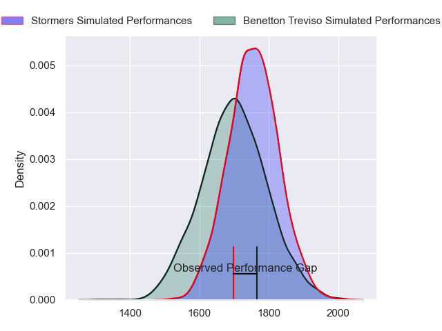
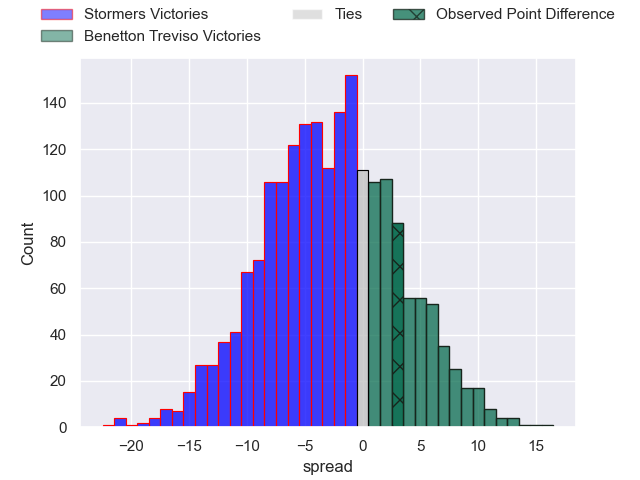
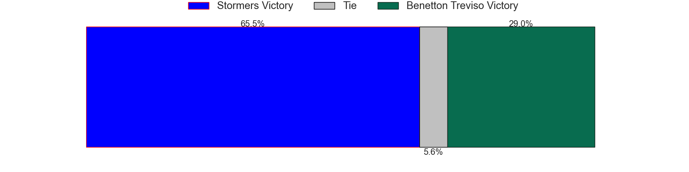
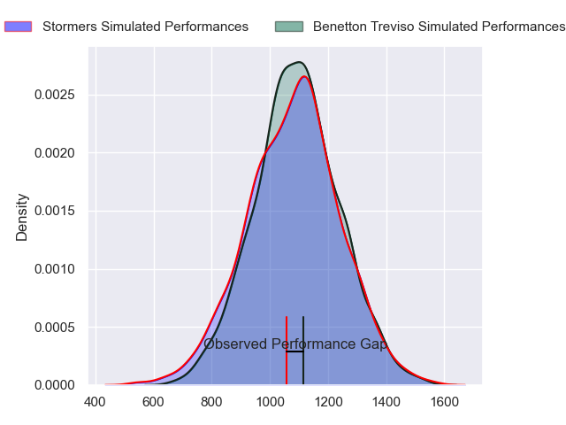
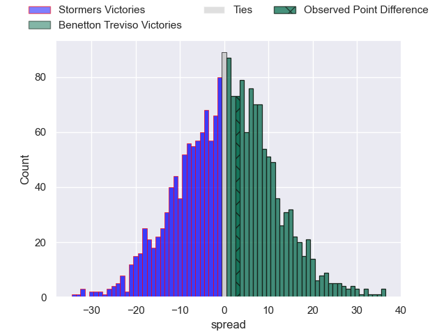
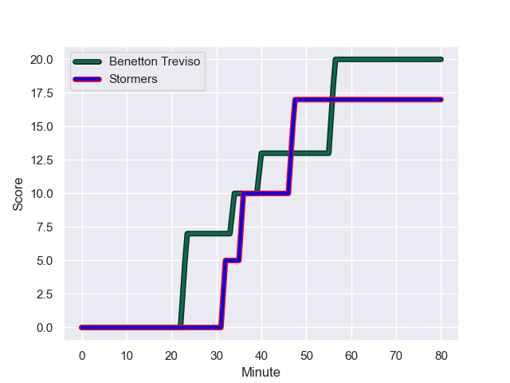
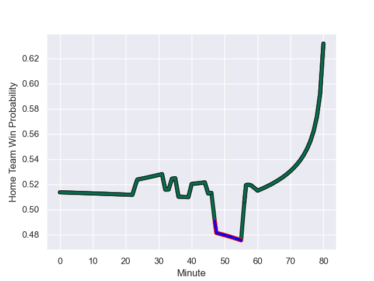

---  
layout: page  
title: Stormers at Benetton Treviso; 17-20  
date: 2023-11-11 18:00:00 -0500  
categories: "United Rugby Championship 2023" match review  
---
# Stormers at Benetton Treviso; 17-20

# Club Level Predictions

The first set of predictions treats a club as the smallest object, as the club develops its members, organizes a gameplan, and deploys its players as needed for each match. This club model has a prediction of 0.423, which translates to predicting Stormers to win by 2.8.

Each club has a rating and a rating deviation (similar to a Glicko rating), and expected performances can be generated. This allows for simulated matches and spreads like the ones below.
## Projected Performances - Club Model

## Projected Spreads - Club Model

## Projected Results - Club Model

# Player Level Predictions - Version 2

Treating teams instead as an entity made up of the currently active players, I have ratings for each player in an altogether different system. These can be combined to form team ratings once teamsheets are announced, weighting starters a bit higher than the reserves. After the match is played, players can be weighted by their minutes on the field, allowing for an accurate measure of the team's composition. With these compiled team ratings, we can make predictions, measure inaccuracy, and update the individual player ratings.
## Prediction with Player Minutes: Benetton Treviso by 0.6

Stormers by 3.3 on a neutral field
## Prediction without Player Minutes: Benetton Treviso by 2.2

Stormers by 1.8 on a neutral pitch

## Projected Performances - Player Model

## Projected Spreads - Player Model

## Projected Results - Player Model

## Scores over Time

## Win Probability over Time

There were 2 large changes in win probability in this match

|   Away Minutes | Away Player                       |   Away elo |   Number |   Home elo | Home Player         |   Home Minutes |
|---------------:|:----------------------------------|-----------:|---------:|-----------:|:--------------------|---------------:|
|             58 | Alistair Vermaak                  |      74.6  |        1 |      63.98 | Ivan Nemer          |             45 |
|             47 | Scarra Ntubeni                    |      88.24 |        2 |      97.27 | Giacomo Nicotera    |             45 |
|             66 | Neethling Fouche                  |      58.94 |        3 |      91.45 | Simone Ferrari      |             45 |
|             58 | Adre Smith                        |      76.3  |        4 |      42.83 | Niccolo Cannone     |             68 |
|             75 | Ruben van Heerden                 |      54.7  |        5 |      97.79 | Federico Ruzza      |             80 |
|             58 | Marcel Theunissen                 |      44.14 |        6 |      63.27 | Sebastian Negri     |             48 |
|             80 | Ben-Jason Dixon                   |      40.54 |        7 |      96.66 | Michele Lamaro      |             80 |
|             80 | Evan Roos                         |      73.77 |        8 |      80.44 | Lorenzo Cannone     |             48 |
|             63 | Herschel Jantjies                 |      89.01 |        9 |      61.03 | Alessandro Garbisi  |             59 |
|             60 | Jean-Luc du Plessis               |      61.67 |       10 |      66.94 | Tomas Albornoz      |             80 |
|             80 | Leolin Zas                        |      78.87 |       11 |      70.11 | Paolo Odogwu        |             80 |
|             80 | Ruhan Nel                         |      51.02 |       12 |      58.75 | Marco Zanon         |             80 |
|             80 | Ben Loader                        |      84.12 |       13 |      75.41 | Malakai Fekitoa     |             80 |
|             80 | Courtnall Skosan                  |     101.68 |       14 |      26.91 | Ignacio Mendy       |             80 |
|             80 | Warrick Gelant                    |     116.03 |       15 |      70.13 | Rhyno Smith         |             62 |
|             33 | Joseph Dweba                      |      51.81 |       16 |      55.67 | Mirco Spagnolo      |             35 |
|             22 | Nama Xaba                         |      20.81 |       17 |      40.67 | Bautista Bernasconi |             35 |
|             22 | Brok Harris                       |     127.56 |       18 |      48.15 | Giosue Zilocchi     |             35 |
|             22 | Gary Porter                       |      47.57 |       19 |      56.35 | Eli Snyman          |             32 |
|             20 | Clayton Blommetjies               |      91.61 |       20 |      50.87 | Alessandro Izekor   |             32 |
|             17 | Paul de Wet                       |      69.37 |       21 |      73.09 | Jacob Umaga         |             18 |
|             14 | Lee-Marvin Lofty Siyanda Mazibuko |      59.75 |       22 |      34.73 | Andy Uren           |             21 |
|              5 | Keke Morabe                       |      40.57 |       23 |      80.31 | Toa Halafihi        |             12 |

