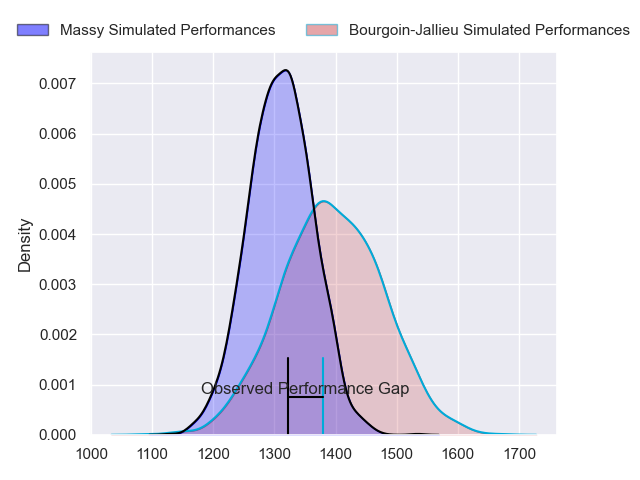
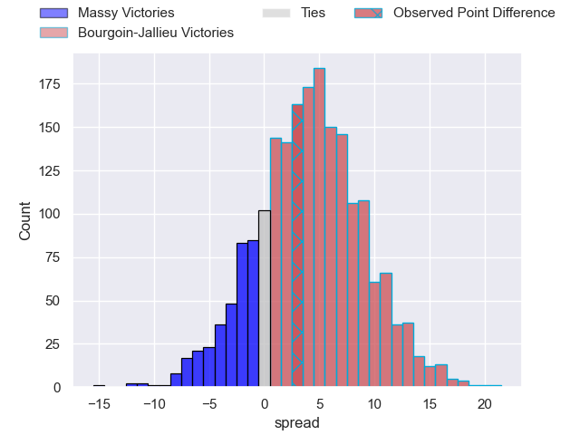
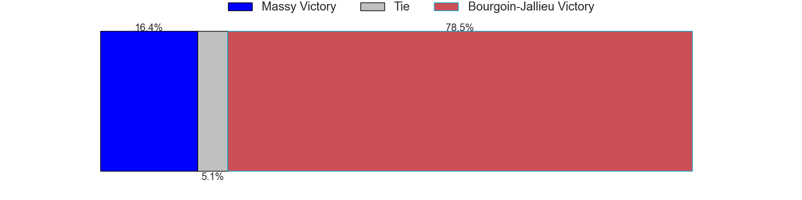
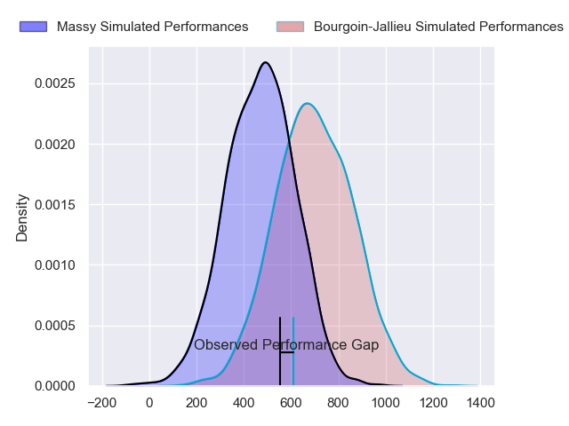
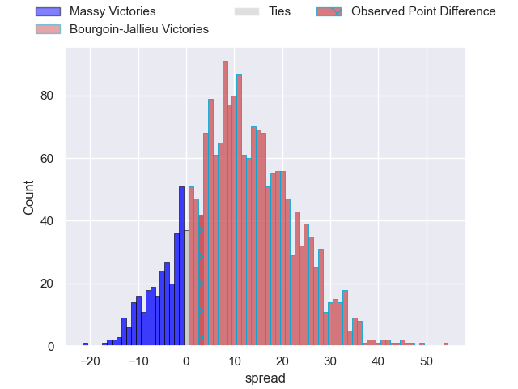
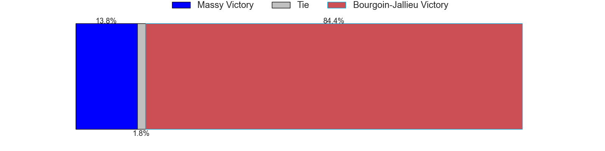
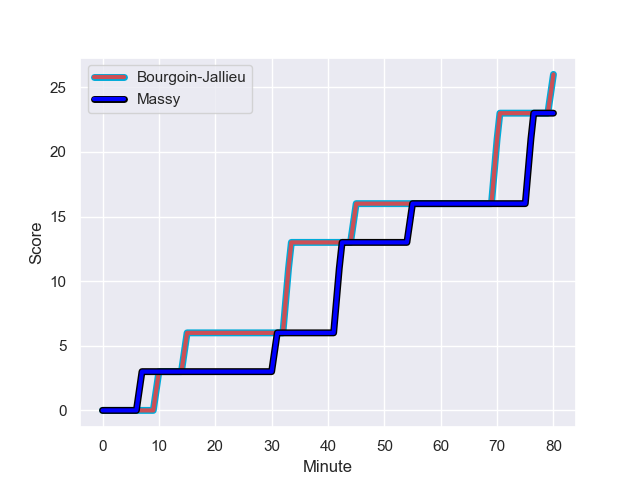
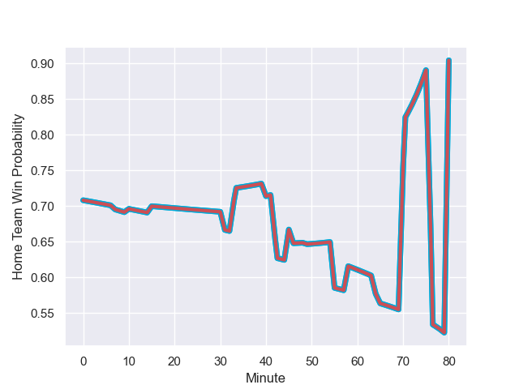

---  
layout: page  
title: Massy at Bourgoin-Jallieu; 23-26  
date: 2023-11-11 18:00:00 -0500  
categories: "Nationale 2023" match review  
---
# Massy at Bourgoin-Jallieu; 23-26

# Club Level Predictions

The first set of predictions treats a club as the smallest object, as the club develops its members, organizes a gameplan, and deploys its players as needed for each match. This club model has a prediction of 0.62, which translates to predicting Bourgoin-Jallieu to win by 4.3.

Each club has a rating and a rating deviation (similar to a Glicko rating), and expected performances can be generated. This allows for simulated matches and spreads like the ones below.
## Projected Performances - Club Model

## Projected Spreads - Club Model

## Projected Results - Club Model

# Player Level Predictions - Version 2

Treating teams instead as an entity made up of the currently active players, I have ratings for each player in an altogether different system. These can be combined to form team ratings once teamsheets are announced, weighting starters a bit higher than the reserves. After the match is played, players can be weighted by their minutes on the field, allowing for an accurate measure of the team's composition. With these compiled team ratings, we can make predictions, measure inaccuracy, and update the individual player ratings.
## Prediction with Player Minutes: Bourgoin-Jallieu by 9.7

Bourgoin-Jallieu by 5.3 on a neutral field
## Prediction without Player Minutes: Bourgoin-Jallieu by 10.6

Bourgoin-Jallieu by 6.2 on a neutral pitch

## Projected Performances - Player Model

## Projected Spreads - Player Model

## Projected Results - Player Model

## Scores over Time

## Win Probability over Time

There were 13 large changes in win probability in this match

|   Away Minutes | Away Player              |   Away elo |   Number |   Home elo | Home Player              |   Home Minutes |
|---------------:|:-------------------------|-----------:|---------:|-----------:|:-------------------------|---------------:|
|             46 | Fernandez Correa         |       0.8  |        1 |      36.59 | Zhorzhi (Jorji) Saldadze |             64 |
|             46 | Nolan Pienaar            |      48.25 |        2 |      57.34 | Killian Tripier          |             56 |
|             46 | Tijde Visser             |      38.01 |        3 |      44.77 | Maxime Calliet           |             56 |
|             58 | Saba Pesvianidze         |      54.35 |        4 |      40.68 | Poutasi Luafutu          |             72 |
|             80 | Koen Bloemen             |      11.96 |        5 |     -12.64 | Morgan Eames             |             80 |
|             65 | Abongile Nonkontwana     |      -1.21 |        6 |      44.08 | Kevin Chaudouard         |             80 |
|             65 | Alexandre Loubiere       |      46.8  |        7 |      38.37 | Theophile Cotte          |             56 |
|             80 | Samuel Nollet            |      17.24 |        8 |      64.2  | Kevin Rivoire            |             72 |
|             40 | Lucas Rubio              |      18.44 |        9 |      60.47 | Jeremy Gondrand          |             80 |
|             80 | Hugo Verdu               |      12.35 |       10 |      32.12 | Aviata Silago            |             80 |
|             80 | Yanis Dit Robaglia       |      22.83 |       11 |      21.63 | Quentin Lefort           |             64 |
|             49 | Arthur Seigneuret        |      43.39 |       12 |      54.55 | Pieter Morton            |             72 |
|             80 | Tom Cusson               |      32.04 |       13 |      33.84 | Christopher Bosch        |             80 |
|             80 | Martin Carre             |      51.52 |       14 |      41.04 | Paul-Hugo Champ          |             80 |
|             80 | Tom Deleuze              |      27.8  |       15 |      39.84 | Nicolas Cachet           |             80 |
|             40 | Alex Preira              |      58.45 |       16 |      40.53 | Romain Favaretto         |             16 |
|             34 | Robin Poipy              |      42.29 |       17 |      24.16 | Mohamed Khribache        |             24 |
|             34 | Pierre-Alexandre Duclieu |      41.49 |       18 |      48.32 | Oktay Yilmaz             |             24 |
|             34 | Nicolas Ferrer           |      43.66 |       19 |      62.78 | Bynjamin Rabatel         |             24 |
|             31 | Victorien Jacomme        |      48.46 |       20 |      25.3  | Brieuc Plessis-Couillaud |             16 |
|             22 | Lilian Rousset           |      47.79 |       21 |      41.11 | Robin Gascou             |              8 |
|             15 | Tony Tissot              |      35.79 |       22 |      53.38 | Théo Lepage              |              8 |
|             15 | Clément Vidoni           |      42.25 |       23 |      57.7  | Tomas Munilla lo Duca    |              8 |

