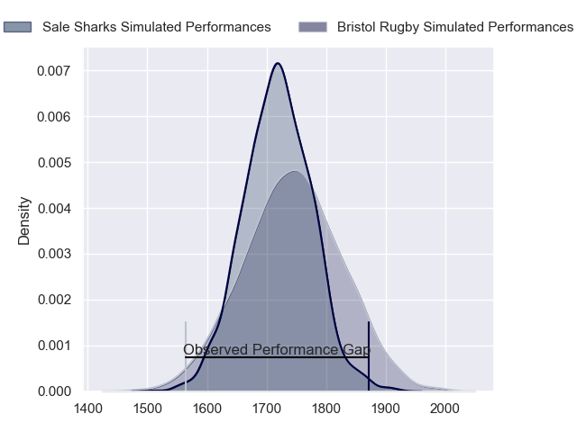
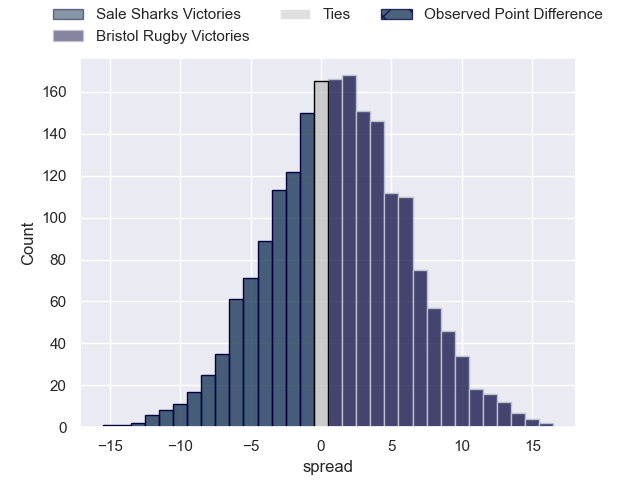
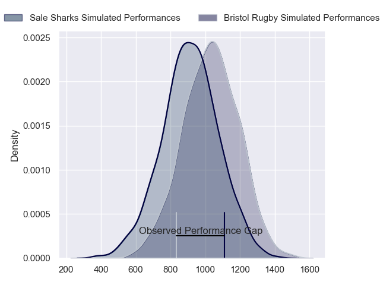
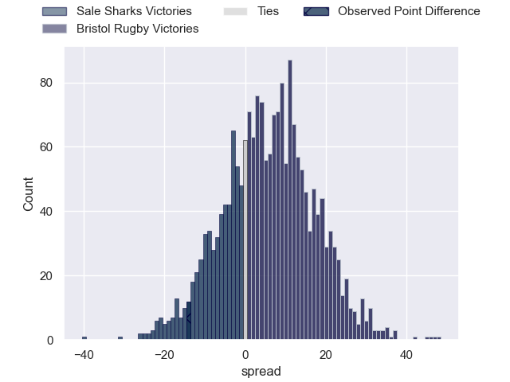
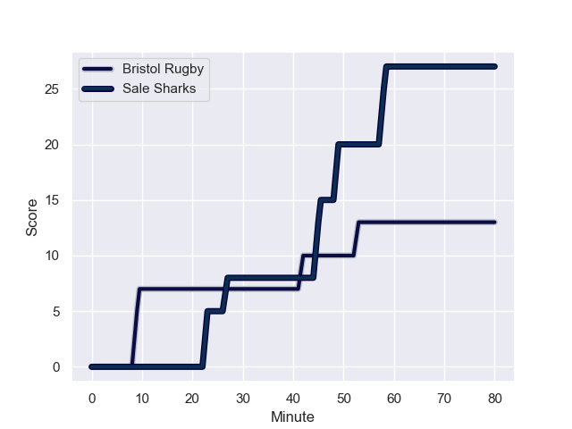
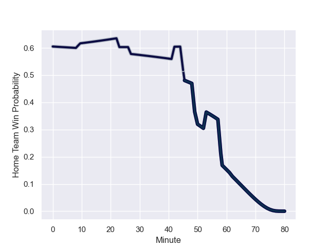

---  
layout: page  
title: Sale Sharks at Bristol Rugby; 27-13  
date: 2023-11-11 18:00:00 -0500  
categories: "Gallagher Premiership 2023" match review  
---
# Sale Sharks at Bristol Rugby; 27-13

# Club Level Predictions

The first set of predictions treats a club as the smallest object, as the club develops its members, organizes a gameplan, and deploys its players as needed for each match. This club model has a prediction of 0.54, which translates to predicting Bristol Rugby to win by 1.4.

Each club has a rating and a rating deviation (similar to a Glicko rating), and expected performances can be generated. This allows for simulated matches and spreads like the ones below.
## Projected Performances - Club Model

## Projected Spreads - Club Model

## Projected Results - Club Model

# Player Level Predictions - Version 2

Treating teams instead as an entity made up of the currently active players, I have ratings for each player in an altogether different system. These can be combined to form team ratings once teamsheets are announced, weighting starters a bit higher than the reserves. After the match is played, players can be weighted by their minutes on the field, allowing for an accurate measure of the team's composition. With these compiled team ratings, we can make predictions, measure inaccuracy, and update the individual player ratings.
## Prediction with Player Minutes: Bristol Rugby by 4.7

Bristol Rugby by 0.9 on a neutral field
## Prediction without Player Minutes: Bristol Rugby by 5.2

Bristol Rugby by 1.4 on a neutral pitch

## Projected Performances - Player Model

## Projected Spreads - Player Model

## Projected Results - Player Model

## Scores over Time

## Win Probability over Time

There were 10 large changes in win probability in this match

|   Away Minutes | Away Player       |   Away elo |   Number |   Home elo | Home Player                 |   Home Minutes |
|---------------:|:------------------|-----------:|---------:|-----------:|:----------------------------|---------------:|
|             53 | Bevan Rodd        |      63.54 |        1 |      61.01 | Jake Woolmore               |             65 |
|             48 | Agustin Creevy    |      89.25 |        2 |      47.45 | Gabriel Oghre               |             65 |
|             53 | Nic Schonert      |      24.5  |        3 |      62.88 | Kyle Sinckler               |             65 |
|             80 | Cobus Wiese       |      65.26 |        4 |      65.04 | Josh Caulfield              |             62 |
|             53 | Josh Beaumont     |      58.48 |        5 |      57.53 | Joe Batley                  |             80 |
|             80 | Ernst van Rhyn    |      73.86 |        6 |      49.86 | Magnus Bradbury             |             80 |
|             68 | Ben Curry         |      45.51 |        7 |      69.8  | Harry Thacker               |             80 |
|             80 | Daniel du Preez   |      78.69 |        8 |      59.87 | Fitz Harding                |             30 |
|             80 | Gus Warr          |      36.08 |        9 |      73.47 | Harry Randall               |             67 |
|             80 | George Ford       |      92.79 |       10 |      73.38 | Callum Sheedy               |             67 |
|             80 | Arron Reed        |      59.96 |       11 |      67.04 | Richard Lane                |             80 |
|             80 | Sam Bedlow        |      60.09 |       12 |      70.03 | Benhard Janse van Rensburg  |             80 |
|             50 | Robert du Preez   |      51.46 |       13 |      96.36 | Virimi Vakatawa             |             63 |
|             80 | Tom Roebuck       |      48.78 |       14 |      52.54 | Noah Heward                 |             80 |
|             80 | Sam James         |      81.58 |       15 |      52.27 | Max Malins                  |             80 |
|             27 | Simon McIntyre    |      75.19 |       16 |      76.64 | Samuel Alexander Grahamslaw |             15 |
|             32 | Luke Cowan-Dickie |      72.29 |       17 |      35.58 | Will Capon                  |             15 |
|             27 | James Harper      |      20.59 |       18 |      52.53 | George Kloska               |             15 |
|             27 | Ben Bamber        |      44.6  |       19 |      51.35 | Daniel Thomas               |             18 |
|             12 | Sam Dugdale       |      38.89 |       20 |      61.67 | James Dun                   |             50 |
|             30 | Joe Carpenter     |      33.14 |       21 |      76.04 | Kieran Marmion              |             13 |
|            nan | nan               |     nan    |       22 |      36.32 | James Williams              |             13 |
|            nan | nan               |     nan    |       23 |      25.25 | Piers O'Conor               |             17 |

