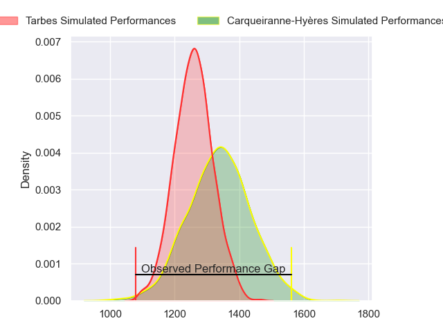
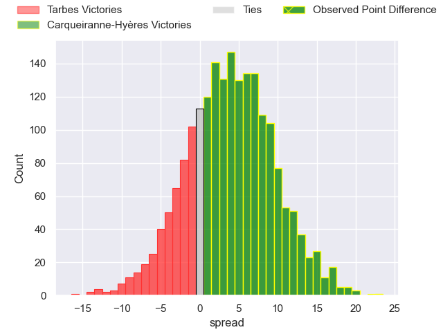
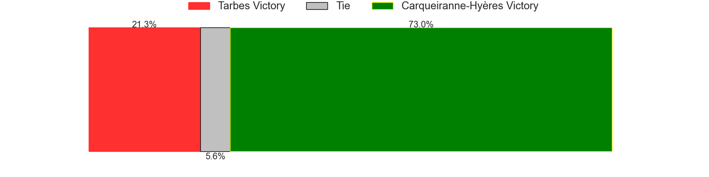
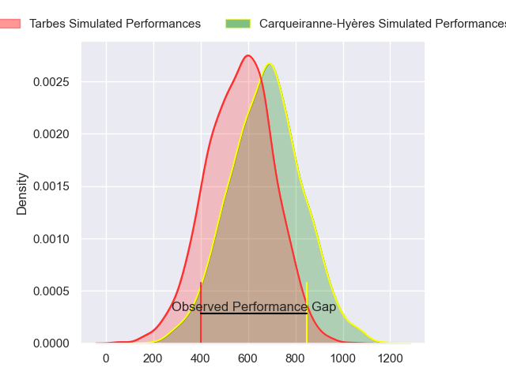
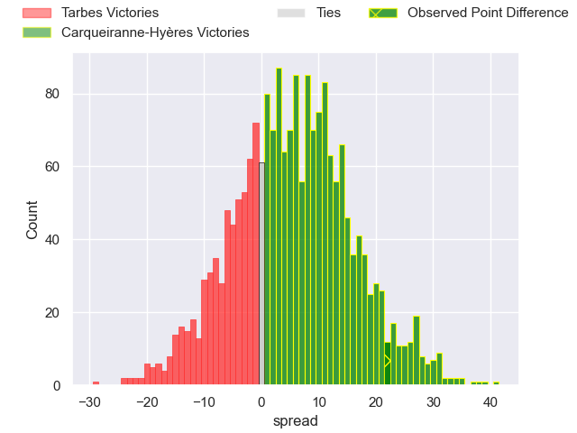
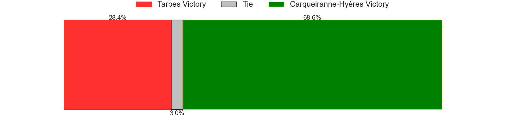
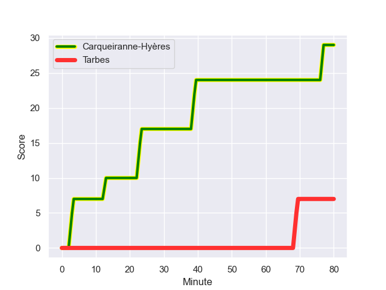
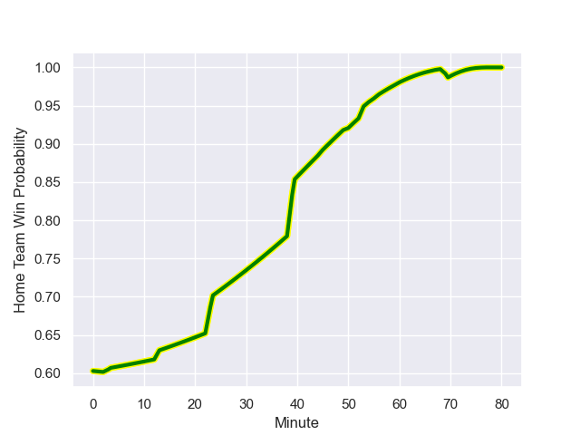

---  
layout: page  
title: Tarbes at Carqueiranne-Hyères; 7-29  
date: 2023-11-11 18:00:00 -0500  
categories: "Nationale 2023" match review  
---
# Tarbes at Carqueiranne-Hyères; 7-29

# Club Level Predictions

The first set of predictions treats a club as the smallest object, as the club develops its members, organizes a gameplan, and deploys its players as needed for each match. This club model has a prediction of 0.614, which translates to predicting Carqueiranne-Hyères to win by 4.1.

Each club has a rating and a rating deviation (similar to a Glicko rating), and expected performances can be generated. This allows for simulated matches and spreads like the ones below.
## Projected Performances - Club Model

## Projected Spreads - Club Model

## Projected Results - Club Model

# Player Level Predictions - Version 2

Treating teams instead as an entity made up of the currently active players, I have ratings for each player in an altogether different system. These can be combined to form team ratings once teamsheets are announced, weighting starters a bit higher than the reserves. After the match is played, players can be weighted by their minutes on the field, allowing for an accurate measure of the team's composition. With these compiled team ratings, we can make predictions, measure inaccuracy, and update the individual player ratings.
## Prediction with Player Minutes: Carqueiranne-Hyères by 4.6

Carqueiranne-Hyères by 1.4 on a neutral field
## Prediction without Player Minutes: Carqueiranne-Hyères by 4.9

Carqueiranne-Hyères by 1.7 on a neutral pitch

## Projected Performances - Player Model

## Projected Spreads - Player Model

## Projected Results - Player Model

## Scores over Time

## Win Probability over Time

There were 2 large changes in win probability in this match

|   Away Minutes | Away Player            |   Away elo |   Number |   Home elo | Home Player         |   Home Minutes |
|---------------:|:-----------------------|-----------:|---------:|-----------:|:--------------------|---------------:|
|             45 | Antoine Palisse        |      47.12 |        1 |      48.17 | Sti Sithole         |             53 |
|             45 | Enzo Mondon            |      39.8  |        2 |      42.52 | Yan Tabarot         |             53 |
|             45 | Aleksi Tchitchiashvili |      38.22 |        3 |      50.05 | Lasha Mchelidze     |             53 |
|             80 | Baptiste Peytavi       |      46.88 |        4 |      25.6  | Adam Peters         |             80 |
|             45 | Jone Trevor Seuvou     |      30.83 |        5 |      19.89 | Lucas Cazac         |             56 |
|             45 | Léo Estaque            |      39.61 |        6 |      31.32 | Nicolas Baquer      |             80 |
|             80 | Aurelien Ricart        |      45.67 |        7 |      52.5  | Joachim Beaumont    |             80 |
|             80 | Len Massyn             |      35.81 |        8 |      50.45 | Andre Gorin         |             59 |
|             50 | Anthony Meric          |      18.3  |        9 |      31.4  | Rémi Dubié          |             60 |
|             80 | Anthony Fuertes        |      20.59 |       10 |      42.62 | Juan Kotze          |             67 |
|             80 | Johan Paulet           |      25.67 |       11 |      50.11 | Paul Gadea          |             80 |
|             80 | Kalione Nasoko         |      47.78 |       12 |      36.69 | Dylan Sage          |             80 |
|             80 | Savenaca Rawaca        |      35.76 |       13 |      35.59 | Charles Brousse     |             80 |
|             50 | William Pees           |      34.11 |       14 |      46.46 | Quentin Bourdieu    |             54 |
|             50 | Yon Camou              |      48.01 |       15 |      34.52 | Adrien Amans        |             80 |
|             35 | Alexandre Combier      |      33.27 |       16 |      42.71 | Eli Serra-Miglietti |             27 |
|             35 | Florian Lamothe        |      49.83 |       17 |      34.37 | Theo Lachaud        |             27 |
|             35 | Toma Taufa             |      47.19 |       18 |      48.85 | Costel Burtila      |             27 |
|             35 | Antoine Bousquet       |      39.56 |       19 |      29.32 | Nathan Gendre       |             24 |
|             35 | Léo Saint-Guilhem      |      40.46 |       20 |      36.9  | Spike Salman        |             21 |
|             30 | Thibaut Dulucq         |      35.93 |       21 |      59.38 | Thomas Sonetti      |             20 |
|             30 | Clement Latorre        |      41.74 |       22 |      36.27 | Théo Defrance       |             13 |
|             30 | Thibaut Trotta         |      35.1  |       23 |      52.5  | Romain Leveque      |             26 |

