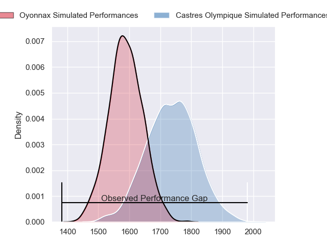
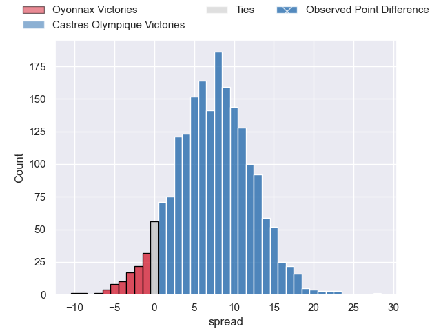
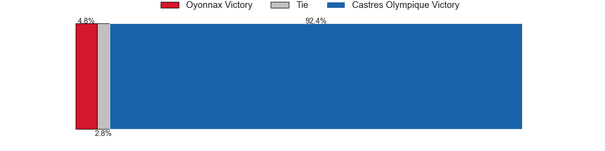
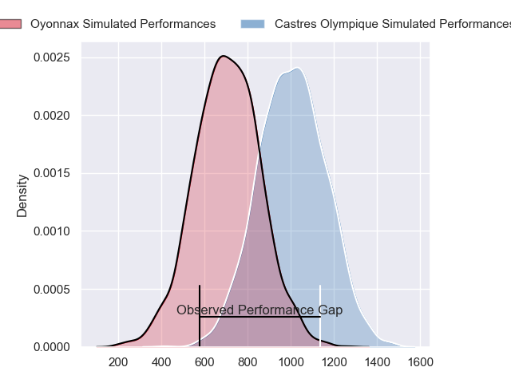
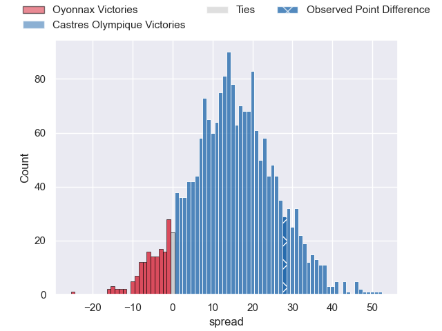
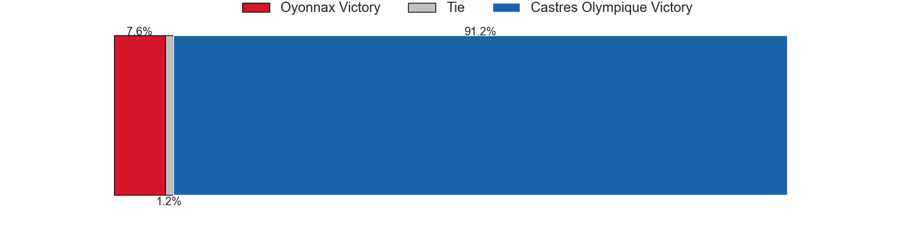
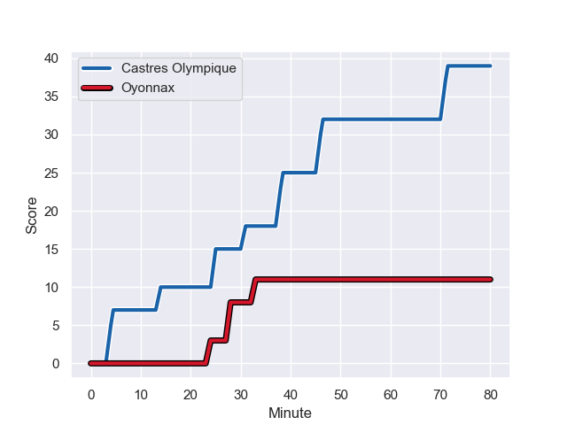
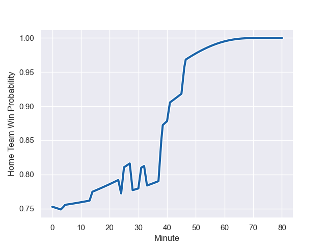

---  
layout: page  
title: Oyonnax at Castres Olympique; 11-39  
date: 2023-11-11 18:00:00 -0500  
categories: "Top 14 Orange 2023" match review  
---
# Oyonnax at Castres Olympique; 11-39

# Club Level Predictions

The first set of predictions treats a club as the smallest object, as the club develops its members, organizes a gameplan, and deploys its players as needed for each match. This club model has a prediction of 0.694, which translates to predicting Castres Olympique to win by 7.2.

Each club has a rating and a rating deviation (similar to a Glicko rating), and expected performances can be generated. This allows for simulated matches and spreads like the ones below.
## Projected Performances - Club Model

## Projected Spreads - Club Model

## Projected Results - Club Model

# Player Level Predictions - Version 2

Treating teams instead as an entity made up of the currently active players, I have ratings for each player in an altogether different system. These can be combined to form team ratings once teamsheets are announced, weighting starters a bit higher than the reserves. After the match is played, players can be weighted by their minutes on the field, allowing for an accurate measure of the team's composition. With these compiled team ratings, we can make predictions, measure inaccuracy, and update the individual player ratings.
## Prediction with Player Minutes: Castres Olympique by 12.2

Castres Olympique by 7.3 on a neutral field
## Prediction without Player Minutes: Castres Olympique by 10.5

Castres Olympique by 5.6 on a neutral pitch

## Projected Performances - Player Model

## Projected Spreads - Player Model

## Projected Results - Player Model

## Scores over Time

## Win Probability over Time

There were 7 large changes in win probability in this match

|   Away Minutes | Away Player        |   Away elo |   Number |   Home elo | Home Player                |   Home Minutes |
|---------------:|:-------------------|-----------:|---------:|-----------:|:---------------------------|---------------:|
|             45 | Antoine Abraham    |      48.11 |        1 |      76.56 | Antoine Tichit             |             47 |
|             54 | Benjamin Geledan   |      33.9  |        2 |      44.08 | Loris Zarantonello         |             57 |
|             54 | Ali Oz             |      39.09 |        3 |      60.5  | Levan Chilachava           |             47 |
|             80 | Victor Lebas       |      24.97 |        4 |      14.7  | Gauthier Maravat           |             41 |
|             57 | Hugo Fabregue      |      52.37 |        5 |      70.59 | Tom Staniforth             |             80 |
|             80 | Kevin Lebreton     |      45.61 |        6 |      60.76 | Mathieu Babillot           |             68 |
|             80 | Kevin Kornath      |      27.78 |        7 |      54.07 | Nick Champion de Crespigny |             41 |
|             45 | Filimo Taofifenua  |      69.69 |        8 |      90.33 | Tyler Ardron               |             80 |
|             62 | Charlie Cassang    |      76.13 |        9 |      52.72 | Santiago Arata             |             62 |
|             80 | Jules Soulan       |      68.13 |       10 |      58.17 | Pierre Popelin             |             80 |
|             80 | Daniel Ikpefan     |      60.46 |       11 |      75.85 | Nathanael Hulleu           |             80 |
|             80 | Lucas Mensa        |      82.63 |       12 |      63.54 | Adrea Cocagi               |             80 |
|             53 | Chris Farrell      |      28.99 |       13 |      37.08 | Adrien Seguret             |             80 |
|             47 | Joe Ravouvou       |      66.74 |       14 |      53.55 | Josaia Raisuqe             |             80 |
|             80 | Justin Bouraux     |      39.56 |       15 |      68.91 | Julien Dumora              |             67 |
|             27 | Pedro Bettencourt  |      15.33 |       16 |      54.24 | Abraham Papali'i           |             39 |
|             35 | Loic Godener       |      30.12 |       17 |      77.46 | Leone Nakarawa             |             39 |
|             35 | Rory Sutherland    |      48.43 |       18 |      60.68 | Wilfrid Hounkpatin         |             33 |
|             33 | Maxime Salles      |      51.8  |       19 |      50.96 | Wayan de Benedittis        |             33 |
|             26 | Manu Leiataua      |      15.19 |       20 |      16.65 | Jeremy Fernandez           |             18 |
|             23 | Leva Fifita        |       7.22 |       21 |      30.5  | Pierre Colonna             |             23 |
|             18 | Ilan El Khattabi   |      36.45 |       22 |      52.58 | Baptiste Delaporte         |             12 |
|             26 | Christopher Vaotoa |      36.36 |       23 |      39.55 | Théo Chabouni              |             13 |

