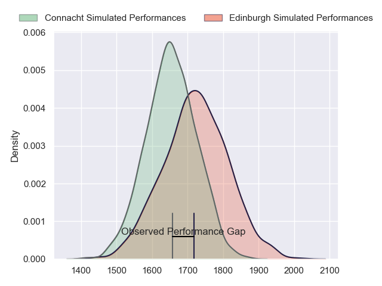
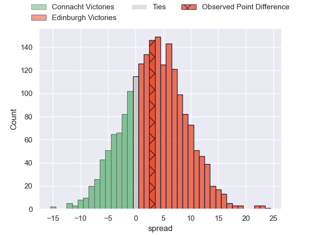
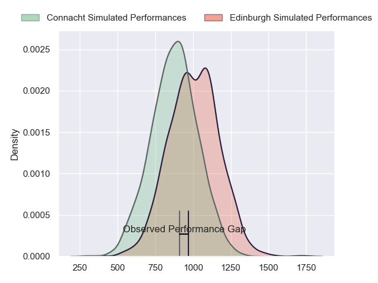
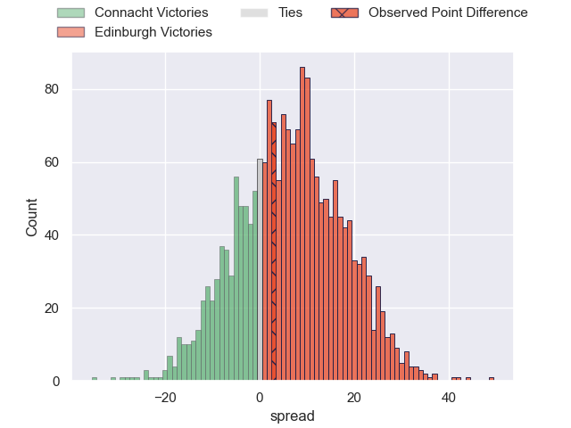
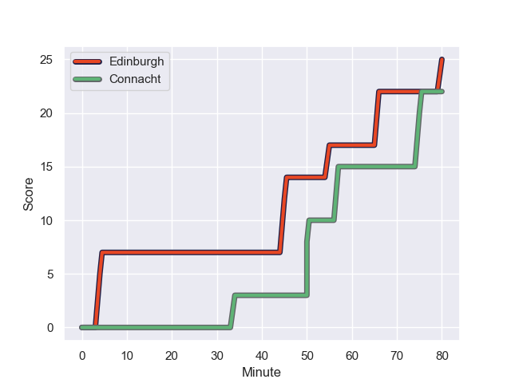
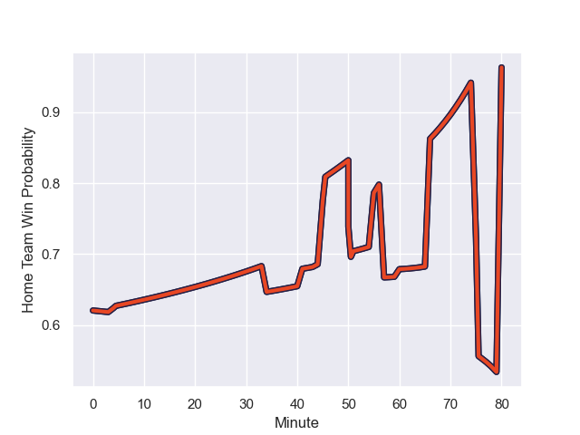

---  
layout: page  
title: Connacht at Edinburgh; 22-25  
date: 2023-11-11 18:00:00 -0500  
categories: "United Rugby Championship 2023" match review  
---
# Connacht at Edinburgh; 22-25

# Club Level Predictions

The first set of predictions treats a club as the smallest object, as the club develops its members, organizes a gameplan, and deploys its players as needed for each match. This club model has a prediction of 0.596, which translates to predicting Edinburgh to win by 3.5.

Each club has a rating and a rating deviation (similar to a Glicko rating), and expected performances can be generated. This allows for simulated matches and spreads like the ones below.
## Projected Performances - Club Model

## Projected Spreads - Club Model

## Projected Results - Club Model

# Player Level Predictions - Version 2

Treating teams instead as an entity made up of the currently active players, I have ratings for each player in an altogether different system. These can be combined to form team ratings once teamsheets are announced, weighting starters a bit higher than the reserves. After the match is played, players can be weighted by their minutes on the field, allowing for an accurate measure of the team's composition. With these compiled team ratings, we can make predictions, measure inaccuracy, and update the individual player ratings.
## Prediction with Player Minutes: Edinburgh by 5.4

Connacht by 1.1 on a neutral field
## Prediction without Player Minutes: Edinburgh by 3.0

Connacht by 1.3 on a neutral pitch

## Projected Performances - Player Model

## Projected Spreads - Player Model

## Projected Results - Player Model

## Scores over Time

## Win Probability over Time

There were 11 large changes in win probability in this match

|   Away Minutes | Away Player          |   Away elo |   Number |   Home elo | Home Player         |   Home Minutes |
|---------------:|:---------------------|-----------:|---------:|-----------:|:--------------------|---------------:|
|             56 | Peter Dooley         |      96.72 |        1 |      49.68 | Pierre Schoeman     |             60 |
|             60 | Tadgh McElroy        |      44.97 |        2 |      41.57 | Ewan Ashman         |             60 |
|             51 | Jack Aungier         |      60.45 |        3 |      43.64 | Javan Sebastian     |             60 |
|             80 | Niall Murray         |      66.15 |        4 |      11.89 | Glen Young          |             60 |
|             56 | Darragh Murray       |      54.86 |        5 |      99.22 | Grant Gilchrist     |             80 |
|             80 | Cian Prendergast     |      47.73 |        6 |      81.47 | Thomas Dodd         |             71 |
|             61 | Conor Oliver         |      64.51 |        7 |      35.95 | Connor Boyle        |             80 |
|             80 | Sean F O'Brien       |      45.67 |        8 |      36.62 | Viliame Mata        |             80 |
|             61 | Caolin Blade         |      52.11 |        9 |      45.47 | Charlie Shiel       |             44 |
|             80 | Jack Carty           |      82.91 |       10 |      52.18 | Ben Healy           |             80 |
|             80 | Andrew Smith         |      32.48 |       11 |      73.12 | Duhan van der Merwe |             80 |
|             80 | Tom Daly             |      38.58 |       12 |      60.23 | James Lang          |             80 |
|             80 | Byron Ralston        |      43.57 |       13 |      62.16 | Mark Bennett        |             70 |
|             41 | John Porch           |      92.51 |       14 |      72.02 | Wes Goosen          |             80 |
|             61 | Tiernan O'Halloran   |      65.96 |       15 |     134.67 | Blair Kinghorn      |             80 |
|             39 | David Hawkshaw       |      58.73 |       16 |      49.25 | Ben Vellacott       |             36 |
|             29 | Sam Illo             |      47.98 |       17 |      35.14 | Boan Venter         |             20 |
|             24 | Jordan Duggan        |      35.52 |       18 |      45.19 | Angus Williams      |             20 |
|             20 | Dylan Tierney-Martin |      56.17 |       19 |      46.55 | Dave Cherry         |             20 |
|             19 | Colm Reilly          |      48.5  |       20 |      40.21 | Marshall Sykes      |             20 |
|             19 | JJ Hanrahan          |      84.98 |       21 |      34.32 | Chris Dean          |             10 |
|             19 | Jarrad Butler        |      75    |       22 |      43.35 | Ben Muncaster       |              9 |
|             24 | Joe Joyce            |      99.16 |       23 |     nan    | nan                 |            nan |

