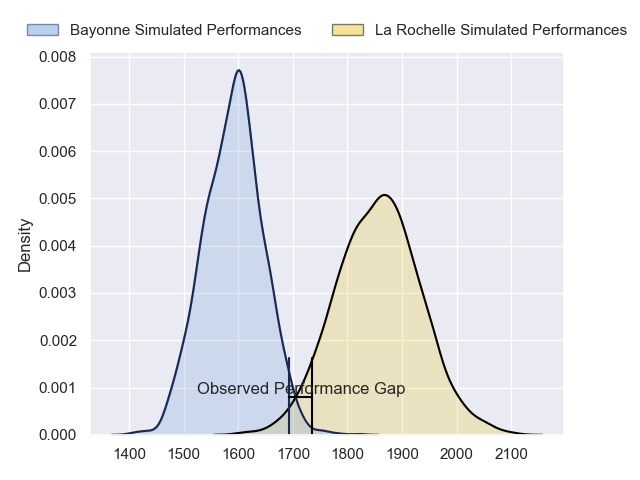
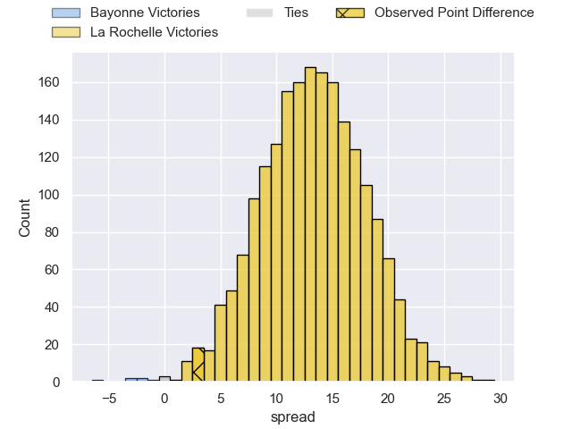
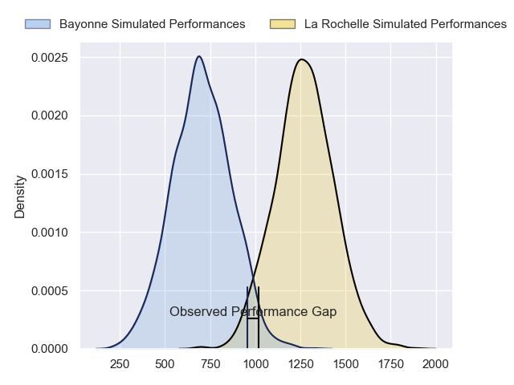
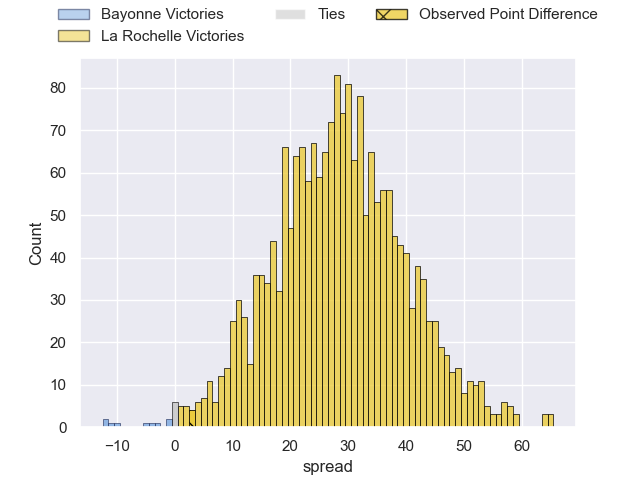
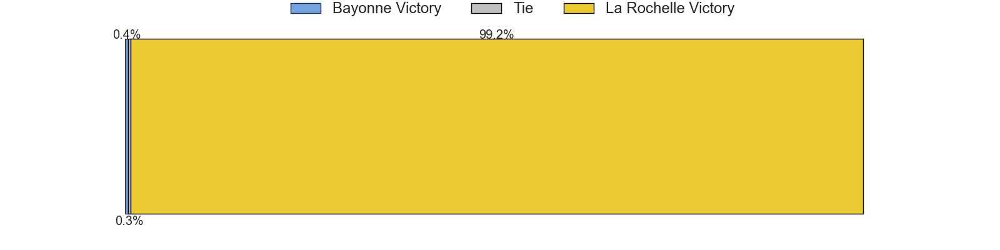
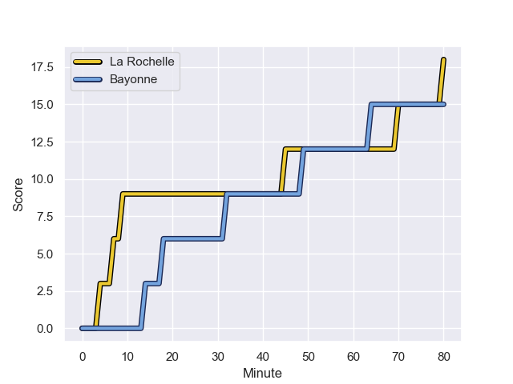
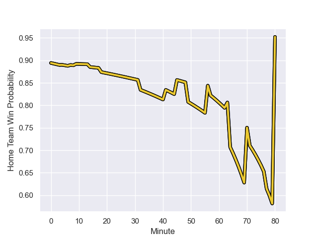

---  
layout: page  
title: Bayonne at La Rochelle; 15-18  
date: 2023-11-11 18:00:00 -0500  
categories: "Top 14 Orange 2023" match review  
---
# Bayonne at La Rochelle; 15-18

# Club Level Predictions

The first set of predictions treats a club as the smallest object, as the club develops its members, organizes a gameplan, and deploys its players as needed for each match. This club model has a prediction of 0.816, which translates to predicting La Rochelle to win by 13.1.

Each club has a rating and a rating deviation (similar to a Glicko rating), and expected performances can be generated. This allows for simulated matches and spreads like the ones below.
## Projected Performances - Club Model

## Projected Spreads - Club Model

## Projected Results - Club Model

# Player Level Predictions - Version 2

Treating teams instead as an entity made up of the currently active players, I have ratings for each player in an altogether different system. These can be combined to form team ratings once teamsheets are announced, weighting starters a bit higher than the reserves. After the match is played, players can be weighted by their minutes on the field, allowing for an accurate measure of the team's composition. With these compiled team ratings, we can make predictions, measure inaccuracy, and update the individual player ratings.
## Prediction with Player Minutes: La Rochelle by 23.6

La Rochelle by 18.9 on a neutral field
## Prediction without Player Minutes: La Rochelle by 21.5

La Rochelle by 16.8 on a neutral pitch

## Projected Performances - Player Model

## Projected Spreads - Player Model

## Projected Results - Player Model

## Scores over Time

## Win Probability over Time

There were 8 large changes in win probability in this match

|   Away Minutes | Away Player             |   Away elo |   Number |   Home elo | Home Player           |   Home Minutes |
|---------------:|:------------------------|-----------:|---------:|-----------:|:----------------------|---------------:|
|             68 | Matis Perchaud          |      31.93 |        1 |      55.96 | Thierry Paiva         |             56 |
|             75 | Vincent Giudicelli      |      25.76 |        2 |      48.9  | Quentin Lespiaucq     |             39 |
|             56 | Pascal Cotet            |      25.77 |        3 |      22.03 | Georges-Henri Colombe |             41 |
|             80 | Manuel Leindekar        |      14.38 |        4 |      68.1  | Thomas Lavault        |             80 |
|             65 | Lucas Paulos            |      58.43 |        5 |      62.13 | Ultan Dillane         |             65 |
|             80 | Pierre Huguet           |      20.64 |        6 |      38.54 | Paul Boudehent        |             80 |
|             56 | Baptiste Heguy          |      67    |        7 |     104.02 | Levani Botia          |             80 |
|             80 | Rodrigo Bruni           |      96.68 |        8 |      60.5  | Yoan Tanga            |             63 |
|             67 | Guillaume Rouet Piffard |      60.58 |        9 |     112.57 | Tawera Kerr-Barlow    |             80 |
|             80 | Camille Lopez           |      96.02 |       10 |      54.87 | Antoine Hastoy        |             77 |
|             80 | Nadir Megdoud           |      59.23 |       11 |      98.46 | Jack Nowell           |             80 |
|             71 | Federico Mori           |      37.53 |       12 |     117.99 | Jonathan Danty        |             57 |
|             80 | Sireli Maqala           |      70.7  |       13 |      54.27 | Ulupano Seuteni       |             80 |
|             80 | Bastien Pourailly       |       4.64 |       14 |      88.97 | Teddy Thomas          |             80 |
|             63 | Tom Spring              |      25.74 |       15 |     122.53 | Brice Dulin           |             80 |
|             15 | Thomas Ceyte            |      39.3  |       16 |      78.48 | Pierre Bourgarit      |             41 |
|             24 | Remi Bourdeau           |      84.66 |       17 |     127.2  | Uini Atonio           |             39 |
|             24 | Tevita Tatafu           |      41.08 |       18 |      61.7  | Joel Sclavi           |             24 |
|             17 | Cheikh Tiberghien       |      27.35 |       19 |      66.55 | Jules Favre           |             23 |
|             12 | Pieter Scholtz          |       8.27 |       20 |      32.41 | Judicael Cancoriet    |             17 |
|             13 | Gela Aprasidze          |      48.78 |       21 |      44.8  | Remi Picquette        |             15 |
|              9 | Guillaume Martocq       |      24.7  |       22 |      43.24 | Hugo Reus             |              3 |
|              5 | Thomas Acquier          |      59.62 |       23 |     nan    | nan                   |            nan |

