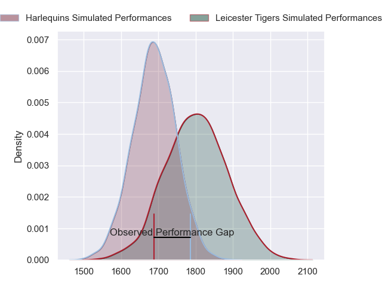
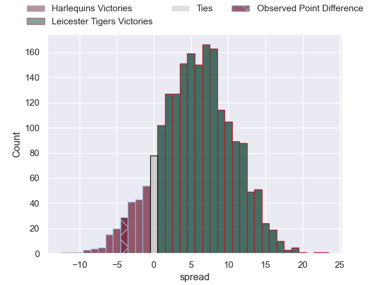
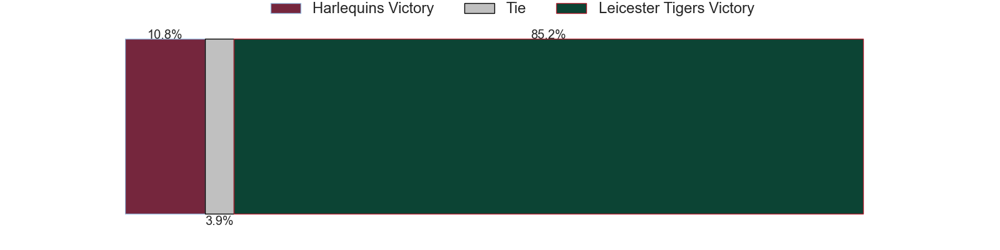
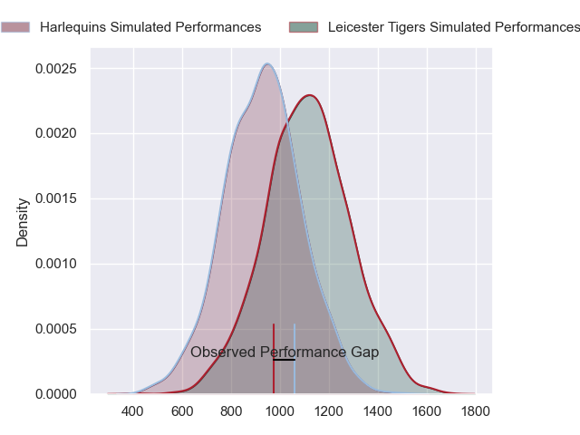
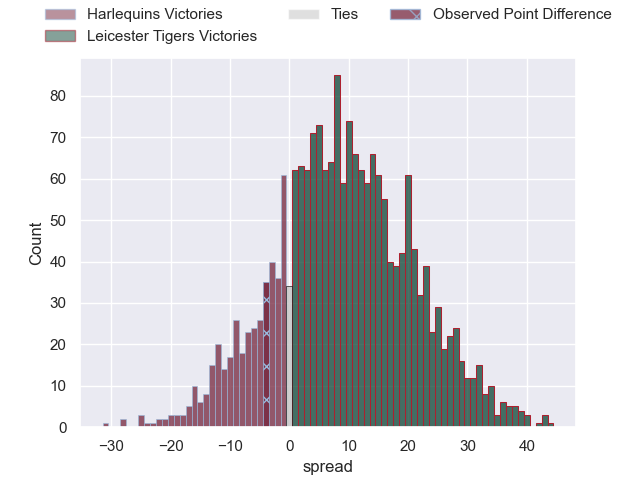
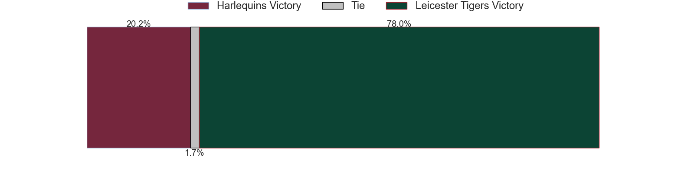
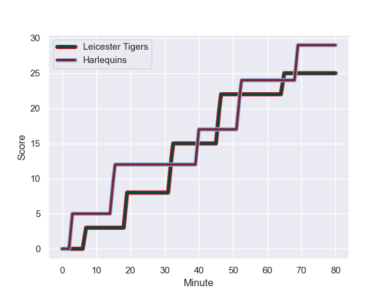
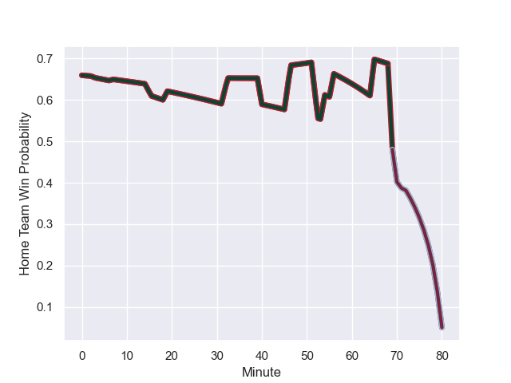

---  
layout: page  
title: Harlequins at Leicester Tigers; 29-25  
date: 2023-11-11 18:00:00 -0500  
categories: "Gallagher Premiership 2023" match review  
---
# Harlequins at Leicester Tigers; 29-25

# Club Level Predictions

The first set of predictions treats a club as the smallest object, as the club develops its members, organizes a gameplan, and deploys its players as needed for each match. This club model has a prediction of 0.657, which translates to predicting Leicester Tigers to win by 5.8.

Each club has a rating and a rating deviation (similar to a Glicko rating), and expected performances can be generated. This allows for simulated matches and spreads like the ones below.
## Projected Performances - Club Model

## Projected Spreads - Club Model

## Projected Results - Club Model

# Player Level Predictions - Version 2

Treating teams instead as an entity made up of the currently active players, I have ratings for each player in an altogether different system. These can be combined to form team ratings once teamsheets are announced, weighting starters a bit higher than the reserves. After the match is played, players can be weighted by their minutes on the field, allowing for an accurate measure of the team's composition. With these compiled team ratings, we can make predictions, measure inaccuracy, and update the individual player ratings.
## Prediction with Player Minutes: Leicester Tigers by 7.3

Leicester Tigers by 2.2 on a neutral field
## Prediction without Player Minutes: Leicester Tigers by 6.7

Leicester Tigers by 1.6 on a neutral pitch

## Projected Performances - Player Model

## Projected Spreads - Player Model

## Projected Results - Player Model

## Scores over Time

## Win Probability over Time

There were 17 large changes in win probability in this match

|   Away Minutes | Away Player       |   Away elo |   Number |   Home elo | Home Player           |   Home Minutes |
|---------------:|:------------------|-----------:|---------:|-----------:|:----------------------|---------------:|
|             56 | Joe Marler        |      98.57 |        1 |      57.76 | Francois van Wyk      |             54 |
|             50 | Sam Riley         |      45.17 |        2 |      23.44 | Charlie Clare         |             80 |
|             65 | Will Collier      |      73.13 |        3 |      49.04 | Dan Cole              |             54 |
|             80 | Joe Launchbury    |     101.85 |        4 |      57.85 | Cameron Henderson     |             72 |
|             80 | George Hammond    |      13.48 |        5 |      58.39 | Ollie Chessum         |             80 |
|             70 | Dino Lamb         |      74.54 |        6 |      75.23 | Hanro Liebenberg      |             80 |
|             80 | Will Evans        |      48.89 |        7 |      79.19 | Matt Rogerson         |             62 |
|             80 | Alex Dombrandt    |      66.74 |        8 |      79.42 | Jasper Wiese          |             80 |
|             56 | Will Porter       |      34.41 |        9 |      68.1  | Ben Youngs            |             79 |
|             80 | Marcus Smith      |      75.3  |       10 |      99.15 | Handre Pollard        |             80 |
|             80 | Louis Lynagh      |      62.05 |       11 |      69.32 | Josh Bassett          |             80 |
|             48 | Lennox Anyanwu    |      59.37 |       12 |      46.78 | Solomone Kata         |             60 |
|             80 | Oscar Beard       |      49.89 |       13 |      71.16 | Dan Kelly             |             80 |
|             80 | Tyrone Green      |      62.97 |       14 |      56.19 | Freddie Steward       |             80 |
|             70 | Nick David        |      34.15 |       15 |      94.42 | Mike Brown            |             80 |
|             24 | Fin Baxter        |      32.52 |       16 |      68.98 | James Cronin          |             26 |
|             15 | Dillon Lewis      |      81.7  |       17 |      45.13 | Will Hurd             |             26 |
|             30 | Jack Walker       |      35.27 |       18 |      99.17 | Sam Carter            |              8 |
|             10 | James Chisholm    |      77.75 |       19 |      43.42 | Emeka Remigius Ilione |             18 |
|             24 | Danny Care        |     136.11 |       20 |      35.87 | Tom Whiteley          |              1 |
|             32 | Andre Esterhuizen |     107.93 |       21 |      67    | Matt Scott            |             20 |
|             10 | Jarrod Evans      |      82.26 |       22 |     nan    | nan                   |            nan |

