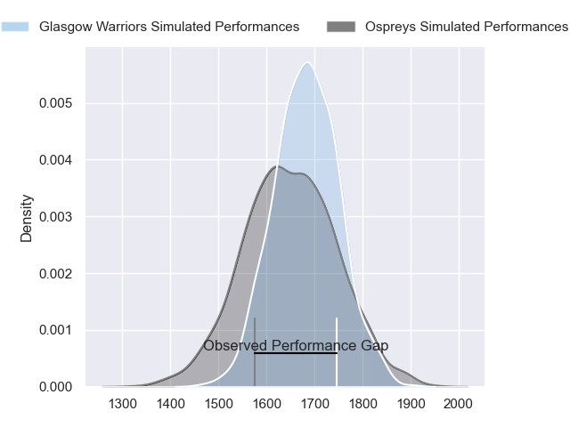
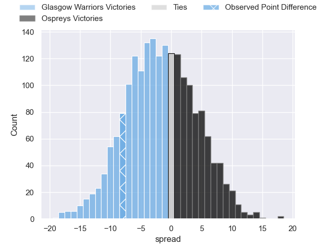
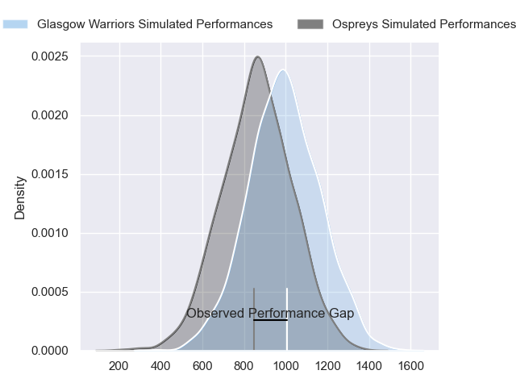
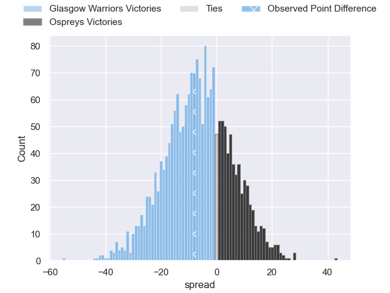
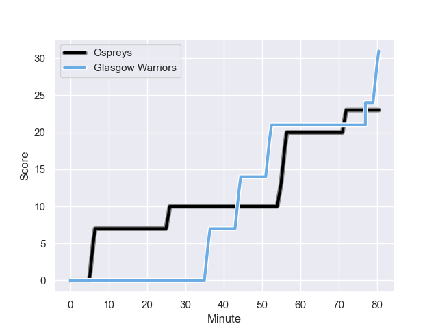
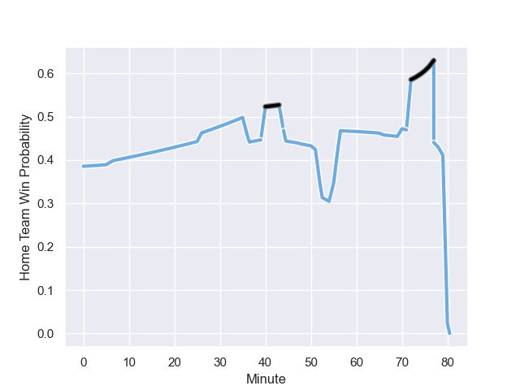

---  
layout: page  
title: Glasgow Warriors at Ospreys; 31-23  
date: 2023-11-11 18:00:00 -0500  
categories: "United Rugby Championship 2023" match review  
---
# Glasgow Warriors at Ospreys; 31-23

# Club Level Predictions

The first set of predictions treats a club as the smallest object, as the club develops its members, organizes a gameplan, and deploys its players as needed for each match. This club model has a prediction of 0.45, which translates to predicting Glasgow Warriors to win by 1.8.

Each club has a rating and a rating deviation (similar to a Glicko rating), and expected performances can be generated. This allows for simulated matches and spreads like the ones below.
## Projected Performances - Club Model

## Projected Spreads - Club Model

## Projected Results - Club Model

# Player Level Predictions - Version 2

Treating teams instead as an entity made up of the currently active players, I have ratings for each player in an altogether different system. These can be combined to form team ratings once teamsheets are announced, weighting starters a bit higher than the reserves. After the match is played, players can be weighted by their minutes on the field, allowing for an accurate measure of the team's composition. With these compiled team ratings, we can make predictions, measure inaccuracy, and update the individual player ratings.
## Prediction with Player Minutes: Glasgow Warriors by 5.2

Glasgow Warriors by 9.4 on a neutral field
## Prediction without Player Minutes: Glasgow Warriors by 5.3

Glasgow Warriors by 9.5 on a neutral pitch

## Projected Performances - Player Model

## Projected Spreads - Player Model

## Projected Results - Player Model

## Scores over Time

## Win Probability over Time

There were 11 large changes in win probability in this match

|   Away Minutes | Away Player           |   Away elo |   Number |   Home elo | Home Player            |   Home Minutes |
|---------------:|:----------------------|-----------:|---------:|-----------:|:-----------------------|---------------:|
|             70 | Jamie Bhatti          |      84    |        1 |      46    | Nicky Smith            |             66 |
|             70 | Johnny Matthews       |      36.75 |        2 |      37.37 | Dewi Lake              |             80 |
|             70 | Lucio Sordoni         |      69.31 |        3 |      48.94 | Ben Warren             |             51 |
|             48 | Sintu Manjezi         |      49.28 |        4 |      50.82 | Rhys Davies            |             66 |
|             80 | Richie Gray           |      60.72 |        5 |      56.5  | Adam Beard             |             80 |
|             70 | Matt Fagerson         |     105.1  |        6 |      41.13 | Harri Deaves           |             52 |
|             80 | Sione Vailanu         |      41.83 |        7 |     115.58 | Justin Tipuric         |             80 |
|             80 | Henco Venter          |      96.29 |        8 |      -5.23 | Morgan Morris          |             80 |
|             40 | Jamie Dobie           |      52.9  |        9 |      28.54 | Reuben Morgan-Williams |             80 |
|             80 | Duncan Weir           |      61.94 |       10 |      44.85 | Jack Walsh             |             80 |
|             80 | Kyle Rowe             |      53.11 |       11 |      80.02 | Matt Protheroe         |             80 |
|             80 | Stafford McDowall     |      74.42 |       12 |      53.26 | Keiran Williams        |             24 |
|             76 | Sione Tuipulotu       |      45.83 |       13 |      79    | Owen Watkin            |             80 |
|             80 | Sebastian Cancelliere |     108.84 |       14 |      -1.36 | Luke Morgan            |             80 |
|             80 | Ollie Smith           |      76.45 |       15 |      50.75 | Max Nagy               |             80 |
|             40 | Sean Kennedy          |      51.7  |       16 |     116.82 | George North           |             56 |
|             32 | Greg Peterson         |      18.35 |       17 |      31.12 | Tom Botha              |             29 |
|             10 | Enrique Pieretto      |      48.68 |       18 |      39.61 | James Ratti            |             28 |
|             10 | Allan Dell            |      63.29 |       19 |      34.87 | James Fender           |             14 |
|             10 | Angus Fraser          |      45.75 |       20 |      48.81 | Garyn Phillips         |             14 |
|             10 | Ally Miller           |      20.7  |       21 |     nan    | nan                    |            nan |
|              4 | Tom Jordan            |      44.54 |       22 |     nan    | nan                    |            nan |

