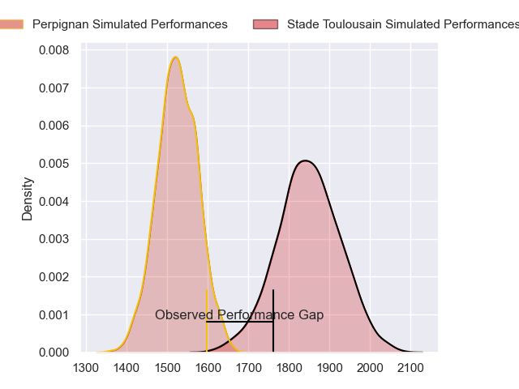
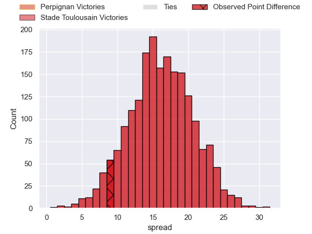
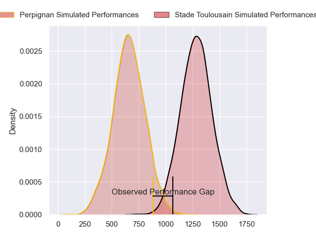
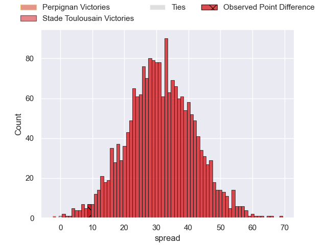
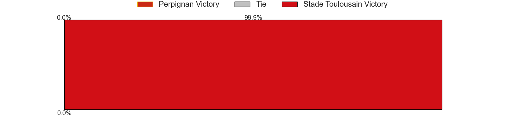
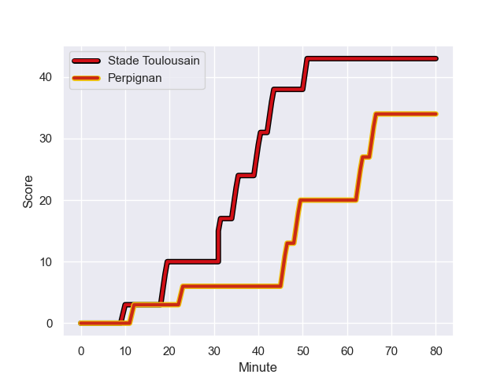
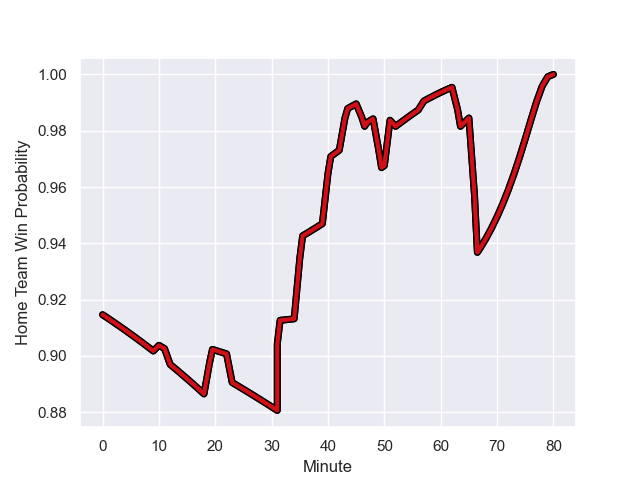

---  
layout: page  
title: Perpignan at Stade Toulousain; 34-43  
date: 2023-11-11 18:00:00 -0500  
categories: "Top 14 Orange 2023" match review  
---
# Perpignan at Stade Toulousain; 34-43

# Club Level Predictions

The first set of predictions treats a club as the smallest object, as the club develops its members, organizes a gameplan, and deploys its players as needed for each match. This club model has a prediction of 0.861, which translates to predicting Stade Toulousain to win by 16.1.

Each club has a rating and a rating deviation (similar to a Glicko rating), and expected performances can be generated. This allows for simulated matches and spreads like the ones below.
## Projected Performances - Club Model

## Projected Spreads - Club Model

## Projected Results - Club Model

# Player Level Predictions - Version 2

Treating teams instead as an entity made up of the currently active players, I have ratings for each player in an altogether different system. These can be combined to form team ratings once teamsheets are announced, weighting starters a bit higher than the reserves. After the match is played, players can be weighted by their minutes on the field, allowing for an accurate measure of the team's composition. With these compiled team ratings, we can make predictions, measure inaccuracy, and update the individual player ratings.
## Prediction with Player Minutes: Stade Toulousain by 26.0

Stade Toulousain by 21.0 on a neutral field
## Prediction without Player Minutes: Stade Toulousain by 26.0

Stade Toulousain by 21.1 on a neutral pitch

## Projected Performances - Player Model

## Projected Spreads - Player Model

## Projected Results - Player Model

## Scores over Time

## Win Probability over Time

There were 1 large changes in win probability in this match

|   Away Minutes | Away Player          |   Away elo |   Number |   Home elo | Home Player            |   Home Minutes |
|---------------:|:---------------------|-----------:|---------:|-----------:|:-----------------------|---------------:|
|             52 | Sacha Lotrian        |      53.92 |        1 |      42.6  | Rodrigue Neti          |             57 |
|             57 | Ignacio Ruiz         |      53.58 |        2 |      88.76 | Peato Mauvaka          |             57 |
|             57 | Arthur Joly          |      98.69 |        3 |     102.87 | Dorian Aldegheri       |             57 |
|             57 | Marvin Orie          |      48.48 |        4 |      39.72 | Richie Arnold          |             57 |
|             80 | Mathieu Tanguy       |      23.82 |        5 |      83.04 | Thibaud Flament        |             80 |
|             46 | Lucas Bachelier      |      64.71 |        6 |     109.14 | Anthony Jelonch        |             48 |
|             80 | Kelian Galletier     |      34.91 |        7 |     123.68 | Francois Cros          |             52 |
|             57 | So'otala Fa'aso'o    |      83.02 |        8 |      86.58 | Alexandre Roumat       |             80 |
|             80 | Sadek Deghmache      |      27.66 |        9 |      42.95 | Paul Graou             |             80 |
|             46 | Jake McIntyre        |      56.45 |       10 |     124.36 | Thomas Ramos           |             47 |
|             80 | Lucas Dubois         |      50.71 |       11 |      80.29 | Arthur Retiere         |             52 |
|             58 | Edward Sawailau      |     -25.59 |       12 |      64.01 | Pierre-Louis Barassi   |             80 |
|             80 | Alivereti Duguivalu  |      17.86 |       13 |      53.17 | Paul Costes            |             80 |
|             80 | Louis Dupichot       |      55.68 |       14 |      87.81 | Ange Capuozzo          |             80 |
|             80 | Jean Pascal Barraque |      38.03 |       15 |      66.75 | Melvyn Jaminet         |             80 |
|             34 | Jacobus van Tonder   |      53.28 |       16 |     138.54 | Antoine Dupont         |             33 |
|             34 | Matteo Rodor         |      37.94 |       17 |      72.68 | Rynhardt Elstadt       |             32 |
|             28 | Xavier Chiocci       |      31.28 |       18 |      47.7  | Mathis Castro Ferreira |             28 |
|             23 | Pietro Ceccarelli    |      45.16 |       19 |      99.7  | Sofiane Guitoune       |             28 |
|             23 | Posolo Tuilagi       |      39.38 |       20 |      62.68 | Owen Franks            |             23 |
|             23 | Seilala Lam          |      55.95 |       21 |      97.55 | Cyril Baille           |             23 |
|             22 | Mathieu Acebes       |      77.05 |       22 |      38.24 | Ian Boubila            |             23 |
|             23 | Lucas Velarte        |      24.79 |       23 |      65.99 | Piula Faasalele        |             23 |

