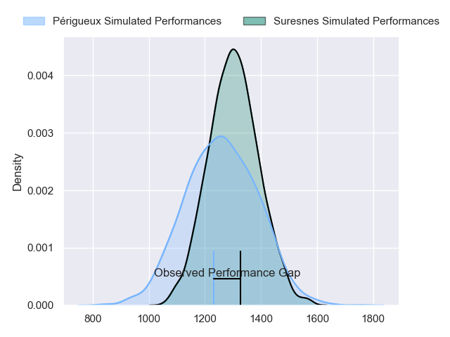
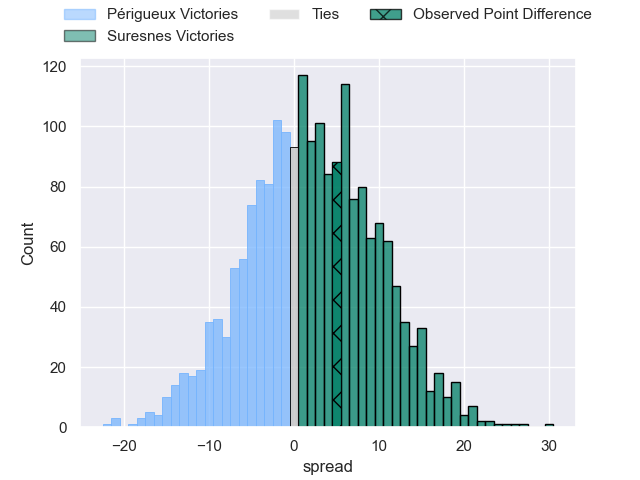
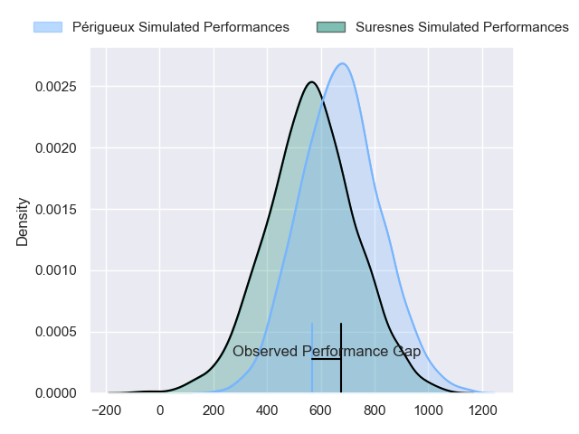
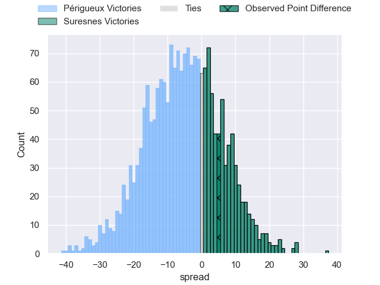
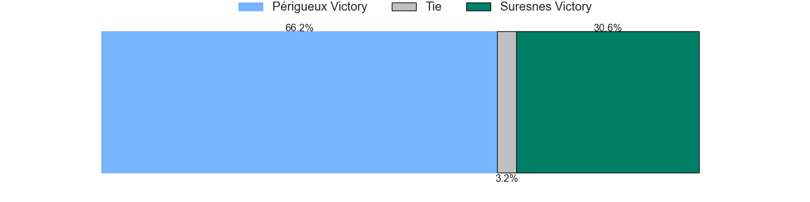
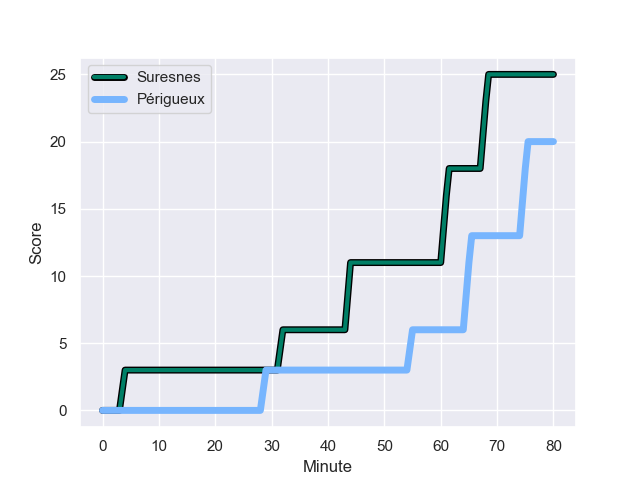
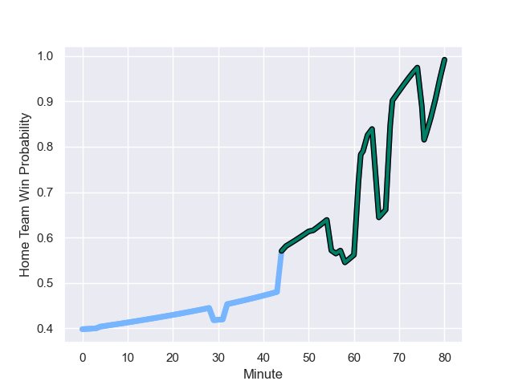

---  
layout: page  
title: Périgueux at Suresnes; 20-25  
date: 2023-11-11 18:00:00 -0500  
categories: "Nationale 2023" match review  
---
# Périgueux at Suresnes; 20-25

# Club Level Predictions

The first set of predictions treats a club as the smallest object, as the club develops its members, organizes a gameplan, and deploys its players as needed for each match. This club model has a prediction of 0.556, which translates to predicting Suresnes to win by 2.1.

Each club has a rating and a rating deviation (similar to a Glicko rating), and expected performances can be generated. This allows for simulated matches and spreads like the ones below.
## Projected Performances - Club Model

## Projected Spreads - Club Model

## Projected Results - Club Model

# Player Level Predictions - Version 2

Treating teams instead as an entity made up of the currently active players, I have ratings for each player in an altogether different system. These can be combined to form team ratings once teamsheets are announced, weighting starters a bit higher than the reserves. After the match is played, players can be weighted by their minutes on the field, allowing for an accurate measure of the team's composition. With these compiled team ratings, we can make predictions, measure inaccuracy, and update the individual player ratings.
## Prediction with Player Minutes: Périgueux by 4.5

Périgueux by 7.8 on a neutral field
## Prediction without Player Minutes: Périgueux by 4.4

Périgueux by 7.6 on a neutral pitch

## Projected Performances - Player Model

## Projected Spreads - Player Model

## Projected Results - Player Model

## Scores over Time

## Win Probability over Time

There were 18 large changes in win probability in this match

|   Away Minutes | Away Player       |   Away elo |   Number |   Home elo | Home Player           |   Home Minutes |
|---------------:|:------------------|-----------:|---------:|-----------:|:----------------------|---------------:|
|             45 | Thomas Vidal      |      52.45 |        1 |      49.37 | Elias Coulibaly       |             58 |
|             45 | Lucas Marijon     |      53.92 |        2 |      40    | Hayam El Bibouji      |             58 |
|             45 | Kalaveti Tawake   |      34.88 |        3 |      35.33 | Victor Damian Arias   |             58 |
|             63 | Madioke Konate    |      37.21 |        4 |      42.44 | Sacha Yahi            |             80 |
|             80 | Jaco Willemse     |      34.43 |        5 |      23.43 | Yakine Djebarri       |             58 |
|             80 | Marius Vialle     |      31.64 |        6 |      29.06 | Florian Desbordes     |             67 |
|             63 | Afaesetiti Amosa  |      72.73 |        7 |      25.66 | Wian Vosloo           |             80 |
|             80 | Karl Lambert      |      43.66 |        8 |      49.73 | Lakisipone Lee        |             80 |
|             56 | Nicolas Faltrept  |      11.34 |        9 |      33.39 | Thomas Lacroix        |             80 |
|             56 | Greg Hutley       |      52.28 |       10 |      43.73 | Tanguy Lacoste        |             80 |
|             51 | Clément Cavaliere |      39.04 |       11 |      14.86 | Alexis Clement        |             80 |
|             80 | Cyril Couturier   |      59.78 |       12 |      64.2  | Victor Barnier        |             80 |
|             80 | Nicolas Piaton    |      46.65 |       13 |      -0.31 | JJ Taulagi            |             67 |
|             80 | Benjamin Yarde    |      40.57 |       14 |       6.22 | Ervin Muric           |             80 |
|             80 | Rory Scholes      |      61.26 |       15 |      22.3  | Thomas Baudy          |             67 |
|             35 | Jason Tindiliere  |      43.15 |       16 |      18.3  | Lucas Dycke           |             22 |
|             35 | Louis Martin      |      54.88 |       17 |      36.53 | Anthony Bajart        |             22 |
|             35 | Anthony Pelmard   |      48.2  |       18 |      38.52 | Leandro Mario Assi    |             22 |
|             17 | Richard Fourcade  |      32.18 |       19 |      60.46 | Marvin Woki           |             22 |
|             17 | Nicolas Labattut  |      53.8  |       20 |      49.55 | Damien Bozic          |             13 |
|             24 | Enzo Hardy        |      43.3  |       21 |      41    | Lilan Savioz Fouillet |             13 |
|             24 | Yann Caillat      |      38.6  |       22 |      11.69 | Goulwen Gueho         |             13 |
|             29 | Paul Piveteau     |      46.65 |       23 |     nan    | nan                   |            nan |

