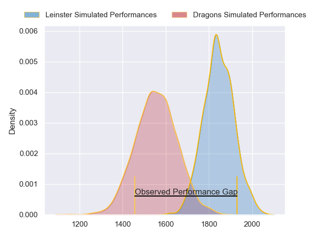
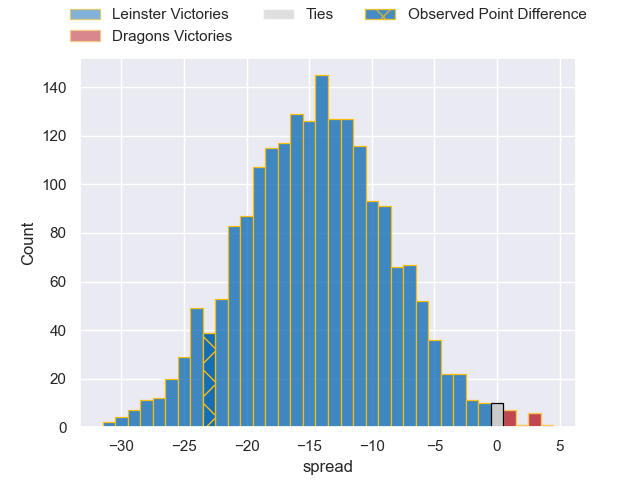
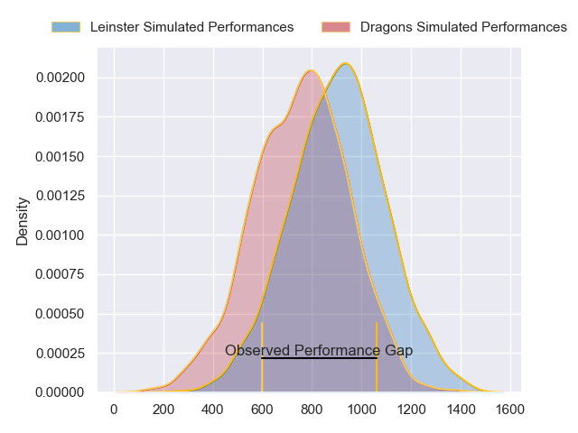
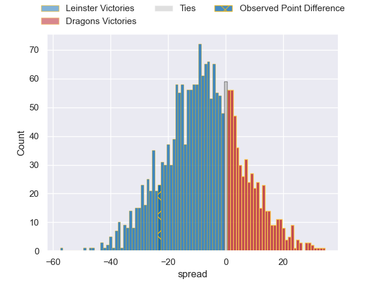
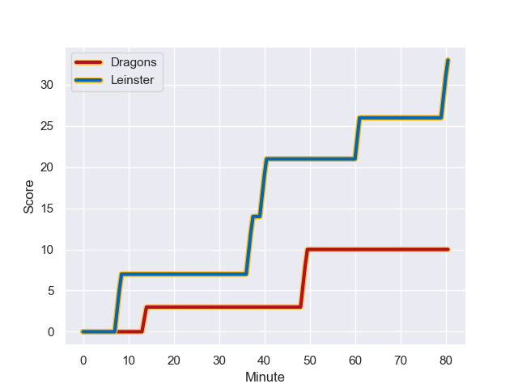
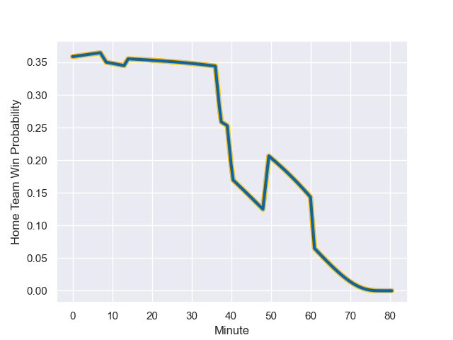

---  
layout: page  
title: Leinster at Dragons; 33-10  
date: 2023-11-12 18:00:00 -0500  
categories: "United Rugby Championship 2023" match review  
---
# Leinster at Dragons; 33-10

# Club Level Predictions

The first set of predictions treats a club as the smallest object, as the club develops its members, organizes a gameplan, and deploys its players as needed for each match. This club model has a prediction of 0.166, which translates to predicting Leinster to win by 14.3.

Each club has a rating and a rating deviation (similar to a Glicko rating), and expected performances can be generated. This allows for simulated matches and spreads like the ones below.
## Projected Performances - Club Model

## Projected Spreads - Club Model

## Projected Results - Club Model

# Player Level Predictions - Version 2

Treating teams instead as an entity made up of the currently active players, I have ratings for each player in an altogether different system. These can be combined to form team ratings once teamsheets are announced, weighting starters a bit higher than the reserves. After the match is played, players can be weighted by their minutes on the field, allowing for an accurate measure of the team's composition. With these compiled team ratings, we can make predictions, measure inaccuracy, and update the individual player ratings.
## Prediction with Player Minutes: Leinster by 6.6

Leinster by 10.9 on a neutral field
## Prediction without Player Minutes: Leinster by 6.6

Leinster by 10.9 on a neutral pitch

## Projected Performances - Player Model

## Projected Spreads - Player Model

## Projected Results - Player Model

## Scores over Time

## Win Probability over Time

There were 5 large changes in win probability in this match

|   Away Minutes | Away Player     |   Away elo |   Number |   Home elo | Home Player       |   Home Minutes |
|---------------:|:----------------|-----------:|---------:|-----------:|:------------------|---------------:|
|             80 | Jack Boyle      |      46.15 |        1 |      24.9  | Rhodri Jones      |             80 |
|             80 | Dan Sheehan     |      57.04 |        2 |      72.48 | Elliot Dee        |             80 |
|             80 | Thomas Clarkson |      56.05 |        3 |      26.72 | Lloyd Fairbrother |             80 |
|             80 | Joe McCarthy    |      51.7  |        4 |       0.02 | Matthew Screech   |             80 |
|             80 | Jason Jenkins   |      54.07 |        5 |      40.08 | George Nott       |             80 |
|             80 | Ryan Baird      |      74.13 |        6 |      52.76 | Dan Lydiate       |             80 |
|             80 | Will Connors    |      58.35 |        7 |      36.31 | Taine Basham      |             80 |
|             80 | James Culhane   |      34.41 |        8 |      67.79 | Aaron Wainwright  |             80 |
|             80 | Ben Murphy      |      42.86 |        9 |      73.87 | Rhodri Williams   |             80 |
|             80 | Ross Byrne      |      94.21 |       10 |      44.37 | Will Reed         |             80 |
|             80 | Jimmy O'Brien   |      74.98 |       11 |      14.52 | Jared Rosser      |             80 |
|             80 | Charlie Ngatai  |      95.57 |       12 |      51.35 | Aneurin Owen      |             80 |
|             80 | Jamie Osborne   |      66.64 |       13 |      74.32 | Steffan Hughes    |             80 |
|             80 | Tommy O'Brien   |      48.16 |       14 |      38.27 | Jack Dixon        |             80 |
|             80 | Ciaran Frawley  |      56.14 |       15 |      29.87 | Cai Evans         |             80 |

