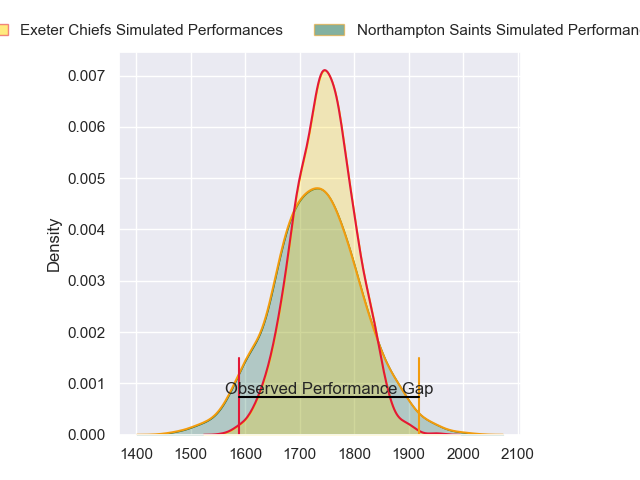
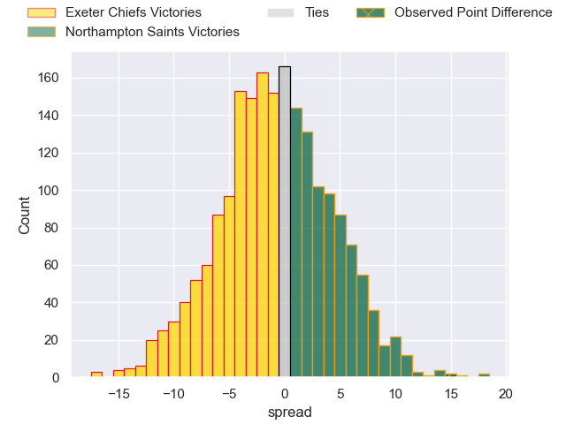
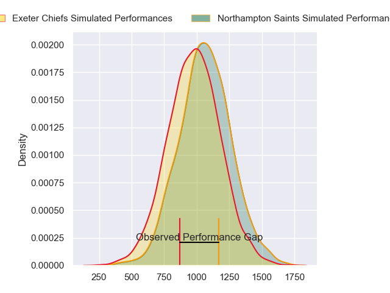
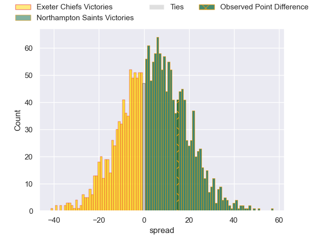
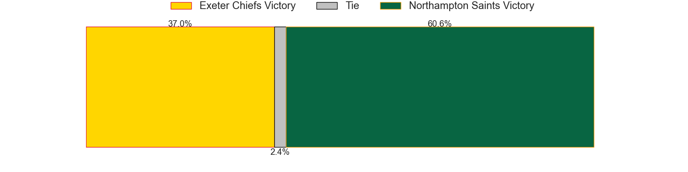
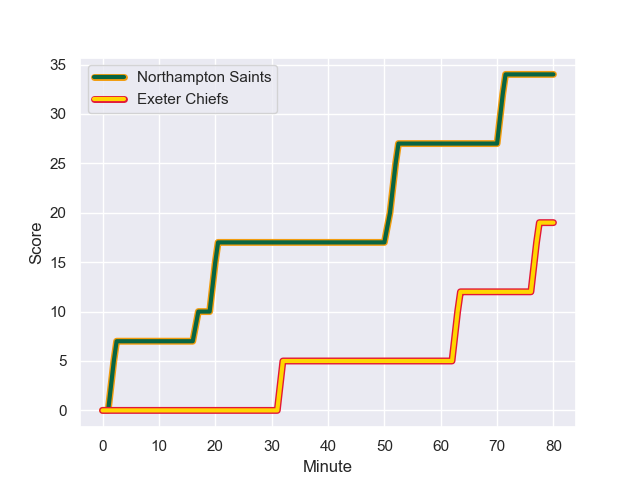
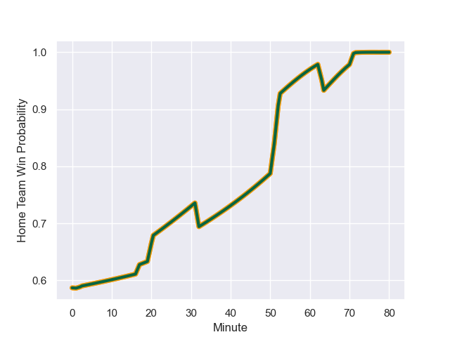

---  
layout: page  
title: Exeter Chiefs at Northampton Saints; 19-34  
date: 2023-11-12 18:00:00 -0500  
categories: "Gallagher Premiership 2023" match review  
---
# Exeter Chiefs at Northampton Saints; 19-34

# Club Level Predictions

The first set of predictions treats a club as the smallest object, as the club develops its members, organizes a gameplan, and deploys its players as needed for each match. This club model has a prediction of 0.484, which translates to predicting Exeter Chiefs to win by 0.6.

Each club has a rating and a rating deviation (similar to a Glicko rating), and expected performances can be generated. This allows for simulated matches and spreads like the ones below.
## Projected Performances - Club Model

## Projected Spreads - Club Model

## Projected Results - Club Model

# Player Level Predictions - Version 2

Treating teams instead as an entity made up of the currently active players, I have ratings for each player in an altogether different system. These can be combined to form team ratings once teamsheets are announced, weighting starters a bit higher than the reserves. After the match is played, players can be weighted by their minutes on the field, allowing for an accurate measure of the team's composition. With these compiled team ratings, we can make predictions, measure inaccuracy, and update the individual player ratings.
## Prediction with Player Minutes: Northampton Saints by 4.0

Exeter Chiefs by 0.9 on a neutral field
## Prediction without Player Minutes: Northampton Saints by 4.0

Exeter Chiefs by 0.9 on a neutral pitch

## Projected Performances - Player Model

## Projected Spreads - Player Model

## Projected Results - Player Model

## Scores over Time

## Win Probability over Time

There were 5 large changes in win probability in this match

|   Away Minutes | Away Player           |   Away elo |   Number |   Home elo | Home Player       |   Home Minutes |
|---------------:|:----------------------|-----------:|---------:|-----------:|:------------------|---------------:|
|             80 | Nika Abuladze         |      69.7  |        1 |      94.78 | Alex Waller       |             80 |
|             80 | Dan Frost             |      53.63 |        2 |      57.72 | Curtis Langdon    |             80 |
|             80 | Josh Iosefa-Scott     |      84.49 |        3 |      91.81 | Paul Hill         |             80 |
|             80 | Dafydd Jenkins        |      72.67 |        4 |      79.66 | Alex Moon         |             80 |
|             80 | Lewis Pearson         |      51.39 |        5 |      49.16 | Chunya Munga      |             80 |
|             80 | Ethan Roots           |      66.17 |        6 |      89.33 | Courtney Lawes    |             80 |
|             80 | Jacques Vermeulen     |      69.15 |        7 |      41.18 | Angus Scott-Young |             80 |
|             80 | Ross Micheal Vintcent |      49.64 |        8 |      82.2  | Sam Graham        |             80 |
|             80 | Tom Cairns            |      61.32 |        9 |      68.5  | Alex Mitchell     |             80 |
|             80 | Harvey Skinner        |      41.59 |       10 |      45.9  | Fin Smith         |             80 |
|             80 | Ben Hammersley        |      57.57 |       11 |      60.89 | James Ramm        |             80 |
|             80 | Joe Hawkins           |      35.35 |       12 |      52.61 | Fraser Dingwall   |             80 |
|             80 | Henry Slade           |     107.8  |       13 |      70.67 | Tommy Freeman     |             80 |
|             80 | Immanuel Feyi-Waboso  |      66.76 |       14 |       0.71 | Tom Seabrook      |             80 |
|             80 | Tom Wyatt             |      82.05 |       15 |      63.44 | George Hendy      |             80 |

