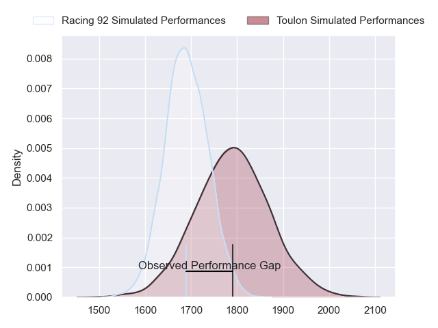
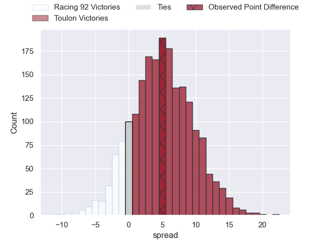
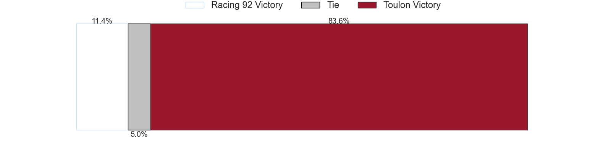
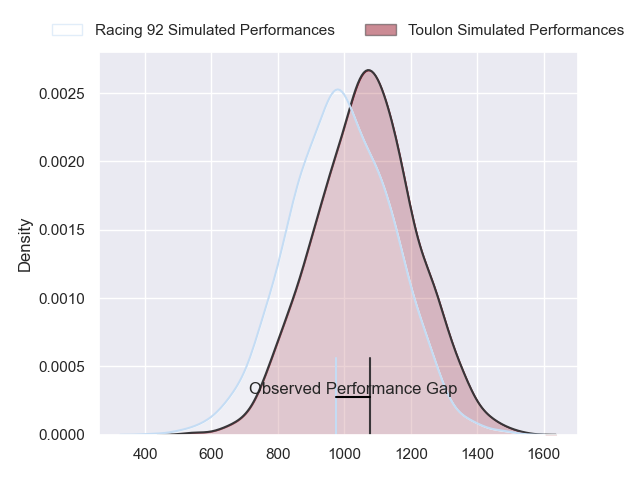
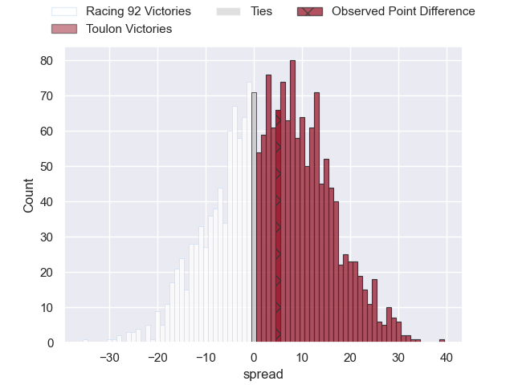
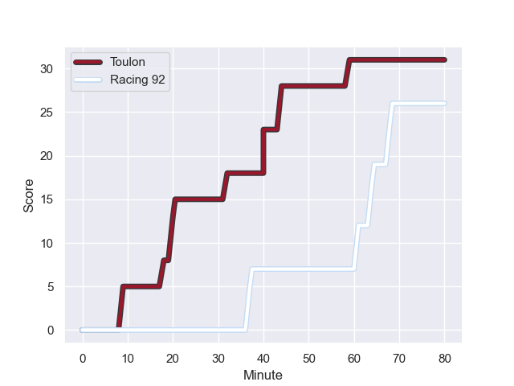
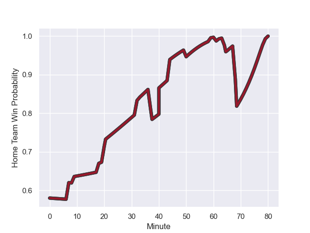

---  
layout: page  
title: Racing 92 at Toulon; 26-31  
date: 2023-11-12 18:00:00 -0500  
categories: "Top 14 Orange 2023" match review  
---
# Racing 92 at Toulon; 26-31

# Club Level Predictions

The first set of predictions treats a club as the smallest object, as the club develops its members, organizes a gameplan, and deploys its players as needed for each match. This club model has a prediction of 0.642, which translates to predicting Toulon to win by 5.1.

Each club has a rating and a rating deviation (similar to a Glicko rating), and expected performances can be generated. This allows for simulated matches and spreads like the ones below.
## Projected Performances - Club Model

## Projected Spreads - Club Model

## Projected Results - Club Model

# Player Level Predictions - Version 2

Treating teams instead as an entity made up of the currently active players, I have ratings for each player in an altogether different system. These can be combined to form team ratings once teamsheets are announced, weighting starters a bit higher than the reserves. After the match is played, players can be weighted by their minutes on the field, allowing for an accurate measure of the team's composition. With these compiled team ratings, we can make predictions, measure inaccuracy, and update the individual player ratings.
## Prediction with Player Minutes: Toulon by 3.5

Racing 92 by 1.2 on a neutral field
## Prediction without Player Minutes: Toulon by 3.1

Racing 92 by 1.6 on a neutral pitch

## Projected Performances - Player Model

## Projected Spreads - Player Model

## Projected Results - Player Model

## Scores over Time

## Win Probability over Time

There were 8 large changes in win probability in this match

|   Away Minutes | Away Player         |   Away elo |   Number |   Home elo | Home Player                    |   Home Minutes |
|---------------:|:--------------------|-----------:|---------:|-----------:|:-------------------------------|---------------:|
|             50 | Hassane Kolingar    |      41.34 |        1 |      44.22 | Bruce Devaux                   |             47 |
|             50 | Peniami Narisia     |      42.48 |        2 |      51.79 | Teddy Baubigny                 |             65 |
|             50 | Cedate Gomes Sa     |      56.55 |        3 |      55.6  | Beka Gigashvili                |             56 |
|              7 | Baptiste Chouzenoux |      77.2  |        4 |      48.49 | Matthias Halagahu              |             47 |
|             80 | Boris Palu          |      67.24 |        5 |      72.25 | Brian Alainu'uese              |             80 |
|             80 | Cameron Woki        |      65.55 |        6 |      69.12 | Cornell du Preez               |             80 |
|             80 | Maxime Baudonne     |      40.37 |        7 |      43.47 | Esteban Abadie                 |             80 |
|             80 | Kitione Kamikamica  |      75.08 |        8 |      83.62 | Selevasio Tolofua              |             56 |
|             62 | Nolann Le Garrec    |      64.63 |        9 |      91.52 | Baptiste Serin                 |             56 |
|             80 | Antoine Gibert      |      75.45 |       10 |      64.95 | Noah Lolesio                   |             80 |
|             50 | Wame Naituvi        |      67.89 |       11 |      41.25 | Seta Tuicuvu                   |             53 |
|             80 | Henry Chavancy      |     115.4  |       12 |      74.86 | Duncan Paia'aua                |             80 |
|             80 | Gael Fickou         |     104.95 |       13 |     126.73 | Waisea Nayacalevu Vuidravuwalu |             80 |
|             80 | Henry Arundell      |      47.2  |       14 |      28.52 | Gaël Dréan                     |             80 |
|             50 | Max Spring          |      54.28 |       15 |      46.93 | Aymeric Luc                    |             80 |
|             26 | Fabien Sanconnie    |      40.91 |       16 |      65.76 | David Ribbans                  |             33 |
|             47 | Ibrahim Diallo      |      38.3  |       17 |      86.33 | Jean-Baptiste Gros             |             33 |
|             30 | Guram Gogichashvili |      48.11 |       18 |      39.22 | Jérémy Sinzelle                |             27 |
|             30 | Thomas Laclayat     |      61.77 |       19 |      37.9  | Kieran Brookes                 |             24 |
|             30 | Vinaya Habosi       |      52.26 |       20 |      97.17 | Facundo Isa                    |             24 |
|             30 | Tristan Tedder      |      70.39 |       21 |      63.63 | Ben White                      |             24 |
|             18 | Clovis Le bail      |      57.58 |       22 |      46.72 | Yanis Boulassel                |             15 |
|             30 | Eddy Ben Arous      |      99.05 |       23 |     nan    | nan                            |            nan |

