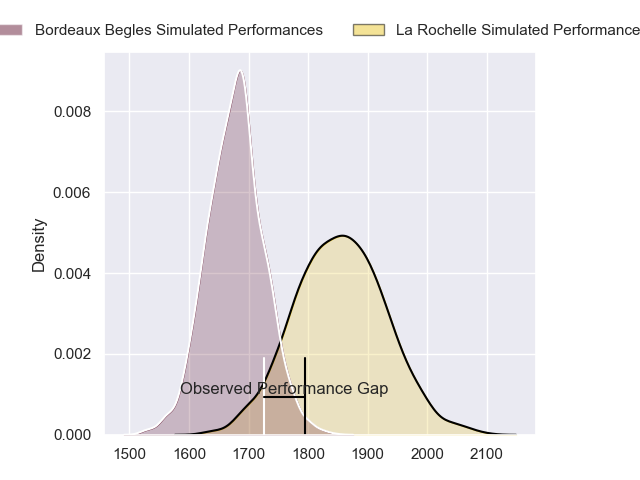
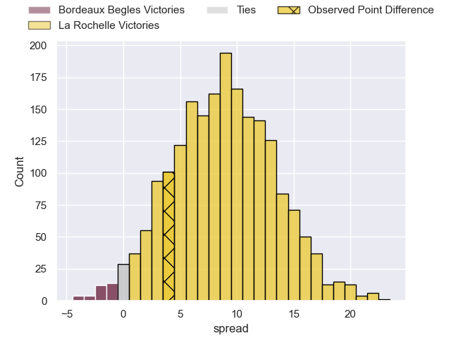
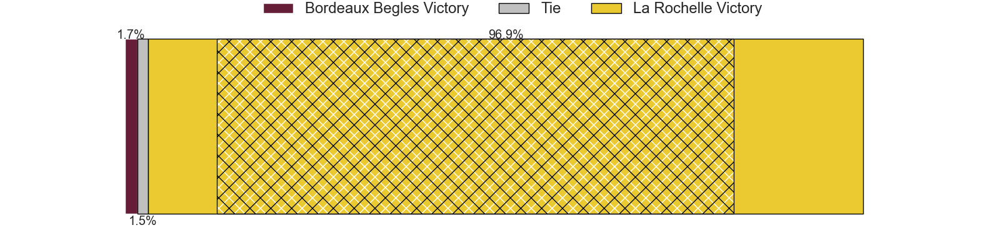
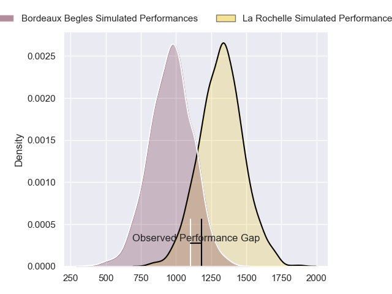
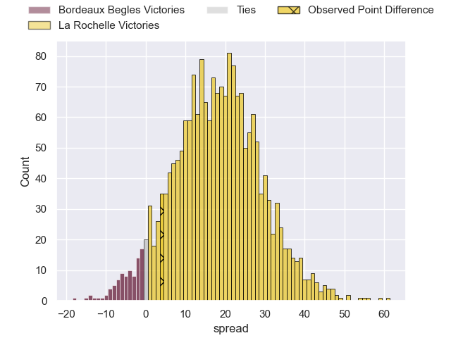
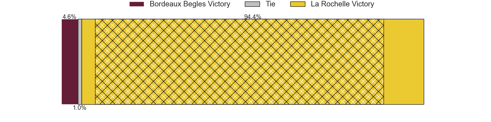
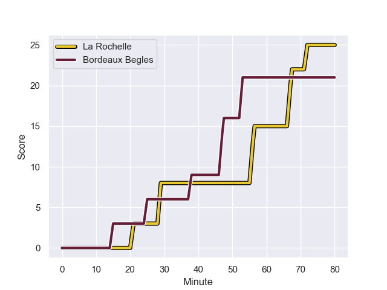
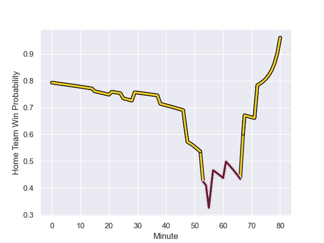

---  
layout: page  
title: Bordeaux Begles at La Rochelle; 21-25  
date: 2023-11-19 18:00:00 -0500  
categories: "Top 14 Orange 2023" match review  
---
# Bordeaux Begles at La Rochelle; 21-25

# Club Level Predictions

The first set of predictions treats a club as the smallest object, as the club develops its members, organizes a gameplan, and deploys its players as needed for each match. This club model has a prediction of 0.731, which translates to predicting La Rochelle to win by 8.8.

Each club has a rating and a rating deviation (similar to a Glicko rating), and expected performances can be generated. This allows for simulated matches and spreads like the ones below.
## Projected Performances - Club Model

## Projected Spreads - Club Model

## Projected Results - Club Model

# Player Level Predictions - Version 2

Treating teams instead as an entity made up of the currently active players, I have ratings for each player in an altogether different system. These can be combined to form team ratings once teamsheets are announced, weighting starters a bit higher than the reserves. After the match is played, players can be weighted by their minutes on the field, allowing for an accurate measure of the team's composition. With these compiled team ratings, we can make predictions, measure inaccuracy, and update the individual player ratings.
## Prediction with Player Minutes: La Rochelle by 14.8

La Rochelle by 10.0 on a neutral field
## Prediction without Player Minutes: La Rochelle by 15.4

La Rochelle by 10.6 on a neutral pitch

## Projected Performances - Player Model

## Projected Spreads - Player Model

## Projected Results - Player Model

## Scores over Time

## Win Probability over Time

There were 15 large changes in win probability in this match

|   Away Minutes | Away Player               |   Away elo |   Number |   Home elo | Home Player           |   Home Minutes |
|---------------:|:--------------------------|-----------:|---------:|-----------:|:----------------------|---------------:|
|             55 | Lekso Kaulashvili         |      67.09 |        1 |      83.19 | Reda Wardi            |             62 |
|             61 | Maxime Lamothe            |      50.51 |        2 |      78.78 | Pierre Bourgarit      |             78 |
|             55 | Sipili Falatea            |      49.45 |        3 |     127.11 | Uini Atonio           |             55 |
|             59 | Kane Douglas              |      48.34 |        4 |      68.19 | Thomas Lavault        |             72 |
|             80 | Cyril Cazeaux             |      77.74 |        5 |      62.97 | Ultan Dillane         |             80 |
|             80 | Pierre Bochaton           |      63.19 |        6 |      38.27 | Paul Boudehent        |             80 |
|             49 | Bastien Vergnes Taillefer |      61.32 |        7 |     105.46 | Levani Botia          |             80 |
|             61 | Tevita Tatafu             |      60.98 |        8 |      60.37 | Yoan Tanga            |             55 |
|             80 | Maxime Lucu               |     109.58 |        9 |     113.02 | Tawera Kerr-Barlow    |             55 |
|             78 | Matthieu Jalibert         |      99.89 |       10 |      55    | Antoine Hastoy        |             55 |
|             80 | Pablo Uberti              |      23.06 |       11 |      98.6  | Jack Nowell           |             80 |
|             80 | Yoram Moefana             |      55.33 |       12 |     117.85 | Jonathan Danty        |             80 |
|             80 | Nicolas Depoortere        |      49.83 |       13 |      54.72 | Ulupano Seuteni       |             57 |
|             80 | Damian Penaud             |      85.29 |       14 |      89    | Teddy Thomas          |             80 |
|             61 | Nans Ducuing              |      65.28 |       15 |     120.88 | Brice Dulin           |             80 |
|             25 | Jefferson Poirot          |      55.03 |       16 |      55.77 | Thierry Paiva         |             18 |
|             19 | Clement Maynadier         |      59.71 |       17 |      50.72 | Sacha Idoumi          |              2 |
|             25 | Carlu Sadie               |      34.2  |       18 |      21.89 | Georges-Henri Colombe |             25 |
|             21 | Guido Petti               |      64.43 |       19 |      44.53 | Remi Picquette        |              8 |
|             19 | Pete Samu                 |      80.99 |       20 |      33.8  | Judicael Cancoriet    |             25 |
|             31 | Mahamadou Diaby           |      56.91 |       21 |      64.93 | Teddy Iribaren        |             25 |
|              2 | Paul Abadie               |      16.46 |       22 |      43.2  | Hugo Reus             |             25 |
|             19 | Louis Bielle-Biarrey      |      60.18 |       23 |      66.39 | Jules Favre           |             23 |

