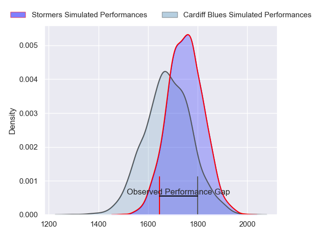
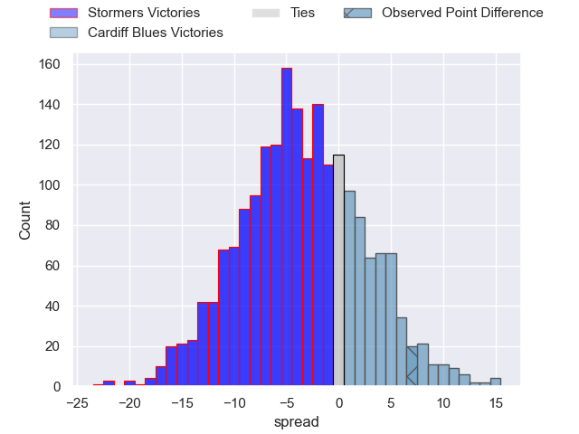
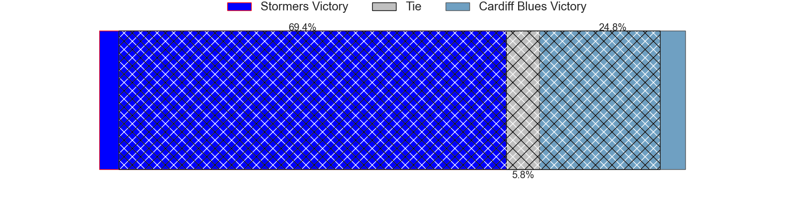
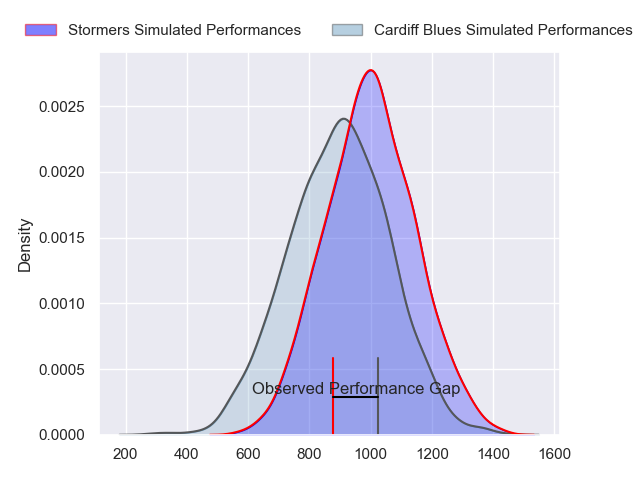
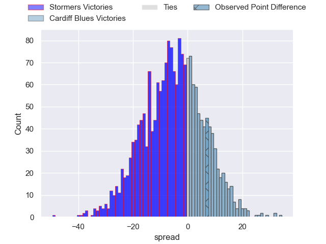
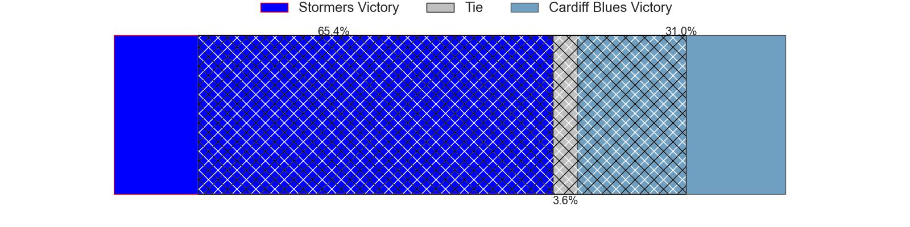
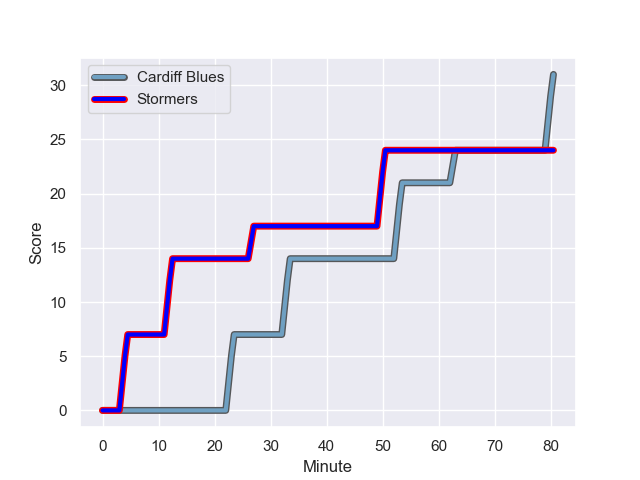
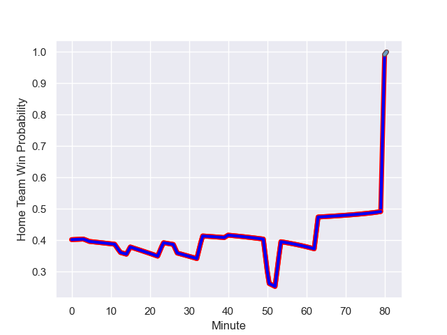

---  
layout: page  
title: Stormers at Cardiff Blues; 24-31  
date: 2023-11-24 18:00:00 -0500  
categories: "United Rugby Championship 2023" match review  
---
# Stormers at Cardiff Blues; 24-31

# Club Level Predictions

The first set of predictions treats a club as the smallest object, as the club develops its members, organizes a gameplan, and deploys its players as needed for each match. This club model has a prediction of 0.399, which translates to predicting Stormers to win by 3.6.

Each club has a rating and a rating deviation (similar to a Glicko rating), and expected performances can be generated. This allows for simulated matches and spreads like the ones below.
## Projected Performances - Club Model

## Projected Spreads - Club Model

## Projected Results - Club Model

# Player Level Predictions - Version 2

Treating teams instead as an entity made up of the currently active players, I have ratings for each player in an altogether different system. These can be combined to form team ratings once teamsheets are announced, weighting starters a bit higher than the reserves. After the match is played, players can be weighted by their minutes on the field, allowing for an accurate measure of the team's composition. With these compiled team ratings, we can make predictions, measure inaccuracy, and update the individual player ratings.
## Prediction with Player Minutes: Stormers by 4.4

Stormers by 8.8 on a neutral field
## Prediction without Player Minutes: Stormers by 4.6

Stormers by 9.0 on a neutral pitch

## Projected Performances - Player Model

## Projected Spreads - Player Model

## Projected Results - Player Model

## Scores over Time

## Win Probability over Time

There were 9 large changes in win probability in this match

|   Away Minutes | Away Player                       |   Away elo |   Number |   Home elo | Home Player         |   Home Minutes |
|---------------:|:----------------------------------|-----------:|---------:|-----------:|:--------------------|---------------:|
|             47 | Brok Harris                       |     125.23 |        1 |      59    | Corey Domachowski   |             52 |
|             47 | Andre-Hugo Venter                 |      56.46 |        2 |      53.7  | Liam Belcher        |             52 |
|             47 | Lee-Marvin Lofty Siyanda Mazibuko |      61.36 |        3 |      34.4  | William Davies-King |             40 |
|             65 | Adre Smith                        |      76.11 |        4 |      40.05 | Seb Davies          |             80 |
|             80 | Ruben van Heerden                 |      53.33 |        5 |      22.38 | Rory Thornton       |             66 |
|             52 | Nama Xaba                         |      21.91 |        6 |      43.55 | Alex Mann           |             80 |
|             65 | Willie Engelbrecht                |      60.2  |        7 |      47.34 | Ellis Jenkins       |             80 |
|             80 | Marcel Theunissen                 |      44.84 |        8 |      64.3  | Lopeti Timani       |             47 |
|             54 | Stefan Ungerer                    |      35.8  |        9 |      40.68 | Ellis Bevan         |             80 |
|             47 | Jean-Luc du Plessis               |      62.5  |       10 |      71.58 | Tinus de Beer       |             80 |
|             80 | Ben Loader                        |      83.97 |       11 |      74.38 | Mason Grady         |             80 |
|             80 | Sacha Mngomezulu                  |      61.2  |       12 |      51.93 | Ben Thomas          |             80 |
|             80 | Ruhan Nel                         |      50.33 |       13 |      97.04 | Uilisi Halaholo     |             74 |
|             80 | Courtnall Skosan                  |     101.95 |       14 |      37.9  | Harri Millard       |             15 |
|             80 | Clayton Blommetjies               |      91.88 |       15 |      30.48 | Cam Winnett         |             80 |
|             33 | Sti Sithole                       |      48.17 |       16 |      72.73 | Gabriel Hamer-Webb  |             65 |
|             33 | Warrick Gelant                    |     114.94 |       17 |      48.42 | Rhys Litterick      |             40 |
|             33 | Scarra Ntubeni                    |      86.97 |       18 |      32.69 | Rhys Carré          |             28 |
|             33 | Neethling Fouche                  |      58.71 |       19 |      46.65 | Evan Lloyd          |             28 |
|             28 | Keke Morabe                       |      41.47 |       20 |      34.7  | Jacob Beetham       |              6 |
|             26 | Herschel Jantjies                 |      89.08 |       21 |      46.65 | Mackenzie Martin    |             33 |
|             15 | Hendre Stassen                    |      33.8  |       22 |      65.91 | Josh Turnbull       |             14 |
|             15 | Connor Evans                      |      42.11 |       23 |     nan    | nan                 |            nan |

