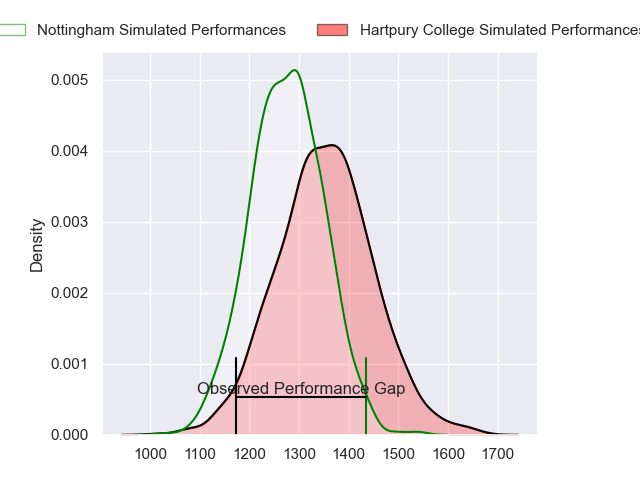
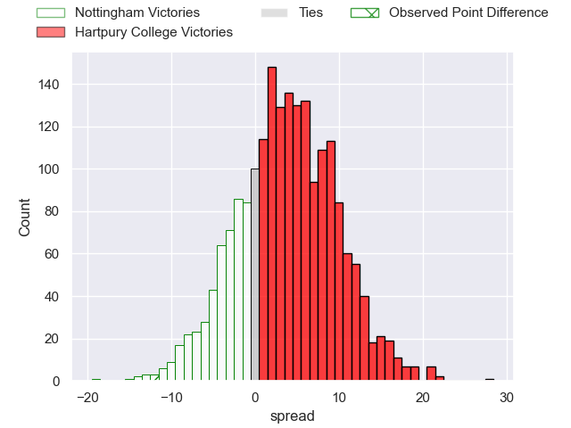
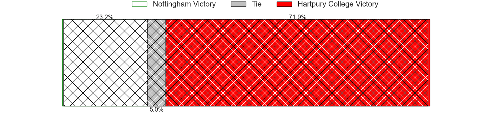
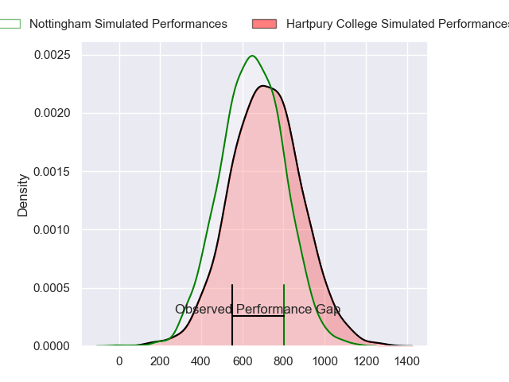
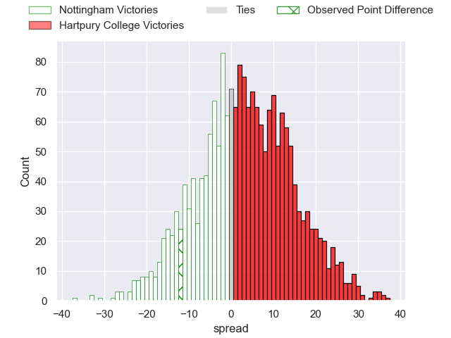
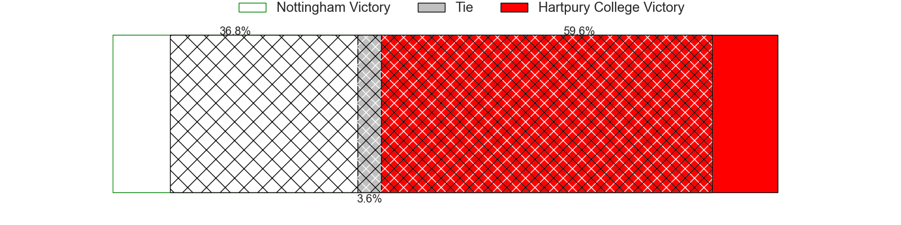
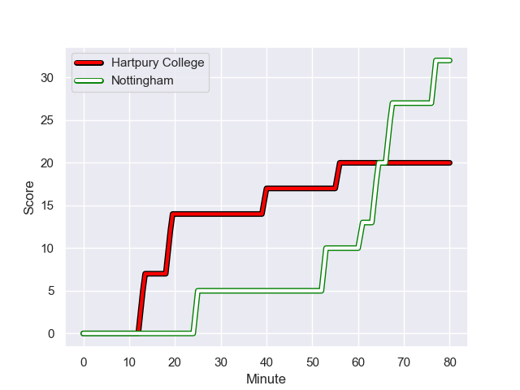
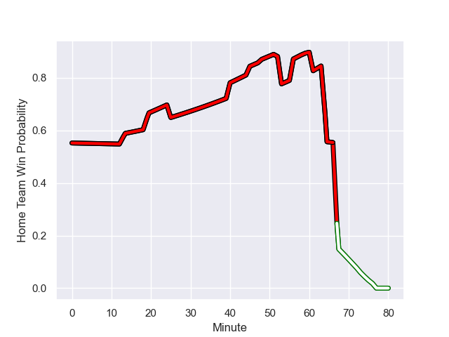

---  
layout: page  
title: Nottingham at Hartpury College; 32-20  
date: 2023-11-24 18:00:00 -0500  
categories: "RFU Championship 2023" match review  
---
# Nottingham at Hartpury College; 32-20

# Club Level Predictions

The first set of predictions treats a club as the smallest object, as the club develops its members, organizes a gameplan, and deploys its players as needed for each match. This club model has a prediction of 0.614, which translates to predicting Hartpury College to win by 4.1.

Each club has a rating and a rating deviation (similar to a Glicko rating), and expected performances can be generated. This allows for simulated matches and spreads like the ones below.
## Projected Performances - Club Model

## Projected Spreads - Club Model

## Projected Results - Club Model

# Player Level Predictions - Version 2

Treating teams instead as an entity made up of the currently active players, I have ratings for each player in an altogether different system. These can be combined to form team ratings once teamsheets are announced, weighting starters a bit higher than the reserves. After the match is played, players can be weighted by their minutes on the field, allowing for an accurate measure of the team's composition. With these compiled team ratings, we can make predictions, measure inaccuracy, and update the individual player ratings.
## Prediction with Player Minutes: Hartpury College by 2.3

Nottingham by 1.0 on a neutral field
## Prediction without Player Minutes: Hartpury College by 2.1

Nottingham by 1.3 on a neutral pitch

## Projected Performances - Player Model

## Projected Spreads - Player Model

## Projected Results - Player Model

## Scores over Time

## Win Probability over Time

There were 12 large changes in win probability in this match

|   Away Minutes | Away Player               |   Away elo |   Number |   Home elo | Home Player           |   Home Minutes |
|---------------:|:--------------------------|-----------:|---------:|-----------:|:----------------------|---------------:|
|             52 | Kai Owen                  |      51.25 |        1 |      50.5  | Aristot Benz-Salomon  |             66 |
|             45 | Antonio TJ Harris         |      54.26 |        2 |      40.45 | William Crane         |             80 |
|             52 | Dan Richardson            |      49.52 |        3 |       4.97 | Joe Rees              |             45 |
|             80 | Sebastien Ferreira        |     -15.71 |        4 |      48.01 | Dale Lemon            |             56 |
|             59 | Come Clayver Joussain     |      47.93 |        5 |      48.62 | Jack Davies           |             80 |
|             80 | Iosefa Danny Wayne Fiaola |      54.1  |        6 |      19.22 | Samuel Lewis          |             80 |
|             80 | Nathan Tweedy             |      54.55 |        7 |      52.34 | Jarrad Hayler         |             80 |
|             48 | George Cox                |      66    |        8 |      57.16 | Josh Gray             |             80 |
|             60 | Micheal Stronge           |      31.65 |        9 |      47.79 | Michael Austin        |             66 |
|             52 | Morgan Bunting            |      27.97 |       10 |      60.17 | Harry Bazalgette      |             73 |
|             64 | Harry Graham              |      37.1  |       11 |      31.33 | Jack Reeves           |             80 |
|             80 | Joe Woodward              |      56.61 |       12 |      38.6  | Tommy Mathews         |             80 |
|             80 | Marcus Alexander Ramage   |      38.4  |       13 |      15.96 | Robbie Smith          |             80 |
|             80 | David Williams            |      41.83 |       14 |      45.28 | Josh Hathaway         |             64 |
|             80 | Ellis Mee                 |      56.61 |       15 |      49.83 | Ioan Jones            |             80 |
|             35 | Jack Dickinson            |      43.7  |       16 |      40.36 | Jonathan Benz-Salomon |             35 |
|             32 | James Cherry              |      51.25 |       17 |      46.87 | Danny Eite            |             24 |
|             28 | Archie Van der Flier      |      51.51 |       18 |      53.01 | Bradley Denty         |             16 |
|             28 | Xavier Valentine          |      51.17 |       19 |      54.78 | Mikey Summerfield     |             14 |
|             28 | Sam Hollingsworth         |      63.37 |       20 |      43.11 | Matty Jones           |             14 |
|             21 | Jack Shine                |      52.03 |       21 |      46.65 | Morgan Adderly-Jones  |              7 |
|             20 | Josh Goodwin              |      45.62 |       22 |     nan    | nan                   |            nan |
|             16 | Jack Stapley              |      -5.93 |       23 |     nan    | nan                   |            nan |

