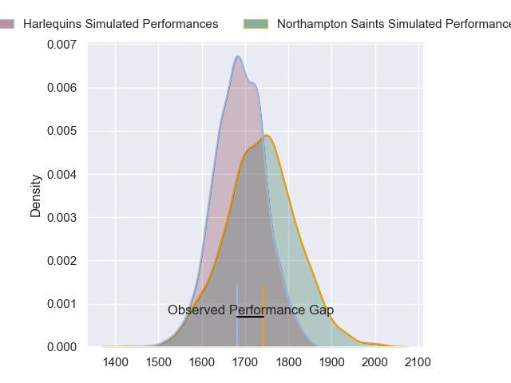
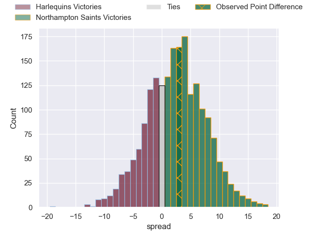
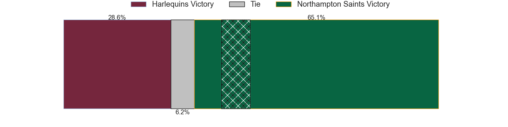
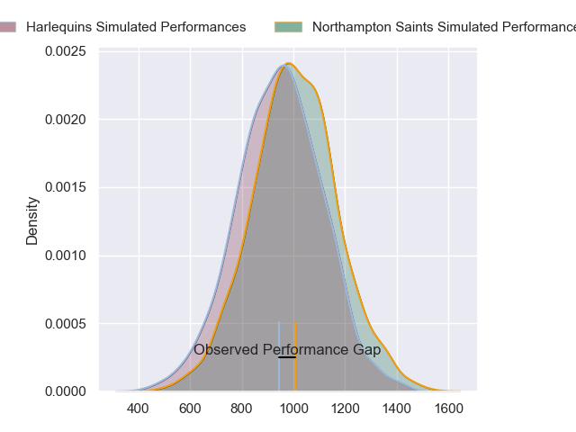
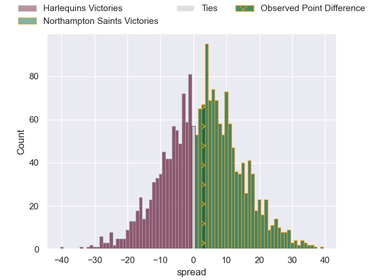
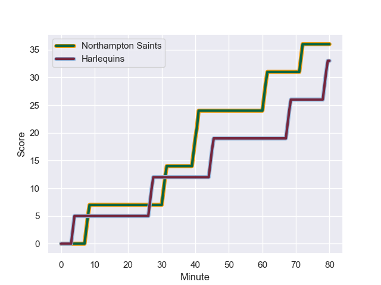
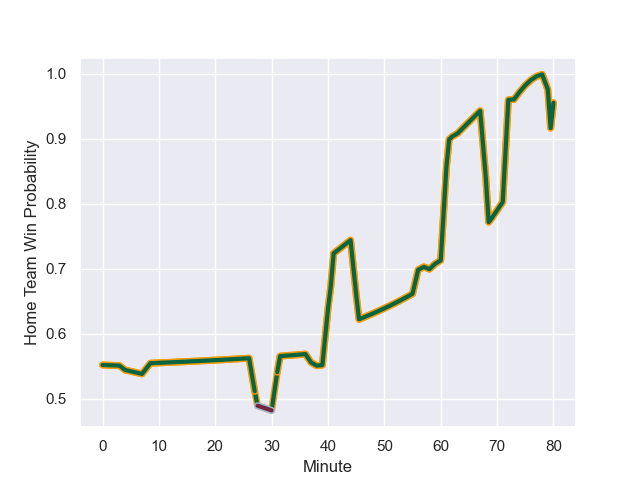

---  
layout: page  
title: Harlequins at Northampton Saints; 33-36  
date: 2023-11-24 18:00:00 -0500  
categories: "Gallagher Premiership 2023" match review  
---
# Harlequins at Northampton Saints; 33-36

# Club Level Predictions

The first set of predictions treats a club as the smallest object, as the club develops its members, organizes a gameplan, and deploys its players as needed for each match. This club model has a prediction of 0.562, which translates to predicting Northampton Saints to win by 2.2.

Each club has a rating and a rating deviation (similar to a Glicko rating), and expected performances can be generated. This allows for simulated matches and spreads like the ones below.
## Projected Performances - Club Model

## Projected Spreads - Club Model

## Projected Results - Club Model

# Player Level Predictions - Version 2

Treating teams instead as an entity made up of the currently active players, I have ratings for each player in an altogether different system. These can be combined to form team ratings once teamsheets are announced, weighting starters a bit higher than the reserves. After the match is played, players can be weighted by their minutes on the field, allowing for an accurate measure of the team's composition. With these compiled team ratings, we can make predictions, measure inaccuracy, and update the individual player ratings.
## Prediction with Player Minutes: Northampton Saints by 2.3

Harlequins by 2.5 on a neutral field
## Prediction without Player Minutes: Northampton Saints by 1.8

Harlequins by 3.0 on a neutral pitch

## Projected Performances - Player Model

## Projected Spreads - Player Model

## Projected Results - Player Model

## Scores over Time

## Win Probability over Time

There were 15 large changes in win probability in this match

|   Away Minutes | Away Player               |   Away elo |   Number |   Home elo | Home Player         |   Home Minutes |
|---------------:|:--------------------------|-----------:|---------:|-----------:|:--------------------|---------------:|
|             63 | Fin Baxter                |      32.52 |        1 |      64.92 | Ethan Waller        |             56 |
|             58 | Jack Walker               |      35.27 |        2 |      56.66 | Sam Matavesi        |             73 |
|             63 | Dillon Lewis              |      81.7  |        3 |      12.08 | Trevor Davison      |             56 |
|             59 | Irne Herbst               |      58.03 |        4 |      49.16 | Chunya Munga        |             73 |
|             80 | George Hammond            |      13.48 |        5 |      18.88 | Alex Coles          |             80 |
|             80 | Dino Lamb                 |      74.54 |        6 |      89.33 | Courtney Lawes      |             80 |
|             78 | Will Evans                |      48.89 |        7 |      82.26 | Tom Pearson         |             80 |
|             80 | Alex Dombrandt            |      66.74 |        8 |      58.96 | Lewis Ludlam        |             37 |
|             69 | Danny Care                |     136.11 |        9 |      68.5  | Alex Mitchell       |             80 |
|             80 | Marcus Smith              |      75.3  |       10 |      63.56 | George Furbank      |             80 |
|             73 | Louis Lynagh              |      62.05 |       11 |      60.89 | James Ramm          |             38 |
|             80 | Andre Esterhuizen         |     107.93 |       12 |      52.61 | Fraser Dingwall     |             80 |
|             80 | Will Joseph               |      58.45 |       13 |      70.67 | Tommy Freeman       |             80 |
|             70 | Cadan Murley              |      39.04 |       14 |      73.78 | Ollie Sleightholme  |             80 |
|             80 | Tyrone Green              |      62.97 |       15 |      63.44 | George Hendy        |             80 |
|             17 | Santiago Garcia Botta     |      97.04 |       16 |      94.78 | Alex Waller         |             24 |
|             22 | Nathan Jibulu             |      52.28 |       17 |      35.31 | Tom Cruse           |              7 |
|             17 | Lovejoy Chawatama         |      33.4  |       18 |      43.41 | Elliot Millar-Mills |             24 |
|             21 | Chandler Cunningham-South |      51.65 |       19 |      47.11 | Tom Lockett         |              7 |
|              2 | James Chisholm            |      77.75 |       20 |      41.18 | Angus Scott-Young   |             43 |
|             11 | Will Porter               |      34.41 |       21 |      53.01 | Tom Litchfield      |             42 |
|              7 | Jarrod Evans              |      82.26 |       22 |     nan    | nan                 |            nan |
|             10 | Oscar Beard               |      49.89 |       23 |     nan    | nan                 |            nan |

