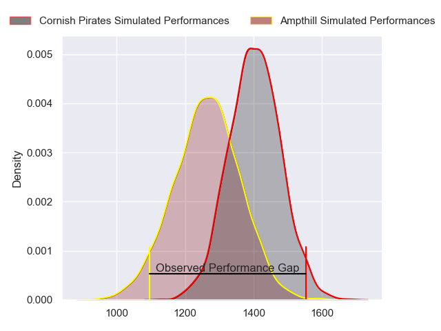
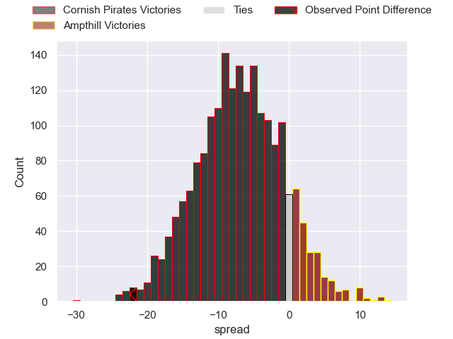
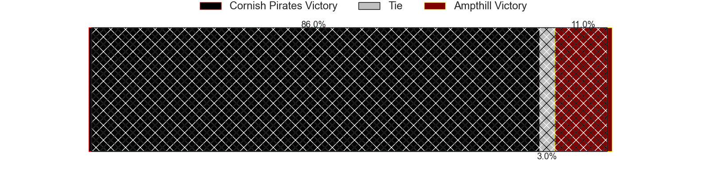
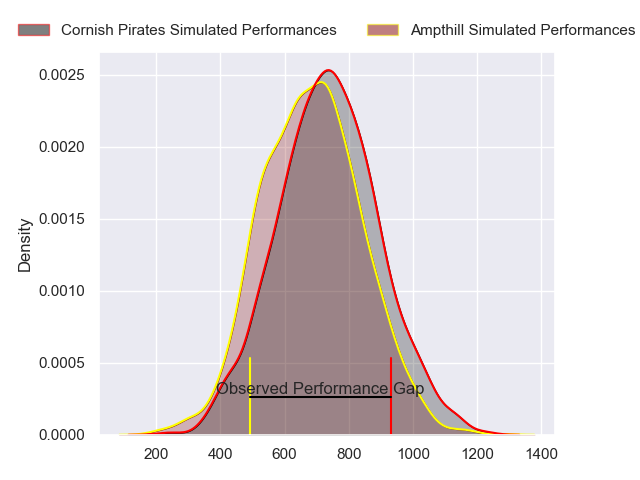
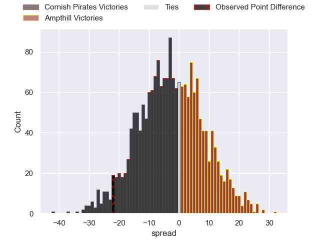
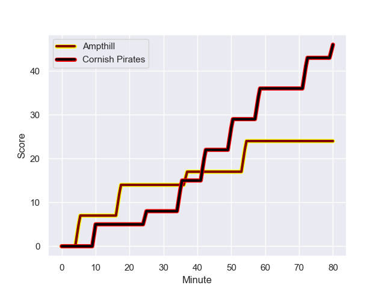
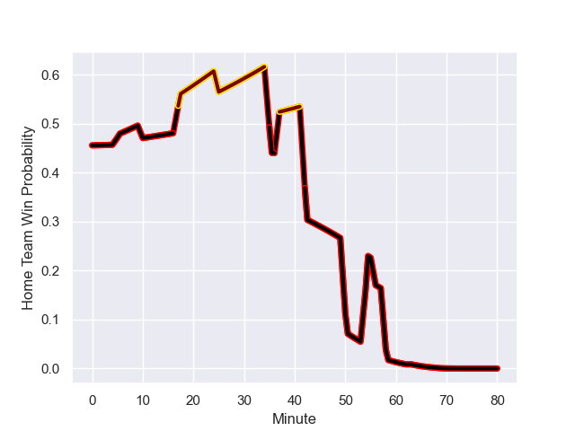

---  
layout: page  
title: Cornish Pirates at Ampthill; 46-24  
date: 2023-11-25 18:00:00 -0500  
categories: "RFU Championship 2023" match review  
---
# Cornish Pirates at Ampthill; 46-24

# Club Level Predictions

The first set of predictions treats a club as the smallest object, as the club develops its members, organizes a gameplan, and deploys its players as needed for each match. This club model has a prediction of 0.312, which translates to predicting Cornish Pirates to win by 7.1.

Each club has a rating and a rating deviation (similar to a Glicko rating), and expected performances can be generated. This allows for simulated matches and spreads like the ones below.
## Projected Performances - Club Model

## Projected Spreads - Club Model

## Projected Results - Club Model

# Player Level Predictions - Version 2

Treating teams instead as an entity made up of the currently active players, I have ratings for each player in an altogether different system. These can be combined to form team ratings once teamsheets are announced, weighting starters a bit higher than the reserves. After the match is played, players can be weighted by their minutes on the field, allowing for an accurate measure of the team's composition. With these compiled team ratings, we can make predictions, measure inaccuracy, and update the individual player ratings.
## Prediction with Player Minutes: Cornish Pirates by 2.0

Cornish Pirates by 5.2 on a neutral field
## Prediction without Player Minutes: Cornish Pirates by 1.8

Cornish Pirates by 5.1 on a neutral pitch

## Projected Performances - Player Model

## Projected Spreads - Player Model

## Projected Results - Player Model

## Scores over Time

## Win Probability over Time

There were 14 large changes in win probability in this match

|   Away Minutes | Away Player          |   Away elo |   Number |   Home elo | Home Player                 |   Home Minutes |
|---------------:|:---------------------|-----------:|---------:|-----------:|:----------------------------|---------------:|
|             59 | Lefty Zigiriadis     |      48.22 |        1 |      48.4  | Sam Crean                   |             56 |
|             63 | Morgan Nelson        |      47.08 |        2 |      31.48 | Samson Adejimi              |             68 |
|             59 | Matt Johnson         |      50.84 |        3 |      51    | Luke Green                  |             63 |
|             80 | Hugh Bokenham        |      46.52 |        4 |      43.94 | Joe Peard                   |             80 |
|             80 | Steele Robert Barker |      49.54 |        5 |      42.53 | Kaden Pearce-Paul           |             56 |
|             80 | Peter Everett        |      51.14 |        6 |      45.56 | Izaiha Moore-Aiono          |             63 |
|             69 | John Stevens         |      50.7  |        7 |      41.79 | Nathan Michelow             |             80 |
|             63 | Ben Grubb            |      39.45 |        8 |      31.69 | Morgan Strong               |             80 |
|             59 | Alex Schwarz         |      42.01 |        9 |      42.47 | Charlie Bracken             |             64 |
|             80 | Bruce Houston        |      46.65 |       10 |      40.14 | Gwyn Parks                  |             64 |
|             69 | Jack Nowell          |      98.6  |       11 |      36.11 | Brandon Jackson-Richards    |             80 |
|             80 | Joe Elderkin         |      40.88 |       12 |      67.86 | Fraser James Kevin Strachan |             80 |
|             68 | Ioan Evans           |      49.23 |       13 |      25.42 | Oli Morris                  |             80 |
|             80 | Matthew McNab        |      28.29 |       14 |      42.07 | Tobias Elliott              |             56 |
|             80 | Will Trewin          |      47.93 |       15 |      45.68 | Tomas Bacon                 |             80 |
|             21 | Jake Morris          |      46.36 |       16 |      -6.03 | James Flynn                 |             24 |
|             21 | Finlay Richardson    |      48.63 |       17 |      36.59 | Ben Harris                  |             24 |
|             21 | Ruaridh Dawson       |      47.1  |       18 |      35.33 | Iestyn Rees                 |             24 |
|             17 | Rhys Williams        |      47.22 |       19 |      37.69 | Dominic Hardman             |             17 |
|             17 | Will Gibson          |      60.41 |       20 |      25.72 | Josh Smart                  |             17 |
|             12 | Tom Georgiou         |      39.72 |       21 |      46.49 | Joe Green                   |             16 |
|             11 | Harry Dugmore        |      48.07 |       22 |      24.88 | Josh Barton                 |             16 |
|             11 | Iwan Jenkins         |      49.54 |       23 |      41.71 | Benjamin Chapman            |             12 |

