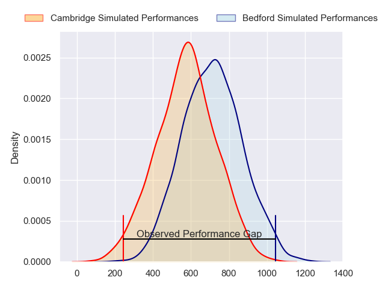
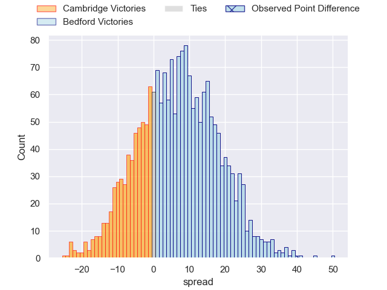
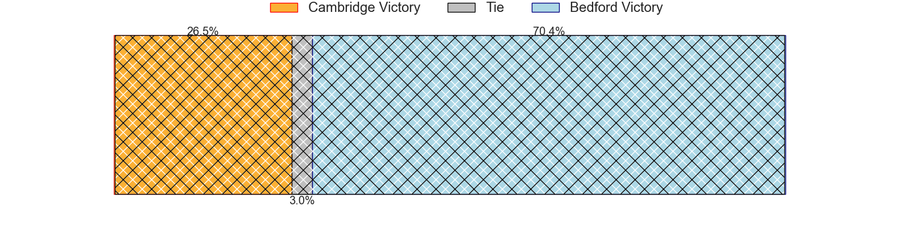
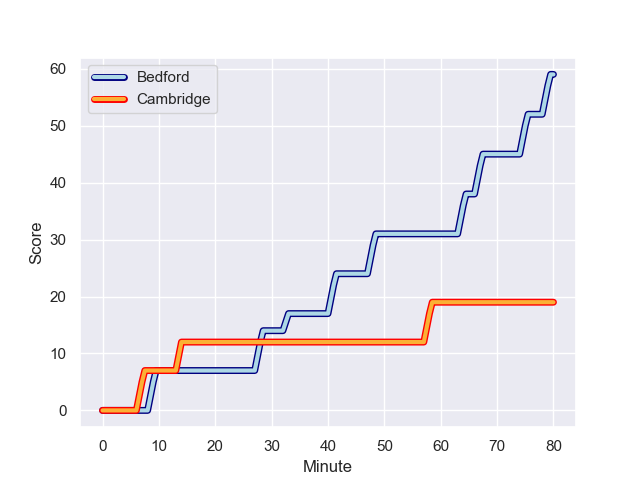
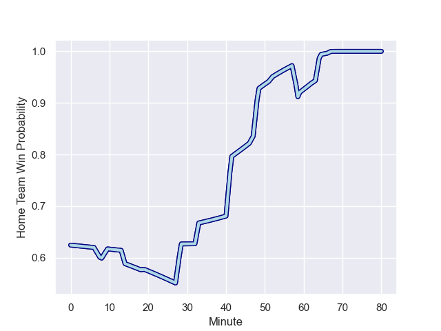

---  
layout: page  
title: Cambridge at Bedford; 19-59  
date: 2023-11-25 18:00:00 -0500  
categories: "RFU Championship 2023" match review  
---
# Cambridge at Bedford; 19-59

# Club Level Predictions

The first set of predictions treats a club as the smallest object, as the club develops its members, organizes a gameplan, and deploys its players as needed for each match. This club model has a prediction of 0.961, which translates to predicting Bedford to win by 31.7.

Each club has a rating and a rating deviation (similar to a Glicko rating), and expected performances can be generated. This allows for simulated matches and spreads like the ones below.
## Projected Performances - Club Model

## Projected Spreads - Club Model

## Projected Results - Club Model

# Player Level Predictions - Version 2

Treating teams instead as an entity made up of the currently active players, I have ratings for each player in an altogether different system. These can be combined to form team ratings once teamsheets are announced, weighting starters a bit higher than the reserves. After the match is played, players can be weighted by their minutes on the field, allowing for an accurate measure of the team's composition. With these compiled team ratings, we can make predictions, measure inaccuracy, and update the individual player ratings.
## Prediction with Player Minutes: Bedford by 5.6

Bedford by 2.2 on a neutral field
## Prediction without Player Minutes: Bedford by 5.2

Bedford by 1.8 on a neutral pitch

## Projected Performances - Player Model

## Projected Spreads - Player Model

## Projected Results - Player Model

## Scores over Time

## Win Probability over Time

There were 8 large changes in win probability in this match

|   Away Minutes | Away Player       |   Away elo |   Number |   Home elo | Home Player          |   Home Minutes |
|---------------:|:------------------|-----------:|---------:|-----------:|:---------------------|---------------:|
|             59 | Huw Owen          |      55.73 |        1 |      31.68 | Jamie Jack           |             47 |
|             73 | Morgan Veness     |      36.75 |        2 |      42.18 | James Fish           |             65 |
|             59 | Billy Walker      |      37.07 |        3 |      47.29 | Bryan O'Connor       |             80 |
|             80 | Kieran Frost      |      41.12 |        4 |      28.17 | Jordan Onojaife      |             52 |
|             68 | Gareth Baxter     |      46.65 |        5 |      40.27 | Alex Woolford        |             80 |
|             47 | Ben Adams         |      14.73 |        6 |      24.19 | Joe Howard           |             80 |
|             80 | Matthew Dawson    |      46.81 |        7 |      42.99 | Jac Arthur           |             19 |
|             80 | Geordie Irvine    |      45.57 |        8 |      12.85 | Cameron King         |             80 |
|             63 | Sam Edwards       |      36.3  |        9 |      61.96 | Alex Day             |             59 |
|             52 | Jamie Benson      |      33.15 |       10 |      25.03 | Louis Grimoldby      |             59 |
|             80 | Matthew Hema      |      38.95 |       11 |      41.86 | Jake Garside         |             80 |
|             80 | Sam Hanks         |      16.83 |       12 |      61.5  | Michael Le Bourgeois |             80 |
|             47 | Tom Hoppe         |      46.65 |       13 |      38.14 | Jamie Elliott        |             47 |
|             80 | Kwaku Asiedu      |      34.95 |       14 |      40.02 | Sean French          |             80 |
|             80 | Elias Caven       |      38    |       15 |      61.8  | Dean Adamson         |             80 |
|             33 | Jared Cardew      |      29.48 |       16 |      46.65 | Henry Pollock        |             61 |
|             33 | Josef Green       |      43.89 |       17 |      52.09 | Joey Conway          |             33 |
|             28 | Steffan James     |      40.61 |       18 |      46.89 | Jordan Venter        |             33 |
|             21 | Jake Elwood       |      38.15 |       19 |      58.57 | Robin Williams       |             28 |
|             21 | Harry Morley      |      51.48 |       20 |      46.09 | Archie McParland     |             21 |
|             17 | Kieran Duffin     |      42.25 |       21 |      61.69 | William Maisey       |             21 |
|             12 | Noah Sloot        |      46.65 |       22 |      46.65 | Craig Wright         |             15 |
|              7 | William Priestley |      45.68 |       23 |     nan    | nan                  |            nan |

