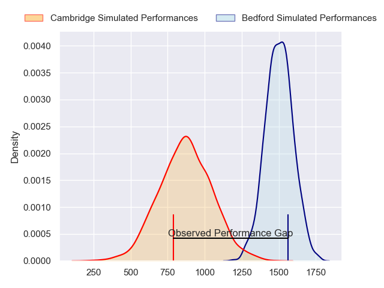
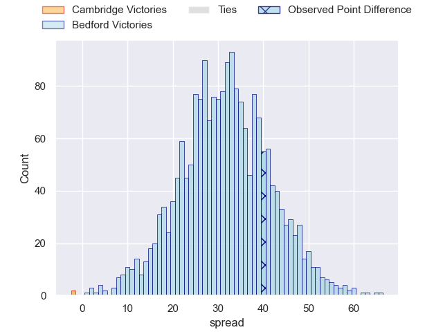
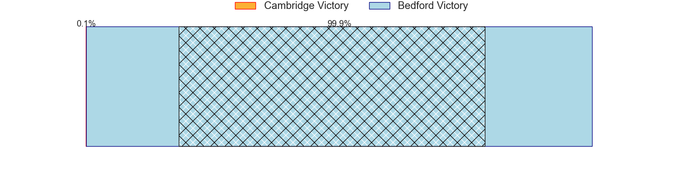

---  
layout: page  
title: Cambridge at Bedford  
date: 2023-11-25 18:00:00 -0500  
categories: "RFU Championship 2023" match review  
---
# Cambridge at Bedford

# Club Level Predictions

The first set of predictions treats a club as the smallest object, as the club develops its members, organizes a gameplan, and deploys its players as needed for each match. This club model has a prediction of 0.961, which translates to predicting Bedford to win by 31.7.

Each club has a rating and a rating deviation (similar to a Glicko rating), and expected performances can be generated. This allows for simulated matches and spreads like the ones below.
## Projected Performances - Club Model

## Projected Spreads - Club Model

## Projected Results - Club Model

