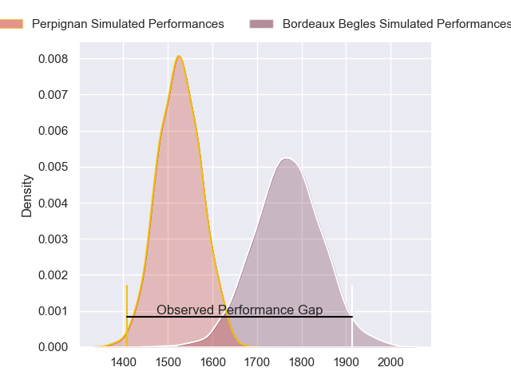
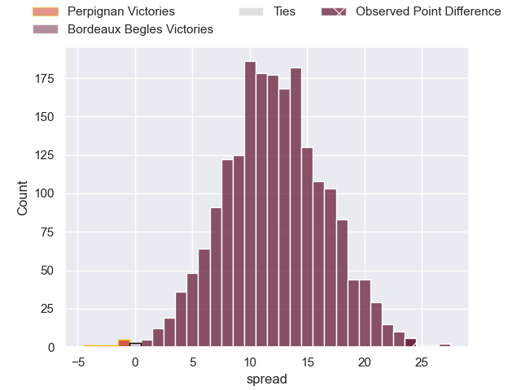
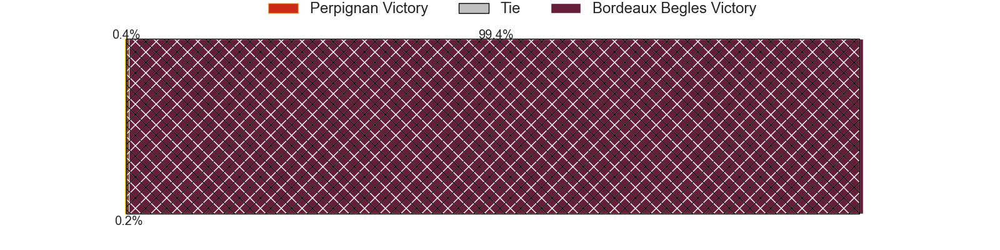
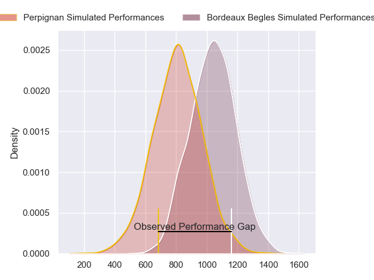
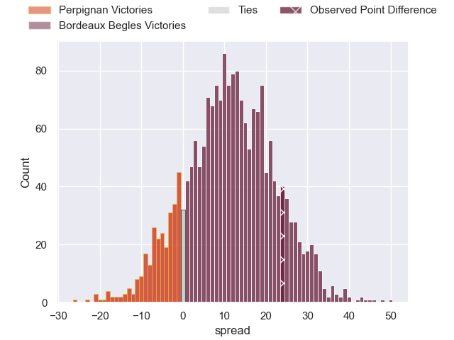
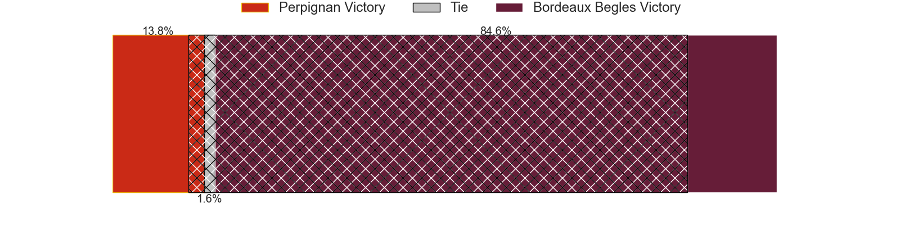
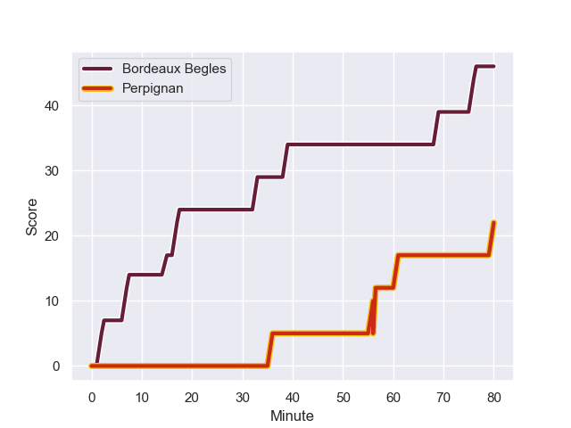
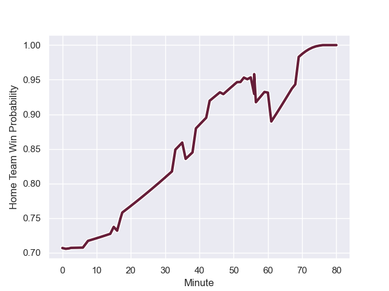

---  
layout: page  
title: Perpignan at Bordeaux Begles; 22-46  
date: 2023-11-25 18:00:00 -0500  
categories: "Top 14 Orange 2023" match review  
---
# Perpignan at Bordeaux Begles; 22-46

# Club Level Predictions

The first set of predictions treats a club as the smallest object, as the club develops its members, organizes a gameplan, and deploys its players as needed for each match. This club model has a prediction of 0.799, which translates to predicting Bordeaux Begles to win by 12.1.

Each club has a rating and a rating deviation (similar to a Glicko rating), and expected performances can be generated. This allows for simulated matches and spreads like the ones below.
## Projected Performances - Club Model

## Projected Spreads - Club Model

## Projected Results - Club Model

# Player Level Predictions - Version 2

Treating teams instead as an entity made up of the currently active players, I have ratings for each player in an altogether different system. These can be combined to form team ratings once teamsheets are announced, weighting starters a bit higher than the reserves. After the match is played, players can be weighted by their minutes on the field, allowing for an accurate measure of the team's composition. With these compiled team ratings, we can make predictions, measure inaccuracy, and update the individual player ratings.
## Prediction with Player Minutes: Bordeaux Begles by 9.7

Bordeaux Begles by 4.9 on a neutral field
## Prediction without Player Minutes: Bordeaux Begles by 11.8

Bordeaux Begles by 7.0 on a neutral pitch

## Projected Performances - Player Model

## Projected Spreads - Player Model

## Projected Results - Player Model

## Scores over Time

## Win Probability over Time

There were 6 large changes in win probability in this match

|   Away Minutes | Away Player           |   Away elo |   Number |   Home elo | Home Player               |   Home Minutes |
|---------------:|:----------------------|-----------:|---------:|-----------:|:--------------------------|---------------:|
|             52 | Giorgi Tetrashvili    |      16.31 |        1 |      67.09 | Lekso Kaulashvili         |             42 |
|             52 | Ignacio Ruiz          |      53.58 |        2 |      25.81 | Romain Laterrade          |             47 |
|             52 | Pietro Ceccarelli     |      45.16 |        3 |      49.45 | Sipili Falatea            |             47 |
|             80 | Tristan Labouteley    |      44.56 |        4 |      64.43 | Guido Petti               |             80 |
|             16 | Mathieu Tanguy        |      23.82 |        5 |      48.34 | Kane Douglas              |             55 |
|             54 | Jacobus van Tonder    |      53.28 |        6 |      56.91 | Mahamadou Diaby           |             80 |
|             80 | Lucas Bachelier       |      64.71 |        7 |      61.32 | Bastien Vergnes Taillefer |             53 |
|             80 | So'otala Fa'aso'o     |      83.02 |        8 |      52.56 | Marko Gazzotti            |             80 |
|             68 | Sadek Deghmache       |      27.66 |        9 |     109.58 | Maxime Lucu               |             52 |
|             43 | Tommaso Allan         |      47.37 |       10 |      99.89 | Matthieu Jalibert         |             54 |
|             80 | Louis Dupichot        |      55.68 |       11 |      60.18 | Louis Bielle-Biarrey      |             80 |
|             80 | Jeronimo de la Fuente |     108.35 |       12 |      55.33 | Yoram Moefana             |             80 |
|             80 | Mathieu Acebes        |      77.05 |       13 |      49.83 | Nicolas Depoortere        |             80 |
|             80 | Tavite Veredamu       |      34.28 |       14 |      85.29 | Damian Penaud             |             60 |
|             80 | Jean Pascal Barraque  |      38.03 |       15 |      90.6  | Romain Buros              |             80 |
|             64 | Posolo Tuilagi        |      39.38 |       16 |      55.03 | Jefferson Poirot          |             38 |
|             37 | Jake McIntyre         |      56.45 |       17 |      85.32 | Ben Tameifuna             |             33 |
|             28 | Sacha Lotrian         |      53.92 |       18 |      50.51 | Maxime Lamothe            |             33 |
|             28 | Nemo Roelofse         |      40.87 |       19 |      16.46 | Paul Abadie               |             28 |
|             28 | Seilala Lam           |      55.95 |       20 |      80.99 | Pete Samu                 |             27 |
|             26 | Patrick Sobela        |      64.53 |       21 |      42.84 | Mateo Garcia              |             26 |
|             12 | Tom Ecochard          |      53.51 |       22 |      26.79 | Thomas Jolmes             |             25 |
|            nan | nan                   |     nan    |       23 |      23.06 | Pablo Uberti              |             20 |

