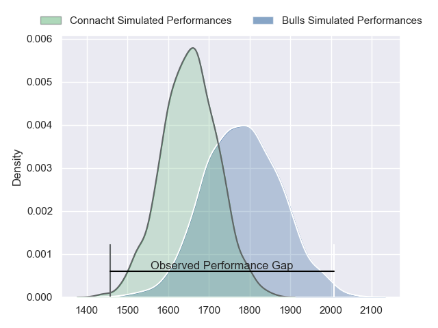
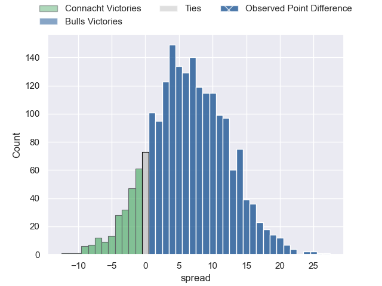
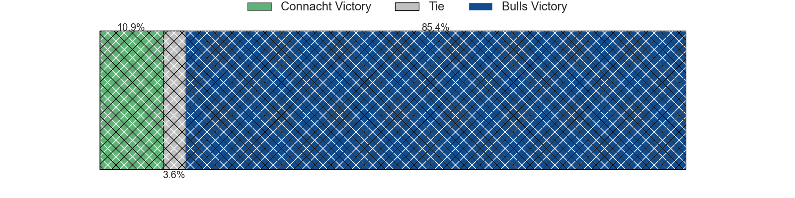
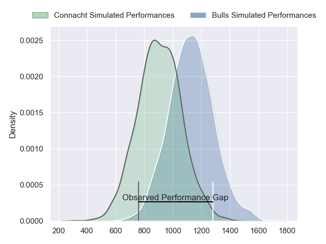
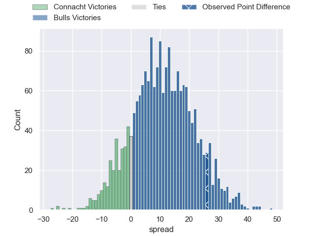
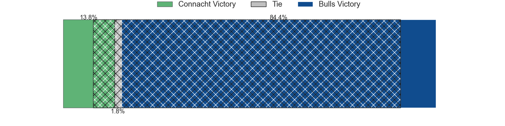
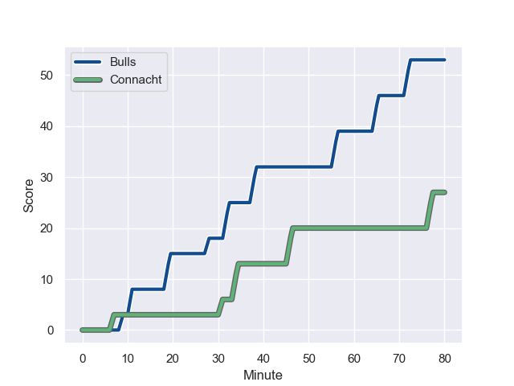
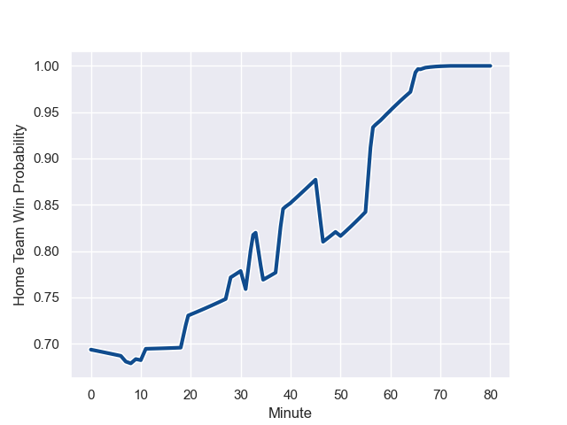

---  
layout: page  
title: Connacht at Bulls; 27-53  
date: 2023-11-25 18:00:00 -0500  
categories: "United Rugby Championship 2023" match review  
---
# Connacht at Bulls; 27-53

# Club Level Predictions

The first set of predictions treats a club as the smallest object, as the club develops its members, organizes a gameplan, and deploys its players as needed for each match. This club model has a prediction of 0.673, which translates to predicting Bulls to win by 6.4.

Each club has a rating and a rating deviation (similar to a Glicko rating), and expected performances can be generated. This allows for simulated matches and spreads like the ones below.
## Projected Performances - Club Model

## Projected Spreads - Club Model

## Projected Results - Club Model

# Player Level Predictions - Version 2

Treating teams instead as an entity made up of the currently active players, I have ratings for each player in an altogether different system. These can be combined to form team ratings once teamsheets are announced, weighting starters a bit higher than the reserves. After the match is played, players can be weighted by their minutes on the field, allowing for an accurate measure of the team's composition. With these compiled team ratings, we can make predictions, measure inaccuracy, and update the individual player ratings.
## Prediction with Player Minutes: Bulls by 9.0

Bulls by 5.2 on a neutral field
## Prediction without Player Minutes: Bulls by 8.4

Bulls by 4.6 on a neutral pitch

## Projected Performances - Player Model

## Projected Spreads - Player Model

## Projected Results - Player Model

## Scores over Time

## Win Probability over Time

There were 5 large changes in win probability in this match

|   Away Minutes | Away Player           |   Away elo |   Number |   Home elo | Home Player             |   Home Minutes |
|---------------:|:----------------------|-----------:|---------:|-----------:|:------------------------|---------------:|
|             61 | Denis Buckley         |      68.82 |        1 |      61    | Gerhard Steenekamp      |             58 |
|             50 | Tadgh McElroy         |      44.97 |        2 |      94.35 | Akker van der Merwe     |             58 |
|             58 | Finlay Bealham        |      89.36 |        3 |     100.92 | Wilco Louw              |             58 |
|             80 | Darragh Murray        |      54.86 |        4 |      31.06 | Reinhardt Ludwig        |             80 |
|             58 | Joe Joyce             |      99.16 |        5 |      54.9  | Ruan Nortje             |             45 |
|             50 | Oisin Dowling         |      50.27 |        6 |      69.69 | Marco van Staden        |             80 |
|             80 | Shamus Hurley-Langton |      49.43 |        7 |      62.34 | Elrigh Louw             |             66 |
|             40 | Sean Jansen           |      43.29 |        8 |      77.69 | Nizaam Carr             |             80 |
|             67 | Colm Reilly           |      48.5  |        9 |      68.37 | Zak Burger              |             58 |
|             61 | Jack Carty            |      82.91 |       10 |      51.06 | Jaco van der Walt       |             66 |
|             80 | Diarmuid Kilgallen    |      59.26 |       11 |      72.23 | Sergeal Petersen        |             80 |
|             80 | Cathal Forde          |      51.8  |       12 |      59.02 | David Kriel             |             80 |
|             80 | David Hawkshaw        |      58.73 |       13 |      51.96 | Stedman-Gee Rivett Gans |             58 |
|             80 | Byron Ralston         |      43.57 |       14 |      93.19 | Sebastian de Klerk      |             80 |
|             80 | Tiernan O'Halloran    |      65.96 |       15 |     105.07 | Willie le Roux          |             80 |
|             40 | Sean F O'Brien        |      45.67 |       16 |      54.97 | Janko Swanepoel         |             35 |
|             30 | Dylan Tierney-Martin  |      56.17 |       17 |      26.26 | Jan Hendrik Wessels     |             22 |
|             30 | Conor Oliver          |      64.51 |       18 |     121.6  | Canan Moodie            |             22 |
|             22 | Niall Murray          |      66.15 |       19 |      53.67 | Simphiwe Matanzima      |             22 |
|             22 | Sam Illo              |      47.98 |       20 |      52.4  | Mornay Smith            |             22 |
|             19 | Peter Dooley          |      96.72 |       21 |      76.4  | Embrose Papier          |             22 |
|             19 | JJ Hanrahan           |      84.98 |       22 |      25.37 | Cyle Brink              |             14 |
|             13 | Caolin Blade          |      52.11 |       23 |      50.27 | Chris Smith             |             14 |

