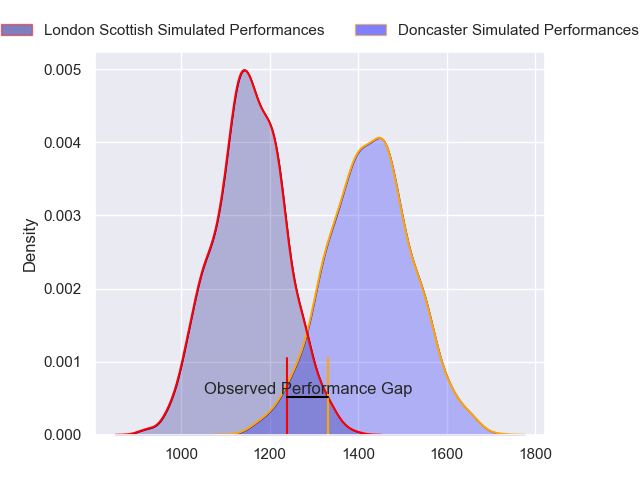
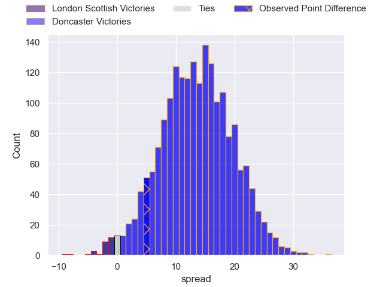
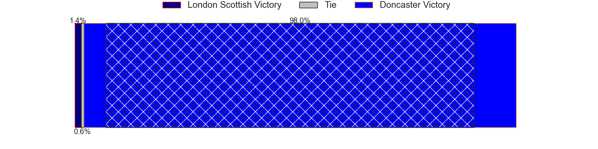
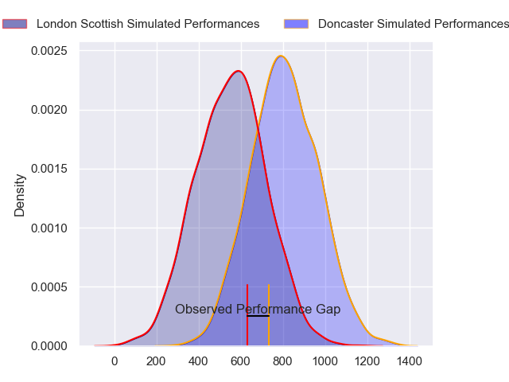
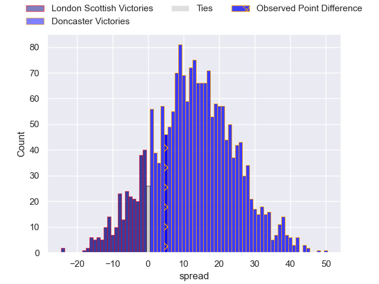
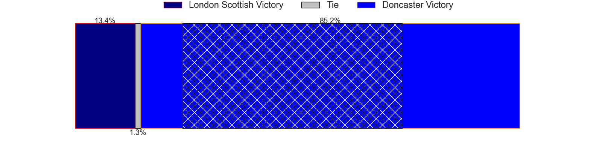
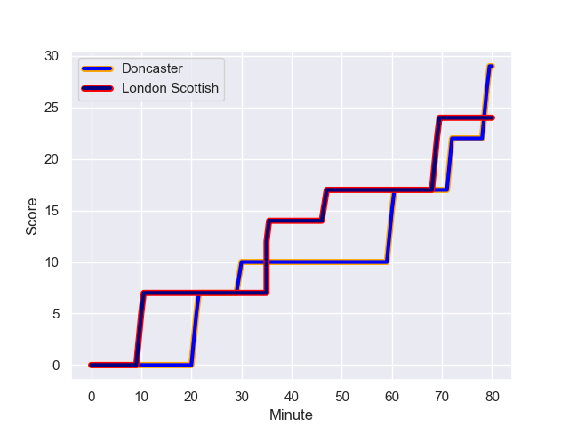
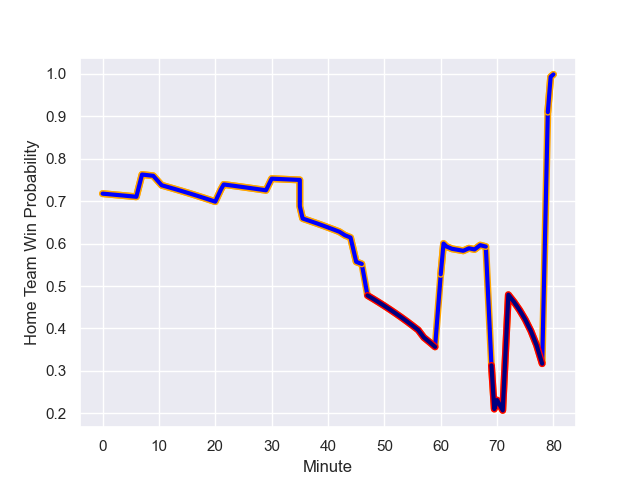

---  
layout: page  
title: London Scottish at Doncaster; 24-29  
date: 2023-11-25 18:00:00 -0500  
categories: "RFU Championship 2023" match review  
---
# London Scottish at Doncaster; 24-29

# Club Level Predictions

The first set of predictions treats a club as the smallest object, as the club develops its members, organizes a gameplan, and deploys its players as needed for each match. This club model has a prediction of 0.815, which translates to predicting Doncaster to win by 13.3.

Each club has a rating and a rating deviation (similar to a Glicko rating), and expected performances can be generated. This allows for simulated matches and spreads like the ones below.
## Projected Performances - Club Model

## Projected Spreads - Club Model

## Projected Results - Club Model

# Player Level Predictions - Version 2

Treating teams instead as an entity made up of the currently active players, I have ratings for each player in an altogether different system. These can be combined to form team ratings once teamsheets are announced, weighting starters a bit higher than the reserves. After the match is played, players can be weighted by their minutes on the field, allowing for an accurate measure of the team's composition. With these compiled team ratings, we can make predictions, measure inaccuracy, and update the individual player ratings.
## Prediction with Player Minutes: Doncaster by 10.3

Doncaster by 7.0 on a neutral field
## Prediction without Player Minutes: Doncaster by 9.5

Doncaster by 6.1 on a neutral pitch

## Projected Performances - Player Model

## Projected Spreads - Player Model

## Projected Results - Player Model

## Scores over Time

## Win Probability over Time

There were 17 large changes in win probability in this match

|   Away Minutes | Away Player           |   Away elo |   Number |   Home elo | Home Player              |   Home Minutes |
|---------------:|:----------------------|-----------:|---------:|-----------:|:-------------------------|---------------:|
|             57 | George Cave           |      27.54 |        1 |      55.23 | Harrison Courtney        |             45 |
|             80 | Jack Musk             |      48.81 |        2 |      53.98 | Harri Morris             |             43 |
|             61 | Ashley Challenger     |      37.61 |        3 |      93.45 | Lewis Thiede             |             45 |
|             70 | Jonny Green           |      41.06 |        4 |      27.07 | Ehize Ehizode            |             80 |
|             80 | Harry Browne          |      46.65 |        5 |      48.7  | Adam Hopkinson           |             45 |
|             80 | Bailey Ransom         |      58.01 |        6 |      37.74 | Harry Wilson             |             80 |
|             62 | Jack Ingall           |      25.82 |        7 |      49.09 | Rhys Tait                |             65 |
|             80 | Will Trenholm         |      37.52 |        8 |      61.48 | Jack Digby               |             80 |
|             65 | Lewis Gjaltema        |      44.91 |        9 |       7.88 | Ollie Fox                |             67 |
|             80 | Alexander Lloyd-Seed  |      43.68 |       10 |      36.62 | Sam Olver                |             67 |
|             57 | Will Brown            |      68.11 |       11 |      53.33 | Westleigh Alleyne Holden |             80 |
|             80 | Robert David McCallum |      24.82 |       12 |      33.54 | Connor Edwards           |             80 |
|             80 | Ben Waghorn           |      41.06 |       13 |      61.94 | Joe Margetts             |             80 |
|              7 | Luke Mehson           |      43.8  |       14 |      50.3  | George Simpson           |             80 |
|             80 | Cameron Anderson      |      21.01 |       15 |      74.43 | Russell Bennett          |             80 |
|             73 | Noah Ferdinand        |     -20.84 |       16 |      49.52 | George Roberts           |             37 |
|             23 | Will Prior            |      55.27 |       17 |      42.89 | Corrie Barrett           |             35 |
|             23 | Connor Slevin         |      52.9  |       18 |      36.03 | Conor Davidson           |             35 |
|             19 | William Hobson        |      48.71 |       19 |      43.85 | Fyn Brown                |             35 |
|             18 | Tom Marshall          |      32.25 |       20 |      50.1  | Archie Smeaton           |             15 |
|             15 | Stephen Kerins        |      27.74 |       21 |      66.89 | Alex Dolly               |             13 |
|             10 | Zach Carr             |      46.65 |       22 |      67.94 | Billy McBryde            |             13 |

