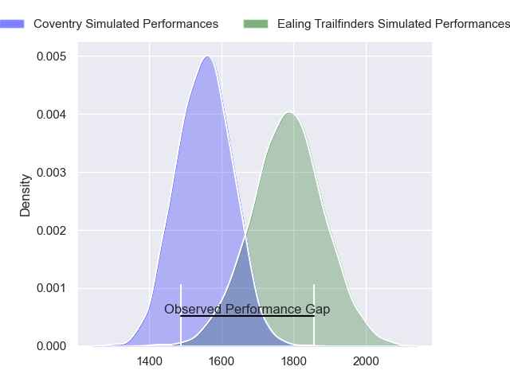
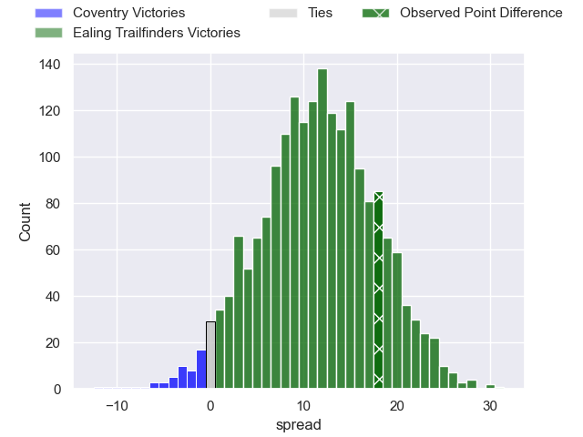
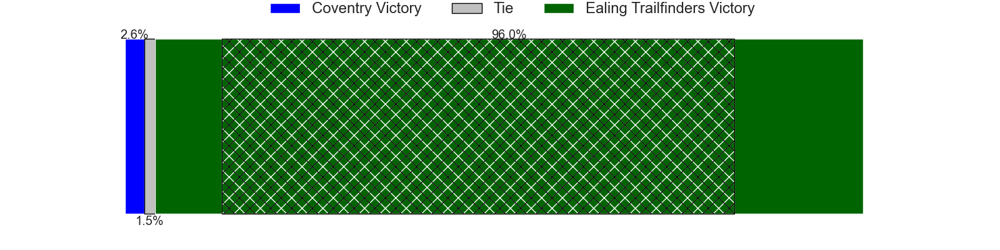
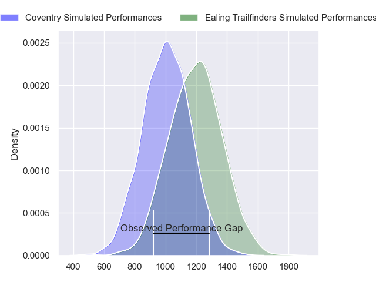
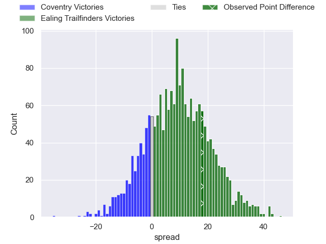
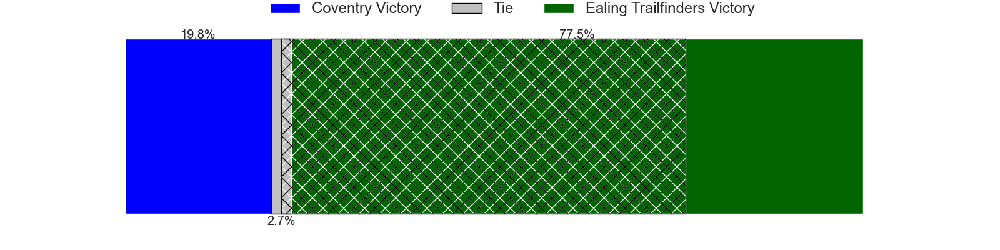
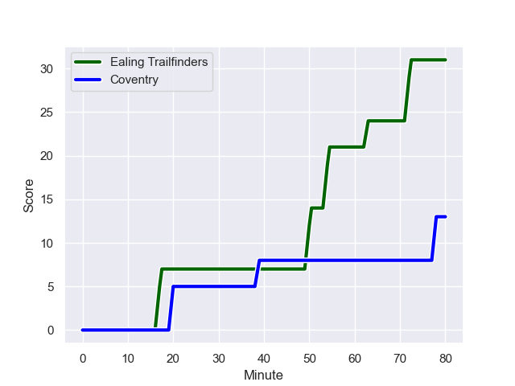
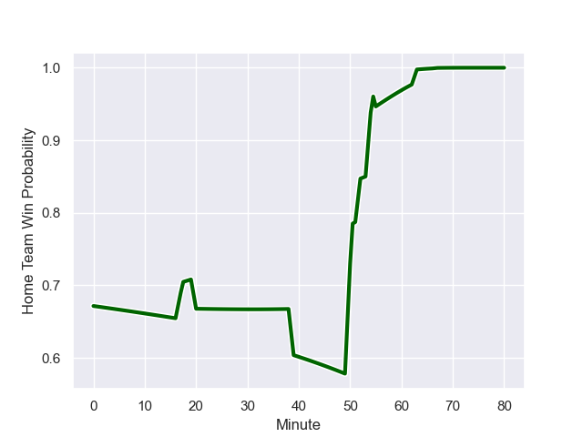

---  
layout: page  
title: Coventry at Ealing Trailfinders; 13-31  
date: 2023-11-25 18:00:00 -0500  
categories: "RFU Championship 2023" match review  
---
# Coventry at Ealing Trailfinders; 13-31

# Club Level Predictions

The first set of predictions treats a club as the smallest object, as the club develops its members, organizes a gameplan, and deploys its players as needed for each match. This club model has a prediction of 0.782, which translates to predicting Ealing Trailfinders to win by 11.4.

Each club has a rating and a rating deviation (similar to a Glicko rating), and expected performances can be generated. This allows for simulated matches and spreads like the ones below.
## Projected Performances - Club Model

## Projected Spreads - Club Model

## Projected Results - Club Model

# Player Level Predictions - Version 2

Treating teams instead as an entity made up of the currently active players, I have ratings for each player in an altogether different system. These can be combined to form team ratings once teamsheets are announced, weighting starters a bit higher than the reserves. After the match is played, players can be weighted by their minutes on the field, allowing for an accurate measure of the team's composition. With these compiled team ratings, we can make predictions, measure inaccuracy, and update the individual player ratings.
## Prediction with Player Minutes: Ealing Trailfinders by 7.9

Ealing Trailfinders by 4.5 on a neutral field
## Prediction without Player Minutes: Ealing Trailfinders by 6.3

Ealing Trailfinders by 3.0 on a neutral pitch

## Projected Performances - Player Model

## Projected Spreads - Player Model

## Projected Results - Player Model

## Scores over Time

## Win Probability over Time

There were 7 large changes in win probability in this match

|   Away Minutes | Away Player        |   Away elo |   Number |   Home elo | Home Player          |   Home Minutes |
|---------------:|:-------------------|-----------:|---------:|-----------:|:---------------------|---------------:|
|             63 | Arthur Cordwell    |      49.38 |        1 |      34.02 | Will Goodrick-Clarke |             63 |
|             63 | Jordon Poole       |      67.21 |        2 |      53.32 | Mike Willemse        |             55 |
|             52 | Eliot Salt         |      47.97 |        3 |      77.47 | Biyi Alo             |             55 |
|             80 | James Tyas         |      44.67 |        4 |      82.12 | Bobby de Wee         |             80 |
|             52 | Obinna Nkwocha     |      48.44 |        5 |      45.83 | Andrew Davidson      |             55 |
|             55 | Tom Ball           |      81.81 |        6 |      37.74 | Callum Chick         |             45 |
|             80 | Matt Kvesic        |      41.41 |        7 |      43.21 | Richard Hardwick     |             73 |
|             58 | Senitiki Nayalo    |      93.49 |        8 |     121.9  | Ryan Smid            |             80 |
|             67 | Will Chudley       |     143.38 |        9 |      73.74 | Craig Hampson        |             77 |
|             80 | Patrick Pellegrini |      87.82 |       10 |     116.17 | Craig Willis         |             80 |
|             80 | James Martin       |      81.2  |       11 |      95.96 | Tom Collins          |             80 |
|             80 | Will Rigg          |      94.31 |       12 |      76.16 | Billy Twelvetrees    |             77 |
|             80 | Will Wand          |      66.43 |       13 |      60.94 | Reuben Bird-Tulloch  |             80 |
|             80 | Ryan Hutler        |      48.28 |       14 |      71.27 | Jonah Holmes         |             80 |
|             67 | Tobi Wilson        |      51.84 |       15 |     103.65 | Cian Kelleher        |             80 |
|             28 | George Smith       |      51.19 |       16 |      56.11 | Ollie Newman         |             35 |
|             28 | Callum Ford        |      46.65 |       17 |      50.1  | Ross Kane            |             25 |
|             25 | Paddy Ryan         |      43.47 |       18 |      49.33 | Matthew Cornish      |             25 |
|             22 | Evan Mitchell      |      43.98 |       19 |      89.09 | Barney Maddison      |             25 |
|             17 | Johnny Stewart     |      45.52 |       20 |      65    | Kyle John Whyte      |             17 |
|             17 | Danny Southworth   |      52.71 |       21 |      86.05 | Simon Uzokwe         |              7 |
|             13 | Will Lane          |      61.55 |       22 |      75.39 | Jordan Burns         |              3 |
|             13 | Jack Bartlett      |      51.92 |       23 |      64.74 | Max Bodilly          |              3 |

