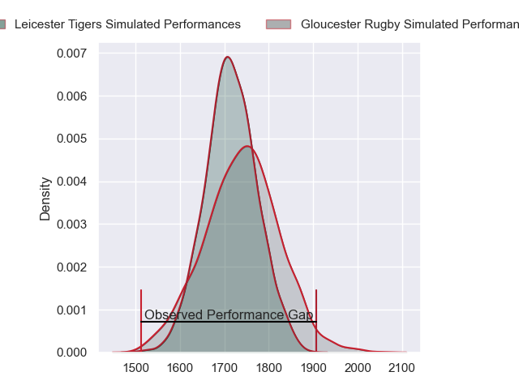
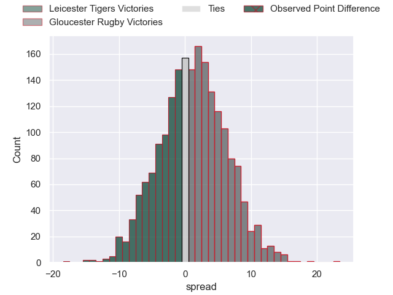
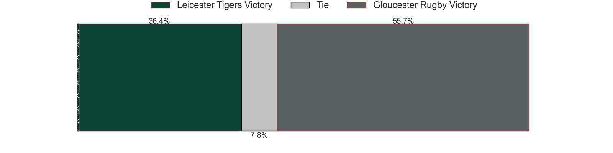
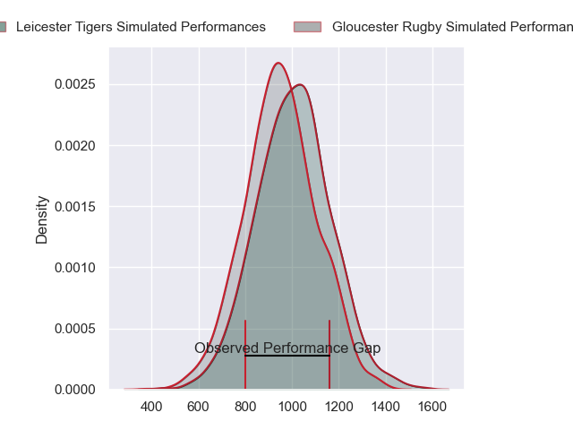
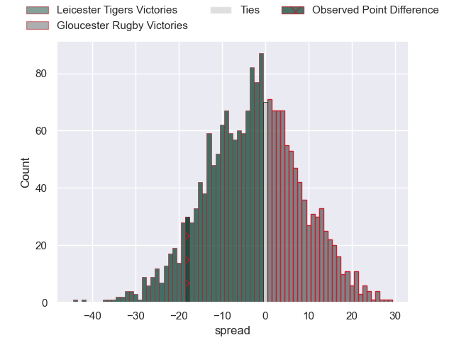
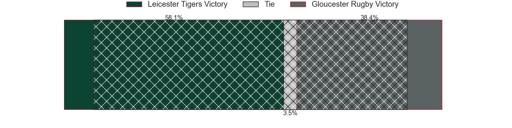
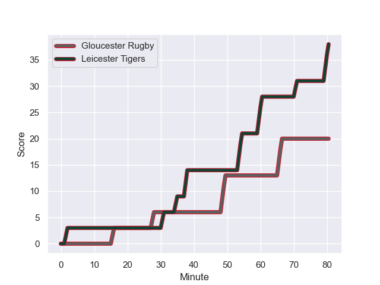
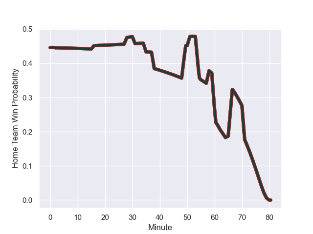

---  
layout: page  
title: Leicester Tigers at Gloucester Rugby; 38-20  
date: 2023-11-25 18:00:00 -0500  
categories: "Gallagher Premiership 2023" match review  
---
# Leicester Tigers at Gloucester Rugby; 38-20

# Club Level Predictions

The first set of predictions treats a club as the smallest object, as the club develops its members, organizes a gameplan, and deploys its players as needed for each match. This club model has a prediction of 0.533, which translates to predicting Gloucester Rugby to win by 1.2.

Each club has a rating and a rating deviation (similar to a Glicko rating), and expected performances can be generated. This allows for simulated matches and spreads like the ones below.
## Projected Performances - Club Model

## Projected Spreads - Club Model

## Projected Results - Club Model

# Player Level Predictions - Version 2

Treating teams instead as an entity made up of the currently active players, I have ratings for each player in an altogether different system. These can be combined to form team ratings once teamsheets are announced, weighting starters a bit higher than the reserves. After the match is played, players can be weighted by their minutes on the field, allowing for an accurate measure of the team's composition. With these compiled team ratings, we can make predictions, measure inaccuracy, and update the individual player ratings.
## Prediction with Player Minutes: Leicester Tigers by 2.4

Leicester Tigers by 7.4 on a neutral field
## Prediction without Player Minutes: Leicester Tigers by 4.2

Leicester Tigers by 9.2 on a neutral pitch

## Projected Performances - Player Model

## Projected Spreads - Player Model

## Projected Results - Player Model

## Scores over Time

## Win Probability over Time

There were 13 large changes in win probability in this match

|   Away Minutes | Away Player           |   Away elo |   Number |   Home elo | Home Player          |   Home Minutes |
|---------------:|:----------------------|-----------:|---------:|-----------:|:---------------------|---------------:|
|             67 | James Cronin          |      68.98 |        1 |      34.93 | Mayco Vivas          |             62 |
|             58 | Julian Montoya        |      88.35 |        2 |      54.41 | George McGuigan      |             55 |
|             51 | Joe Heyes             |      58.5  |        3 |      43.28 | Fraser Balmain       |             62 |
|             65 | Cameron Henderson     |      57.85 |        4 |      38.64 | Freddie Clarke       |             62 |
|             65 | Cameron Henderson     |      57.85 |        4 |      38.64 | Freddie Clarke       |             62 |
|             80 | Ollie Chessum         |      58.39 |        5 |      59.06 | Matias Alemanno      |             80 |
|             80 | Hanro Liebenberg      |      75.23 |        6 |      38.01 | Freddie Thomas       |             62 |
|             68 | Tommy Reffell         |      61.14 |        7 |      42.26 | Lewis Ludlow         |             80 |
|             80 | Jasper Wiese          |      79.42 |        8 |      41.76 | Jack Clement         |             80 |
|             78 | Ben Youngs            |      68.1  |        9 |      65.75 | Michael Young        |             67 |
|             80 | Handre Pollard        |      99.15 |       10 |      49.42 | George Barton        |             80 |
|             80 | Ollie Hassell-Collins |      61.95 |       11 |      73.12 | Ollie Thorley        |             52 |
|             51 | Dan Kelly             |      71.16 |       12 |      20.69 | Sebastien Atkinson   |             51 |
|             80 | Matt Scott            |      67    |       13 |      69.56 | Chris Harris         |             80 |
|             80 | Josh Bassett          |      69.32 |       14 |      84.58 | Louis Rees-Zammit    |             80 |
|             78 | Freddie Steward       |      56.19 |       15 |      78.76 | Santiago Carreras    |             80 |
|             13 | James Whitcombe       |      44.81 |       16 |      34.47 | Harry Elrington      |             18 |
|             22 | Charlie Clare         |      23.44 |       17 |      48.08 | Santiago Socino      |             25 |
|             29 | Dan Cole              |      49.04 |       18 |      14.63 | Jamal Ford-Robinson  |             18 |
|             15 | Harry Wells           |      62.12 |       19 |      38.64 | Freddie Clarke       |             18 |
|             15 | Harry Wells           |      62.12 |       19 |      38.64 | Freddie Clarke       |             18 |
|             12 | Matt Rogerson         |      79.19 |       20 |      51.47 | Ben Donnell          |             18 |
|              2 | Tom Whiteley          |      35.87 |       21 |      39.56 | Charlie Chapman      |             13 |
|             29 | Solomone Kata         |      46.78 |       22 |      46.65 | Louis Hillman-Cooper |             28 |
|              2 | James Shillcock       |      28.04 |       23 |      64.55 | Mark Atkinson        |             29 |

