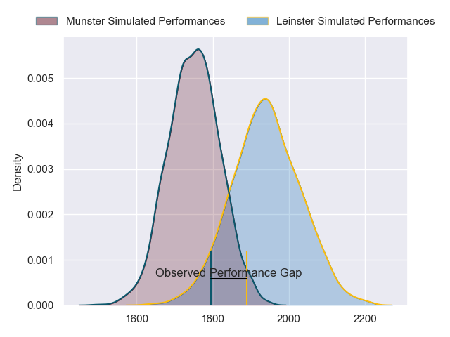
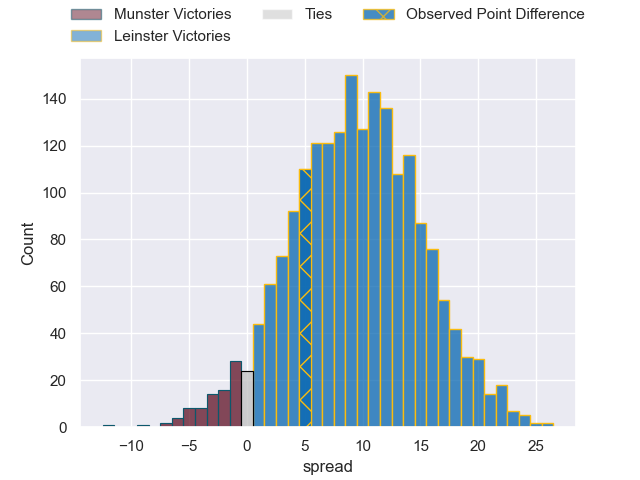
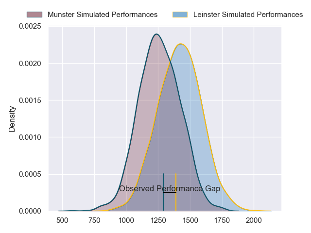
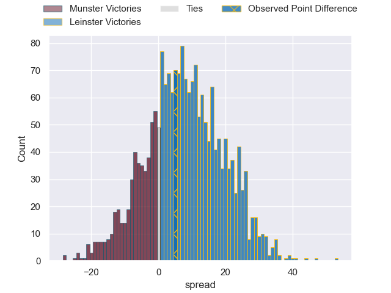
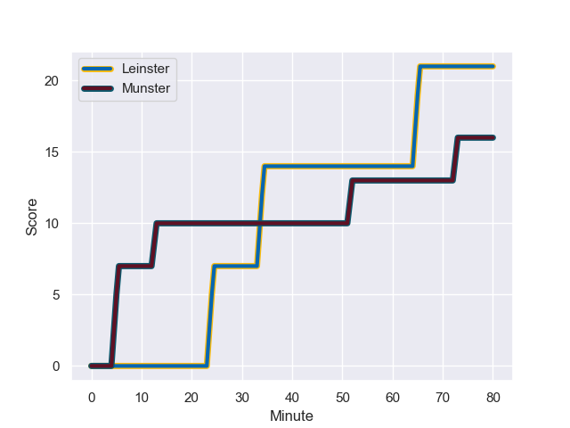
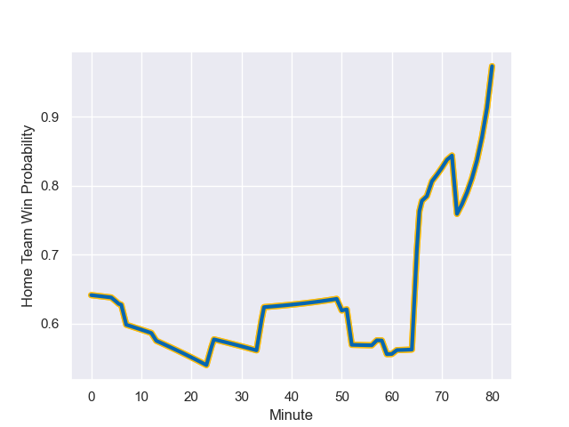

---  
layout: page  
title: Munster at Leinster; 16-21  
date: 2023-11-25 18:00:00 -0500  
categories: "United Rugby Championship 2023" match review  
---
# Munster at Leinster; 16-21

# Club Level Predictions

The first set of predictions treats a club as the smallest object, as the club develops its members, organizes a gameplan, and deploys its players as needed for each match. This club model has a prediction of 0.74, which translates to predicting Leinster to win by 9.3.

Each club has a rating and a rating deviation (similar to a Glicko rating), and expected performances can be generated. This allows for simulated matches and spreads like the ones below.
## Projected Performances - Club Model

## Projected Spreads - Club Model

## Projected Results - Club Model

# Player Level Predictions - Version 2

Treating teams instead as an entity made up of the currently active players, I have ratings for each player in an altogether different system. These can be combined to form team ratings once teamsheets are announced, weighting starters a bit higher than the reserves. After the match is played, players can be weighted by their minutes on the field, allowing for an accurate measure of the team's composition. With these compiled team ratings, we can make predictions, measure inaccuracy, and update the individual player ratings.
## Prediction with Player Minutes: Leinster by 6.4

Leinster by 2.0 on a neutral field
## Prediction without Player Minutes: Leinster by 7.3

Leinster by 2.9 on a neutral pitch

## Projected Performances - Player Model

## Projected Spreads - Player Model

## Projected Results - Player Model

## Scores over Time

## Win Probability over Time

There were 11 large changes in win probability in this match

|   Away Minutes | Away Player     |   Away elo |   Number |   Home elo | Home Player         |   Home Minutes |
|---------------:|:----------------|-----------:|---------:|-----------:|:--------------------|---------------:|
|             52 | Jeremy Loughman |      83.52 |        1 |      76.93 | Andrew Porter       |             72 |
|             80 | Diarmuid Barron |      78.63 |        2 |      56.48 | Dan Sheehan         |             59 |
|             57 | Stephen Archer  |     101.73 |        3 |      90.86 | Tadhg Furlong       |             59 |
|             68 | Jean Kleyn      |     106.96 |        4 |      47.33 | Joe McCarthy        |             80 |
|             80 | Tadhg Beirne    |     134.57 |        5 |      91.47 | James Ryan          |             67 |
|             80 | Thomas Ahern    |      57.96 |        6 |     108.58 | Jack Conan          |             80 |
|             61 | John Hodnett    |      72.24 |        7 |     118.56 | Josh van der Flier  |             59 |
|             80 | Gavin Coombes   |      74.9  |        8 |     107.72 | Caelan Doris        |             79 |
|             50 | Craig Casey     |      68.98 |        9 |     114.59 | Jamison Gibson-Park |             72 |
|             80 | Jack Crowley    |      56.86 |       10 |      94.58 | Ross Byrne          |              7 |
|             80 | Shane Daly      |      94.24 |       11 |      77.26 | Jimmy O'Brien       |             80 |
|             72 | Rory Scannell   |     102.35 |       12 |      93.22 | Robbie Henshaw      |             80 |
|             80 | Antoine Frisch  |      68.08 |       13 |     114.06 | Garry Ringrose      |             80 |
|             80 | Calvin Nash     |      86.61 |       14 |      67.94 | Jordan Larmour      |             80 |
|             66 | Simon Zebo      |      91.3  |       15 |     116.71 | Hugo Keenan         |             80 |
|             30 | Conor Murray    |     112.29 |       16 |      53.61 | Ciaran Frawley      |             73 |
|             23 | John Ryan       |      82.36 |       17 |      72.92 | Michael Ala'alatoa  |             21 |
|             28 | Dave Kilcoyne   |      82.16 |       18 |      77.29 | Ronan Kelleher      |             21 |
|             19 | Alex Kendellen  |      56.7  |       19 |      83.11 | Ross Molony         |             13 |
|             14 | Shay McCarthy   |      45.13 |       20 |      43    | Ben Murphy          |              8 |
|             12 | Brian Gleeson   |      46.69 |       21 |      46.48 | Jack Boyle          |              8 |
|              8 | Tony Butler     |      46.65 |       22 |      34.65 | James Culhane       |              1 |
|            nan | nan             |     nan    |       23 |      61.87 | Scott Penny         |             21 |

