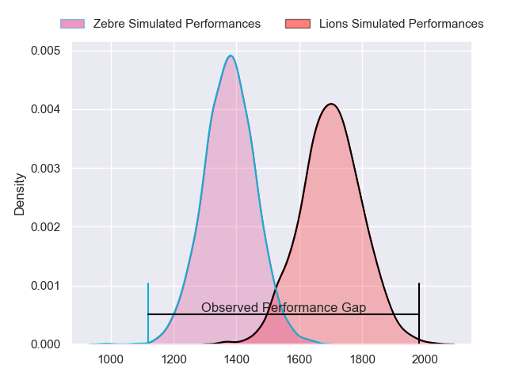
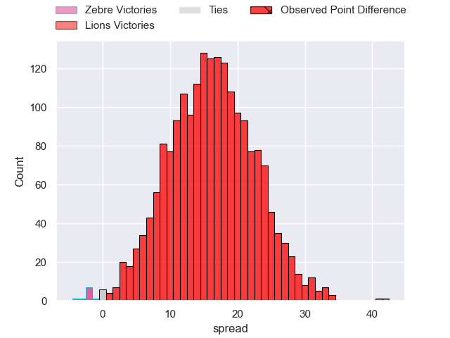
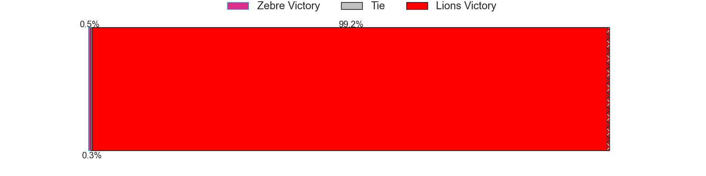
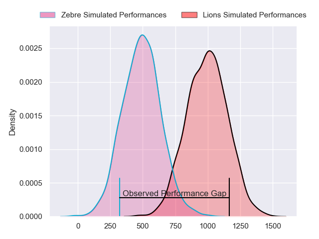
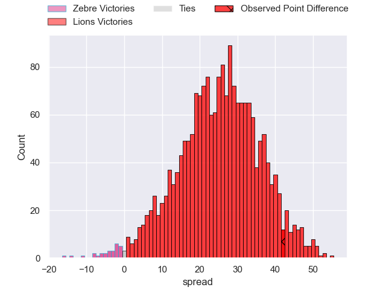
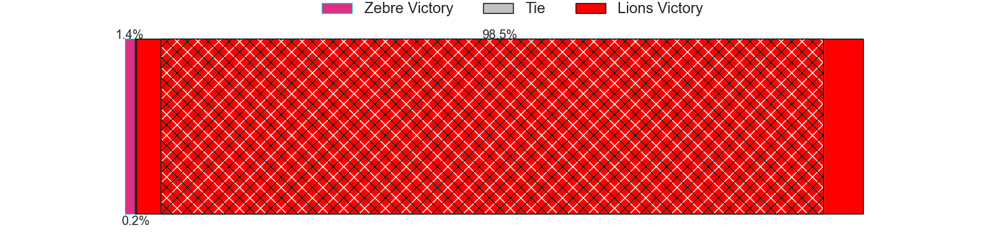
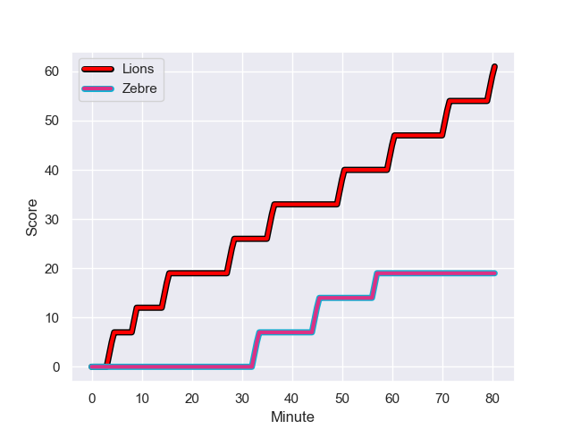
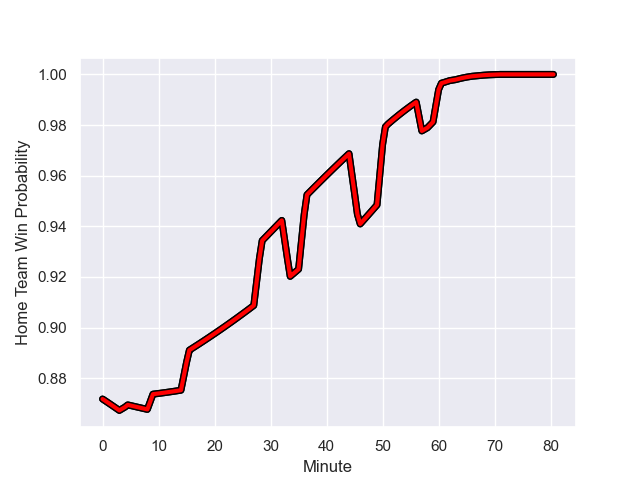

---  
layout: page  
title: Zebre at Lions; 19-61  
date: 2023-11-25 18:00:00 -0500  
categories: "United Rugby Championship 2023" match review  
---
# Zebre at Lions; 19-61

# Club Level Predictions

The first set of predictions treats a club as the smallest object, as the club develops its members, organizes a gameplan, and deploys its players as needed for each match. This club model has a prediction of 0.857, which translates to predicting Lions to win by 16.0.

Each club has a rating and a rating deviation (similar to a Glicko rating), and expected performances can be generated. This allows for simulated matches and spreads like the ones below.
## Projected Performances - Club Model

## Projected Spreads - Club Model

## Projected Results - Club Model

# Player Level Predictions - Version 2

Treating teams instead as an entity made up of the currently active players, I have ratings for each player in an altogether different system. These can be combined to form team ratings once teamsheets are announced, weighting starters a bit higher than the reserves. After the match is played, players can be weighted by their minutes on the field, allowing for an accurate measure of the team's composition. With these compiled team ratings, we can make predictions, measure inaccuracy, and update the individual player ratings.
## Prediction with Player Minutes: Lions by 21.0

Lions by 17.4 on a neutral field
## Prediction without Player Minutes: Lions by 20.9

Lions by 17.2 on a neutral pitch

## Projected Performances - Player Model

## Projected Spreads - Player Model

## Projected Results - Player Model

## Scores over Time

## Win Probability over Time

|   Away Minutes | Away Player            |   Away elo |   Number |   Home elo | Home Player           |   Home Minutes |
|---------------:|:-----------------------|-----------:|---------:|-----------:|:----------------------|---------------:|
|             61 | Danilo Fischetti       |      44.57 |        1 |      54.39 | Jean-Pierre Smith     |             51 |
|             51 | Marco Manfredi         |      14.95 |        2 |      42.29 | PJ Botha              |             51 |
|             58 | Juan Manuel Pitinari   |      37.05 |        3 |      26.67 | Asenathi Ntlabakanye  |             51 |
|             80 | Leonard Krumov         |      -5.2  |        4 |      42.09 | Ruan Delport          |             80 |
|             80 | Andrea Zambonin        |      37.78 |        5 |      77.59 | Ruben Schoeman        |             55 |
|             51 | Giacomo Ferrari        |      45.67 |        6 |      46    | Emmanuel Tshituka     |             80 |
|             58 | Iacopo Bianchi         |      12.1  |        7 |      77.13 | Ruan Venter           |             53 |
|             80 | Giovanni Licata        |      38.82 |        8 |     103.66 | Francke Horn          |             80 |
|             80 | Gonzalo Jesus Garcia   |      25.25 |        9 |      37.49 | Morne Van den Berg    |             80 |
|             67 | Giovanni Montemauri    |       7.73 |       10 |      89.87 | Sanele Nohamba        |             80 |
|             80 | Simone Gesi            |      12.56 |       11 |      69.64 | Edwill van der Merwe  |             80 |
|             46 | Franco Smith           |      39.65 |       12 |      78.54 | Marius Louw           |             63 |
|             80 | Luca Morisi            |      84.79 |       13 |      56.68 | Henco van Wyk         |             69 |
|             51 | Scott Gregory          |      52.22 |       14 |      31.8  | Richard Kriel         |             80 |
|             80 | Lorenzo Pani           |      25.99 |       15 |      76.09 | Quan Horn             |             61 |
|             34 | Geronimo Prisciantelli |      70.1  |       16 |      79.93 | Corne Fourie          |             29 |
|             29 | Giampietro Ribaldi     |      37.48 |       17 |      49.93 | Jaco Visagie          |             29 |
|             29 | Jacopo Trulla          |      13.47 |       18 |      61.01 | Ruan Smith            |             29 |
|             29 | Guido Volpi            |      54.17 |       19 |      82.89 | Hanru Sirgel          |             27 |
|             22 | Matteo Nocera          |       7.14 |       20 |      41.35 | Willem Alberts        |             25 |
|             22 | Taina Fox-Matamua      |      55.02 |       21 |      57.88 | Johannes JC Pretorius |             19 |
|             19 | Luca Rizzoli           |      33.17 |       22 |      40.58 | Jordan Hendrikse      |             17 |
|             13 | Thomas Dominguez       |      46.72 |       23 |      53.04 | Rabz Maxwane          |             11 |

