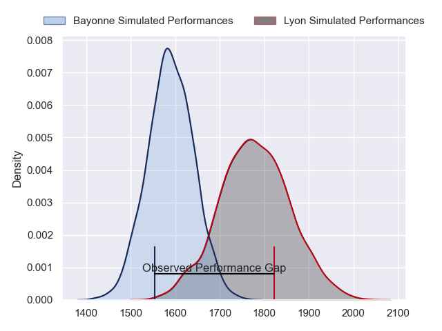
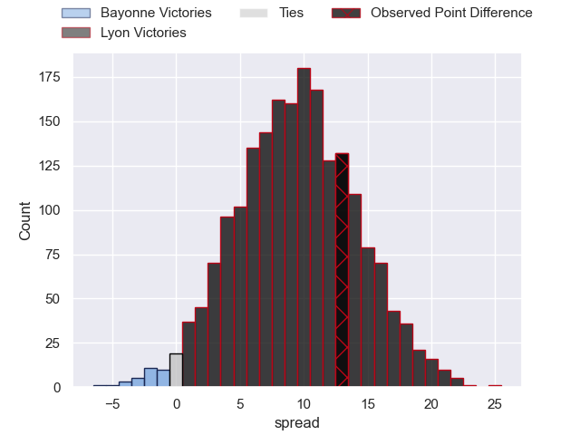
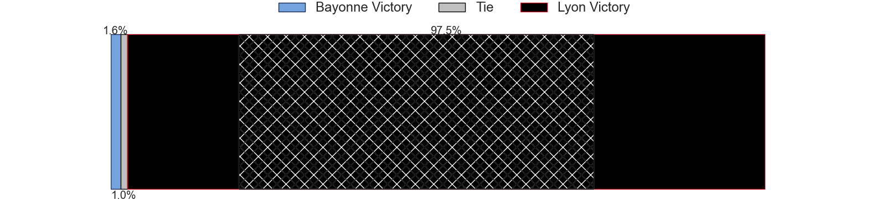
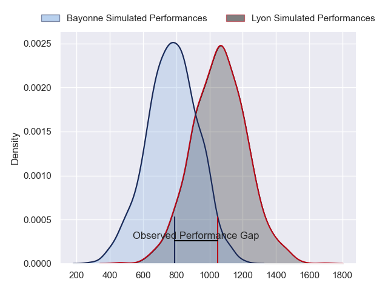
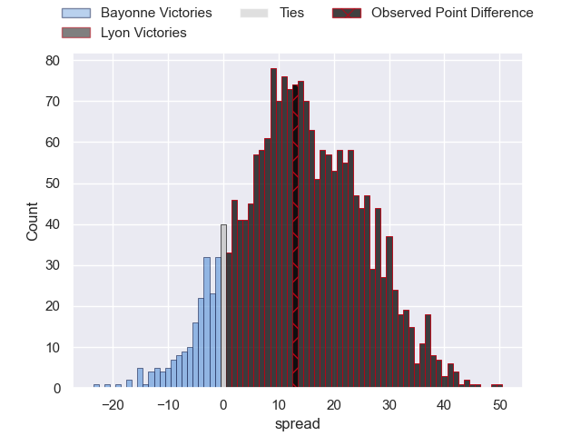
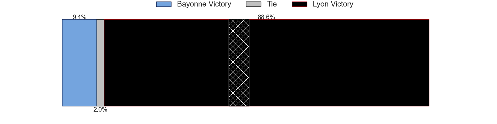
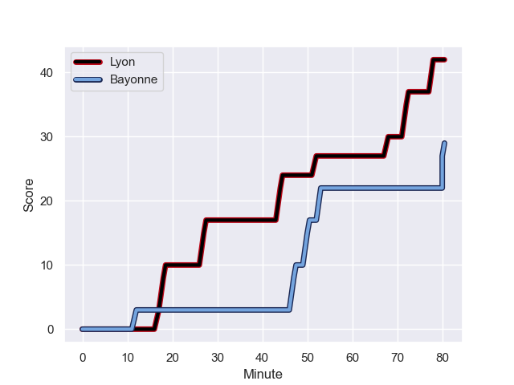
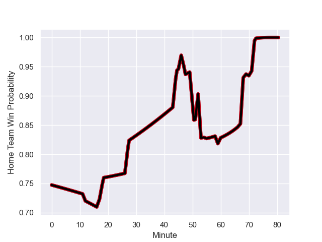

---  
layout: page  
title: Bayonne at Lyon; 29-42  
date: 2023-11-25 18:00:00 -0500  
categories: "Top 14 Orange 2023" match review  
---
# Bayonne at Lyon; 29-42

# Club Level Predictions

The first set of predictions treats a club as the smallest object, as the club develops its members, organizes a gameplan, and deploys its players as needed for each match. This club model has a prediction of 0.743, which translates to predicting Lyon to win by 9.3.

Each club has a rating and a rating deviation (similar to a Glicko rating), and expected performances can be generated. This allows for simulated matches and spreads like the ones below.
## Projected Performances - Club Model

## Projected Spreads - Club Model

## Projected Results - Club Model

# Player Level Predictions - Version 2

Treating teams instead as an entity made up of the currently active players, I have ratings for each player in an altogether different system. These can be combined to form team ratings once teamsheets are announced, weighting starters a bit higher than the reserves. After the match is played, players can be weighted by their minutes on the field, allowing for an accurate measure of the team's composition. With these compiled team ratings, we can make predictions, measure inaccuracy, and update the individual player ratings.
## Prediction with Player Minutes: Lyon by 11.9

Lyon by 7.2 on a neutral field
## Prediction without Player Minutes: Lyon by 10.5

Lyon by 5.8 on a neutral pitch

## Projected Performances - Player Model

## Projected Spreads - Player Model

## Projected Results - Player Model

## Scores over Time

## Win Probability over Time

There were 9 large changes in win probability in this match

|   Away Minutes | Away Player             |   Away elo |   Number |   Home elo | Home Player           |   Home Minutes |
|---------------:|:------------------------|-----------:|---------:|-----------:|:----------------------|---------------:|
|             77 | Matis Perchaud          |      31.92 |        1 |      36.33 | Sebastien Taofifenua  |             50 |
|             67 | Facundo Bosch           |      67.99 |        2 |      39.21 | Guillaume Marchand    |             60 |
|             47 | Tevita Tatafu           |      40.99 |        3 |      86.77 | Demba Bamba           |             50 |
|             80 | Thomas Ceyte            |      39.12 |        4 |      70.5  | Felix Lambey          |             80 |
|             46 | Lucas Paulos            |      58.53 |        5 |      52.19 | Romain Taofifenua     |             80 |
|             80 | Remi Bourdeau           |      84.43 |        6 |      47.1  | Liam Allen            |             55 |
|             46 | Baptiste Heguy          |      66.95 |        7 |      80.58 | Beka Saghinadze       |             80 |
|             46 | Rodrigo Bruni           |      94.49 |        8 |      46.03 | Maxime Gouzou         |             67 |
|             46 | Gela Aprasidze          |      48.83 |        9 |      93.02 | Baptiste Couilloud    |             59 |
|             80 | Camille Lopez           |      96.88 |       10 |      84.31 | Paddy Jackson         |             80 |
|             80 | Nadir Megdoud           |      59.04 |       11 |     105.79 | Vincent Rattez        |             70 |
|             46 | Federico Mori           |      37.76 |       12 |      62.01 | Kyle Godwin           |             62 |
|             80 | Guillaume Martocq       |      24.68 |       13 |      24.2  | Josiah Maraku         |             80 |
|             80 | Aurelien Callandret     |      59.46 |       14 |      59.58 | Xavier Mignot         |             80 |
|             80 | Tom Spring              |      25.67 |       15 |      76.98 | Davit Niniashvili     |             80 |
|             34 | Eneriko Buliruarua      |       9.87 |       16 |      39.72 | Paulo Tafili          |             30 |
|             34 | Uzair Cassiem           |      75.65 |       17 |      58.5  | Vivien Devisme        |             30 |
|             34 | Manuel Leindekar        |      14.18 |       18 |      53.62 | Mickael Guillard      |             25 |
|             34 | Pierre Huguet           |      20.53 |       19 |      60.7  | Martin Page-Relo      |             21 |
|             33 | Pascal Cotet            |      25.7  |       20 |      62.31 | Liam Coltman          |             20 |
|             13 | Thomas Acquier          |      59.55 |       21 |      83.83 | Thibault Regard       |             18 |
|              3 | Martin Villar           |      46.89 |       22 |      42.59 | Pierre-Samuel Pacheco |             13 |
|             34 | Guillaume Rouet Piffard |      60.08 |       23 |      30.16 | Thaakir Abrahams      |             10 |

