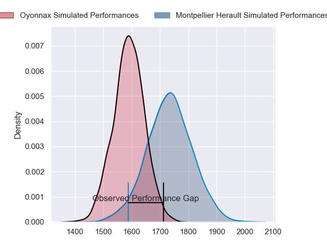
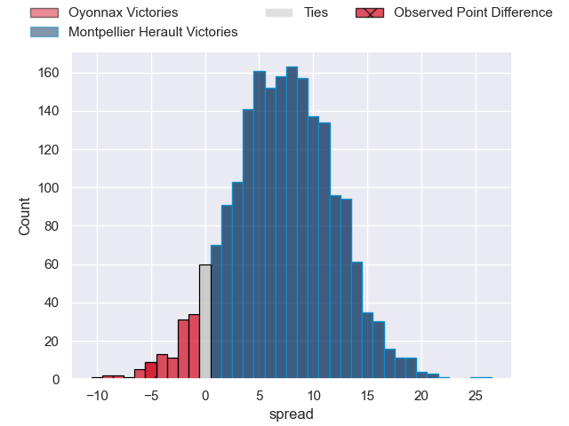
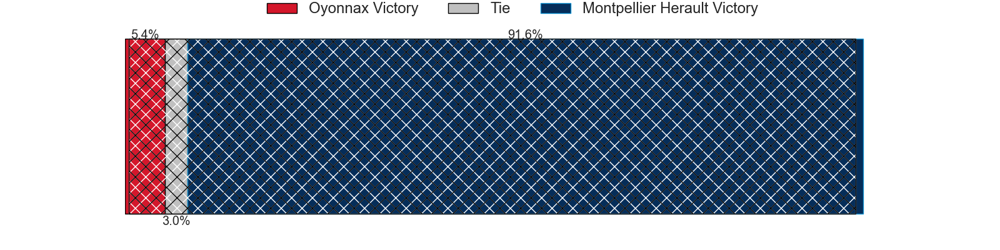
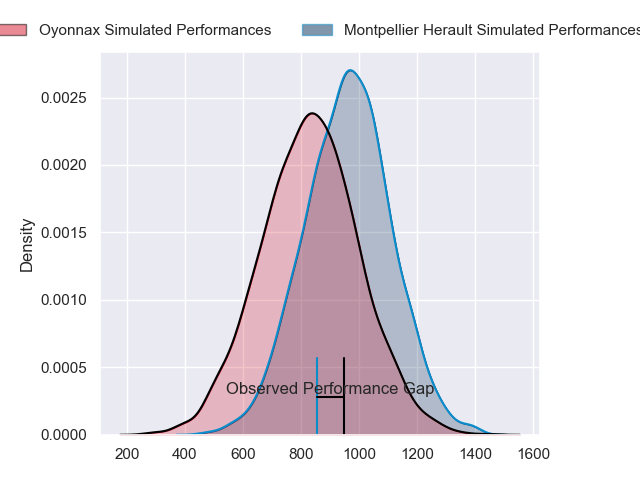
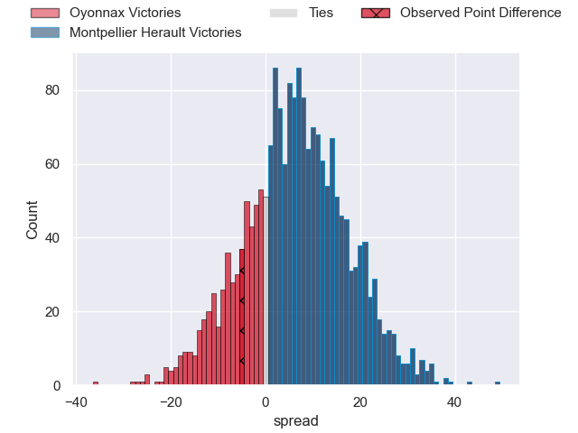
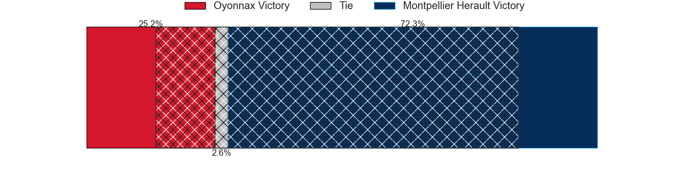
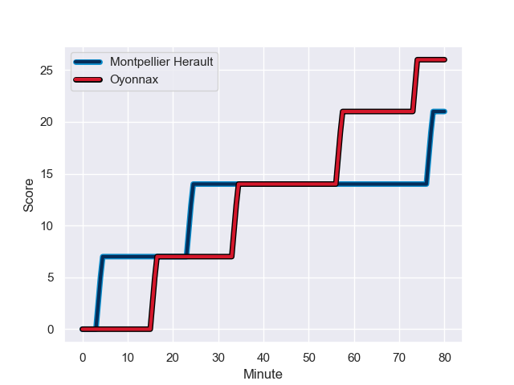
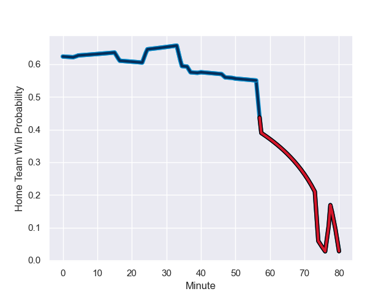

---  
layout: page  
title: Oyonnax at Montpellier Herault; 26-21  
date: 2023-11-25 18:00:00 -0500  
categories: "Top 14 Orange 2023" match review  
---
# Oyonnax at Montpellier Herault; 26-21

# Club Level Predictions

The first set of predictions treats a club as the smallest object, as the club develops its members, organizes a gameplan, and deploys its players as needed for each match. This club model has a prediction of 0.698, which translates to predicting Montpellier Herault to win by 7.4.

Each club has a rating and a rating deviation (similar to a Glicko rating), and expected performances can be generated. This allows for simulated matches and spreads like the ones below.
## Projected Performances - Club Model

## Projected Spreads - Club Model

## Projected Results - Club Model

# Player Level Predictions - Version 2

Treating teams instead as an entity made up of the currently active players, I have ratings for each player in an altogether different system. These can be combined to form team ratings once teamsheets are announced, weighting starters a bit higher than the reserves. After the match is played, players can be weighted by their minutes on the field, allowing for an accurate measure of the team's composition. With these compiled team ratings, we can make predictions, measure inaccuracy, and update the individual player ratings.
## Prediction with Player Minutes: Montpellier Herault by 5.6

Montpellier Herault by 0.9 on a neutral field
## Prediction without Player Minutes: Montpellier Herault by 6.3

Montpellier Herault by 1.6 on a neutral pitch

## Projected Performances - Player Model

## Projected Spreads - Player Model

## Projected Results - Player Model

## Scores over Time

## Win Probability over Time

There were 9 large changes in win probability in this match

|   Away Minutes | Away Player        |   Away elo |   Number |   Home elo | Home Player          |   Home Minutes |
|---------------:|:-------------------|-----------:|---------:|-----------:|:---------------------|---------------:|
|             65 | Tommy Raynaud      |      58.66 |        1 |      19.24 | Baptiste Erdocio     |             47 |
|             78 | Teddy Durand       |      37.41 |        2 |      38.16 | Vano Karkadze        |             47 |
|             50 | Christopher Vaotoa |      36.35 |        3 |      50.84 | Titi Lamositele      |             59 |
|             80 | Phoenix Battye     |      95.13 |        4 |      66.08 | Bastien Chalureau    |             47 |
|             65 | Hugo Fabregue      |      52.35 |        5 |      71.74 | Paul Willemse        |             80 |
|             80 | Wandrille Picault  |      38.92 |        6 |      57.95 | Florian Verhaeghe    |             80 |
|             40 | Loïc Credoz        |      50.98 |        7 |      88.87 | Yacouba Camara       |             57 |
|             51 | Rory Grice         |      61.65 |        8 |      60.45 | Sam Simmonds         |             80 |
|             72 | Jonathan Ruru      |      84.91 |        9 |      85.83 | Cobus Reinach        |             47 |
|             80 | Domingo Miotti     |      84.12 |       10 |      59.49 | Paolo Garbisi        |             47 |
|             80 | Daniel Ikpefan     |      59.62 |       11 |     102.77 | George Bridge        |             80 |
|             80 | Theo Millet        |      69.1  |       12 |      79.78 | Jan Serfontein       |             80 |
|             78 | Chris Farrell      |      28.45 |       13 |      54.4  | Arthur Vincent       |             37 |
|             80 | Maxime Salles      |      51.79 |       14 |      20.57 | Gabriel Ngandebe     |             80 |
|             80 | Justin Bouraux     |      39.64 |       15 |      52.86 | Julien Tisseron      |             80 |
|             29 | Loic Godener       |      30.4  |       16 |      22.65 | Thomas Darmon        |             43 |
|             40 | Kevin Lebreton     |      45.64 |       17 |      39.71 | Louis Carbonel       |             33 |
|             30 | Ali Oz             |      39.11 |       18 |      41.72 | Lenni Nouchi         |             33 |
|             15 | Victor Lebas       |      24.98 |       19 |      31.81 | Léo Coly             |             33 |
|             15 | Rory Sutherland    |      49.29 |       20 |      29.76 | Gregory Fichten      |             33 |
|              8 | Charlie Cassang    |      75.39 |       21 |      50.57 | Brandon Paenga-Amosa |             33 |
|              2 | Lucas Mensa        |      82.67 |       22 |      36.32 | Tyler Duguid         |             23 |
|              2 | Benjamin Geledan   |      33.85 |       23 |      68.92 | Karl Tu'inukuafe     |             21 |

