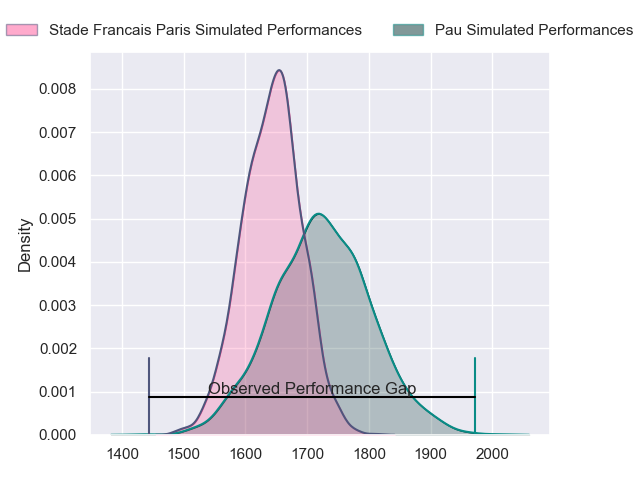
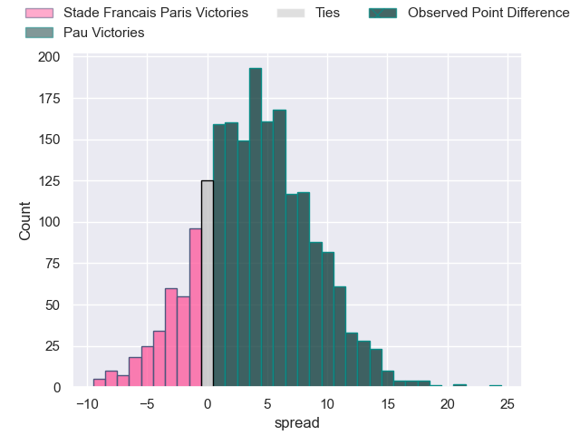
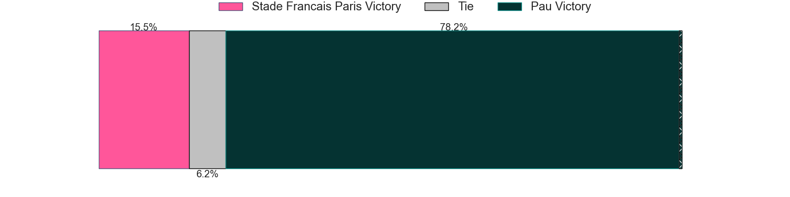
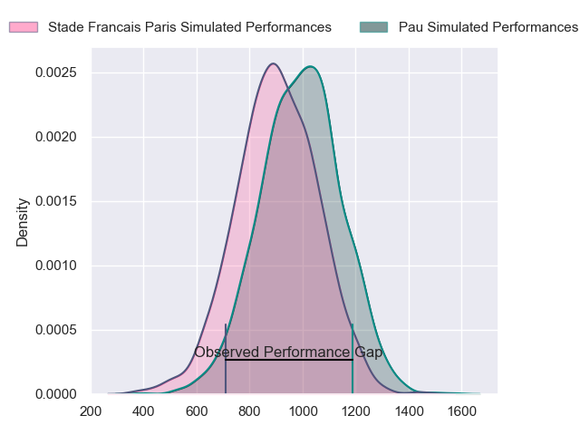
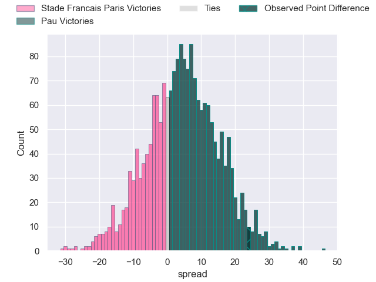
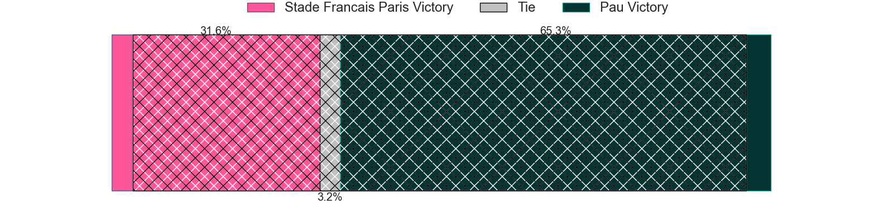
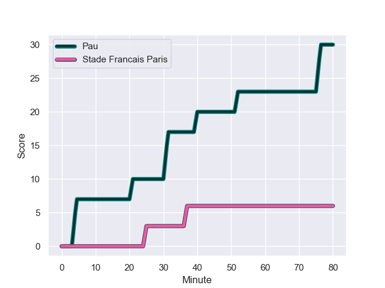
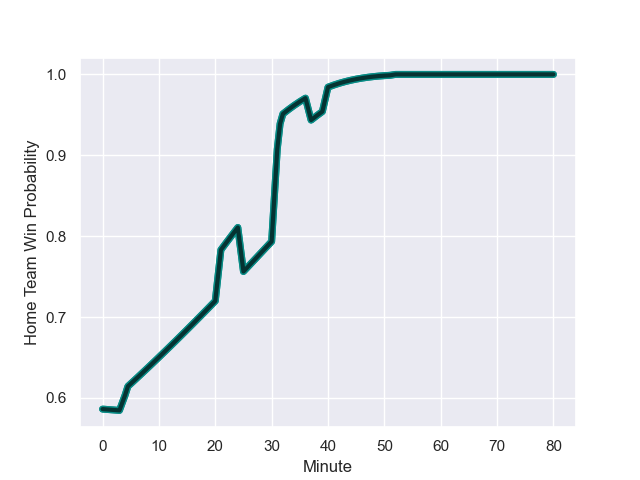

---  
layout: page  
title: Stade Francais Paris at Pau; 6-30  
date: 2023-11-25 18:00:00 -0500  
categories: "Top 14 Orange 2023" match review  
---
# Stade Francais Paris at Pau; 6-30

# Club Level Predictions

The first set of predictions treats a club as the smallest object, as the club develops its members, organizes a gameplan, and deploys its players as needed for each match. This club model has a prediction of 0.61, which translates to predicting Pau to win by 3.9.

Each club has a rating and a rating deviation (similar to a Glicko rating), and expected performances can be generated. This allows for simulated matches and spreads like the ones below.
## Projected Performances - Club Model

## Projected Spreads - Club Model

## Projected Results - Club Model

# Player Level Predictions - Version 2

Treating teams instead as an entity made up of the currently active players, I have ratings for each player in an altogether different system. These can be combined to form team ratings once teamsheets are announced, weighting starters a bit higher than the reserves. After the match is played, players can be weighted by their minutes on the field, allowing for an accurate measure of the team's composition. With these compiled team ratings, we can make predictions, measure inaccuracy, and update the individual player ratings.
## Prediction with Player Minutes: Pau by 3.8

Stade Francais Paris by 1.1 on a neutral field
## Prediction without Player Minutes: Pau by 2.4

Stade Francais Paris by 2.5 on a neutral pitch

## Projected Performances - Player Model

## Projected Spreads - Player Model

## Projected Results - Player Model

## Scores over Time

## Win Probability over Time

There were 6 large changes in win probability in this match

|   Away Minutes | Away Player             |   Away elo |   Number |   Home elo | Home Player         |   Home Minutes |
|---------------:|:------------------------|-----------:|---------:|-----------:|:--------------------|---------------:|
|             52 | Moses Alo-Emile         |      57.99 |        1 |      43.03 | Siegfried Fisi'ihoi |             53 |
|             48 | Lucas Peyresblanques    |      43.22 |        2 |      34.87 | Youri Delhommel     |             53 |
|             52 | Hugo Ndiaye             |      49.37 |        3 |      30.96 | Guram Papidze       |             53 |
|             52 | Paul Gabrillagues       |      69.9  |        4 |      29.3  | Hugo Auradou        |             56 |
|             80 | Baptiste Pesenti        |      71.39 |        5 |      51.23 | Mickael Capelli     |             45 |
|             80 | Ryan Chapuis            |      21.58 |        6 |      21.51 | Sacha Zegueur       |             80 |
|             80 | Mathieu Hirigoyen       |      33.34 |        7 |      48.31 | Reece Hewat         |             32 |
|             52 | Giovanni Habel-Kueffner |      85.71 |        8 |     121.09 | Luke Whitelock      |             80 |
|             78 | Brad Weber              |     112.17 |        9 |     111.24 | Dan Robson          |             56 |
|             80 | Joris Segonds           |      67.78 |       10 |      92.91 | Joe Simmonds        |             80 |
|             34 | Lester Etien            |      63.84 |       11 |      43.49 | Théo Attissogbe     |             80 |
|             52 | Julien Delbouis         |      70.55 |       12 |      57.31 | Nathan Decron       |             80 |
|             80 | Joe Marchant            |      83.58 |       13 |      63.39 | Emilien Gailleton   |             80 |
|             80 | Stéphane Ahmed          |      69.54 |       14 |      47.58 | Thomas Carol        |             72 |
|             80 | Kylan Hamdaoui          |      44.45 |       15 |      56.48 | Jack Maddocks       |             80 |
|             46 | Leo Barre               |      58.48 |       16 |      61.17 | Martin Puech        |             48 |
|             32 | Mamoudou Meite          |      31.35 |       17 |      68.74 | Fabrice Metz        |             35 |
|             28 | Lendi Dakaj             |      46.65 |       18 |      63.86 | Remi Seneca         |             27 |
|             28 | JJ van der Mescht       |      74.49 |       19 |      32.09 | Nicolas Corato      |             27 |
|             28 | Tanginoa Halaifonua     |      23.45 |       20 |      46.07 | Lucas Rey           |             27 |
|             28 | Julien Ory              |      49.77 |       21 |      88.49 | Thibault Daubagna   |             24 |
|             28 | Vasil Kakovin           |      40.04 |       22 |      35.17 | Guillaume Ducat     |             24 |
|              2 | Hugo Zabalza            |      34.78 |       23 |      46.74 | Axel Desperes       |              8 |

