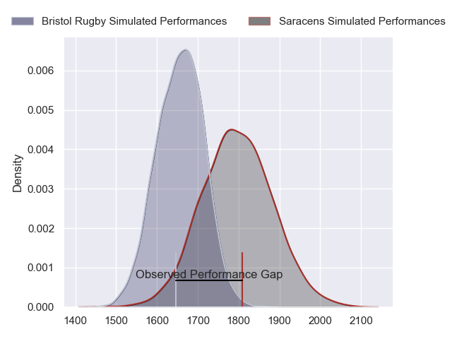
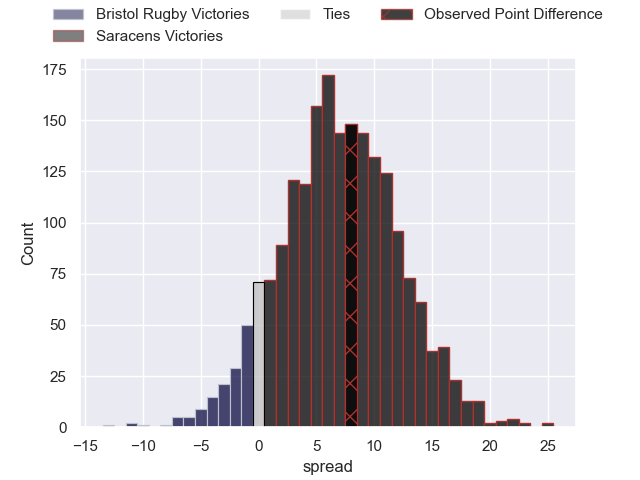
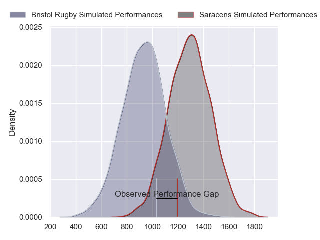
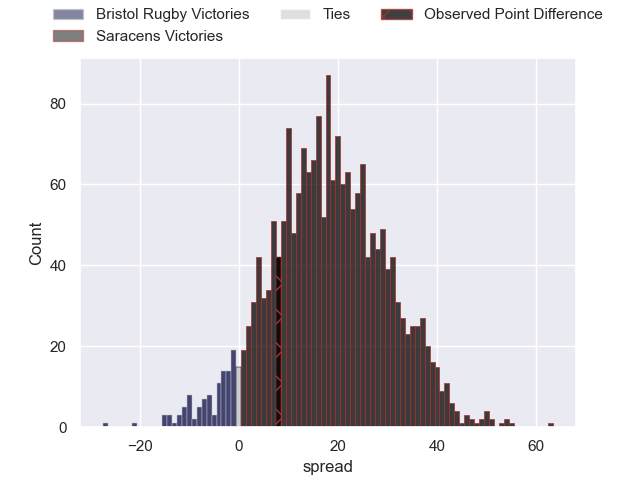
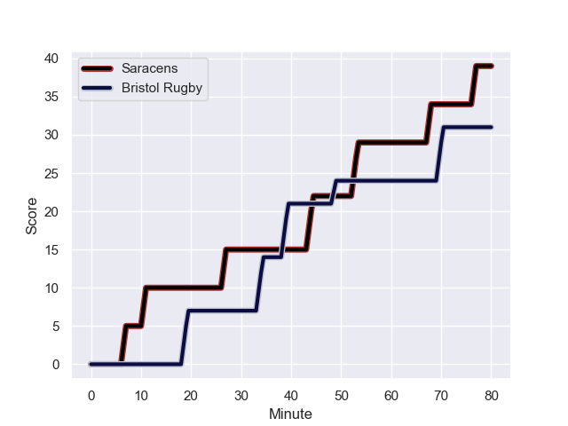
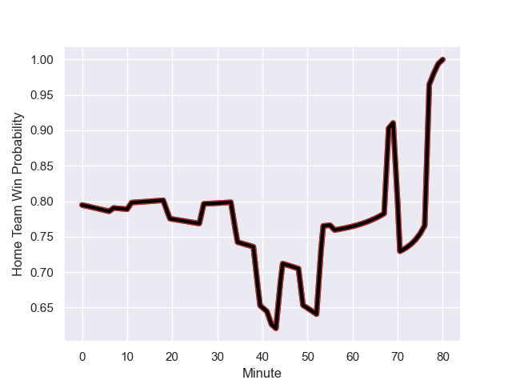

---  
layout: page  
title: Bristol Rugby at Saracens; 31-39  
date: 2023-11-25 18:00:00 -0500  
categories: "Gallagher Premiership 2023" match review  
---
# Bristol Rugby at Saracens; 31-39

# Club Level Predictions

The first set of predictions treats a club as the smallest object, as the club develops its members, organizes a gameplan, and deploys its players as needed for each match. This club model has a prediction of 0.689, which translates to predicting Saracens to win by 7.0.

Each club has a rating and a rating deviation (similar to a Glicko rating), and expected performances can be generated. This allows for simulated matches and spreads like the ones below.
## Projected Performances - Club Model

## Projected Spreads - Club Model

## Projected Results - Club Model

# Player Level Predictions - Version 2

Treating teams instead as an entity made up of the currently active players, I have ratings for each player in an altogether different system. These can be combined to form team ratings once teamsheets are announced, weighting starters a bit higher than the reserves. After the match is played, players can be weighted by their minutes on the field, allowing for an accurate measure of the team's composition. With these compiled team ratings, we can make predictions, measure inaccuracy, and update the individual player ratings.
## Prediction with Player Minutes: Saracens by 15.1

Saracens by 10.3 on a neutral field
## Prediction without Player Minutes: Saracens by 14.2

Saracens by 9.5 on a neutral pitch

## Projected Performances - Player Model

## Projected Spreads - Player Model

## Projected Results - Player Model

## Scores over Time

## Win Probability over Time

There were 13 large changes in win probability in this match

|   Away Minutes | Away Player                |   Away elo |   Number |   Home elo | Home Player     |   Home Minutes |
|---------------:|:---------------------------|-----------:|---------:|-----------:|:----------------|---------------:|
|             69 | Ellis Genge                |      33.92 |        1 |     119.09 | Mako Vunipola   |             58 |
|             56 | Gabriel Oghre              |      47.54 |        2 |     112.05 | Jamie George    |             78 |
|             69 | Kyle Sinckler              |      63.28 |        3 |      62.89 | Christian Judge |             42 |
|             80 | James Dun                  |      61.55 |        4 |     108.28 | Maro Itoje      |             80 |
|             80 | Joe Batley                 |      57.4  |        5 |      40.36 | Hugh Tizard     |             56 |
|             67 | Jake Heenan                |      45.91 |        6 |      27.88 | Tom Willis      |             78 |
|             80 | Daniel Thomas              |      50.91 |        7 |      40.54 | Andy Christie   |             80 |
|             80 | Fitz Harding               |      59.66 |        8 |     123.34 | Billy Vunipola  |             80 |
|             67 | Harry Randall              |      73.35 |        9 |      61    | Aled Davies     |             63 |
|             80 | Callum Sheedy              |      73.36 |       10 |     133.61 | Owen Farrell    |             80 |
|             69 | Richard Lane               |      66.93 |       11 |      97.76 | Tom Parton      |             64 |
|             80 | Benhard Janse van Rensburg |      70.48 |       12 |     104.3  | Nick Tompkins   |             78 |
|             78 | Virimi Vakatawa            |      97.19 |       13 |      69.58 | Elliot Daly     |             80 |
|             80 | Gabriel Ibitoye            |      67.31 |       14 |      44.17 | Alex Lewington  |             80 |
|             80 | Max Malins                 |      52.24 |       15 |      77.3  | Alex Goode      |             80 |
|             11 | Jake Woolmore              |      60.78 |       16 |      43.19 | Eroni Mawi      |             22 |
|             24 | Harry Thacker              |      69.51 |       17 |      31.7  | Kapeli Pifeleti |              2 |
|             11 | George Kloska              |      52.58 |       18 |      38.61 | Alec Clarey     |             38 |
|             13 | Josh Caulfield             |      65.16 |       19 |      48.51 | Theo McFarland  |             24 |
|             13 | Kieran Marmion             |      76.98 |       20 |      27.97 | Toby Knight     |              2 |
|             11 | Kalaveti Ravouvou          |      58.96 |       21 |      34.45 | Gareth Simpson  |             17 |
|              2 | James Williams             |      36.63 |       22 |      92.83 | Sean Maitland   |             16 |
|            nan | nan                        |     nan    |       23 |      15.8  | Olly Hartley    |              2 |

