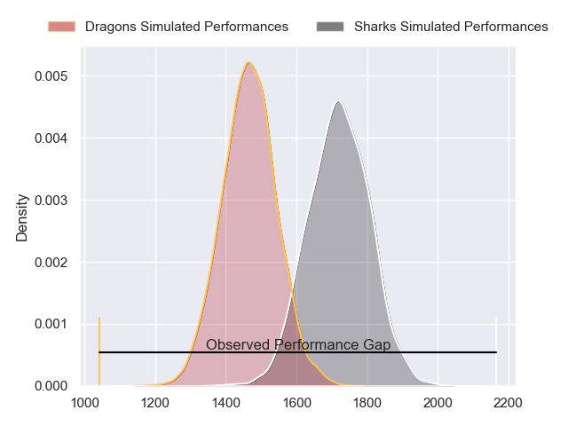
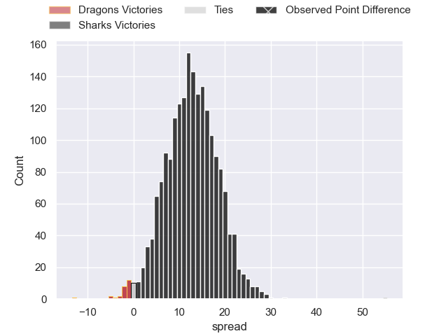
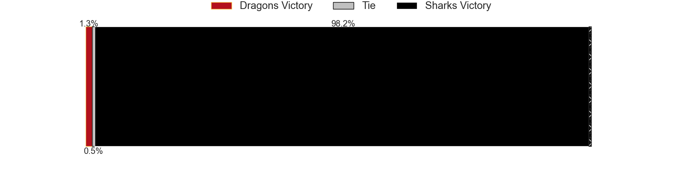
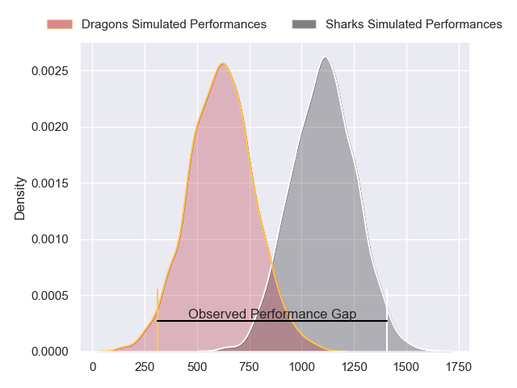
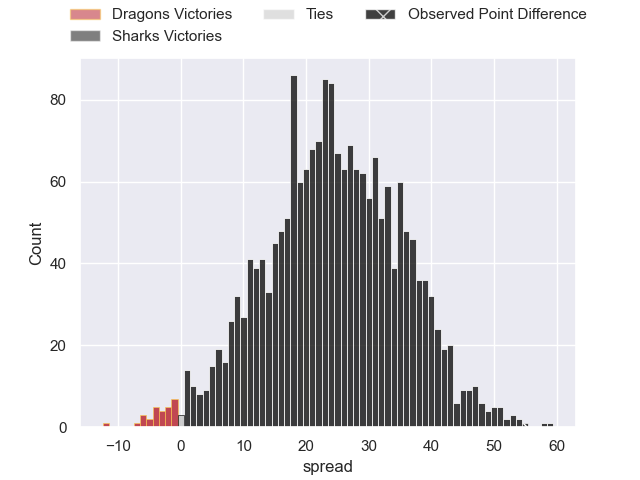
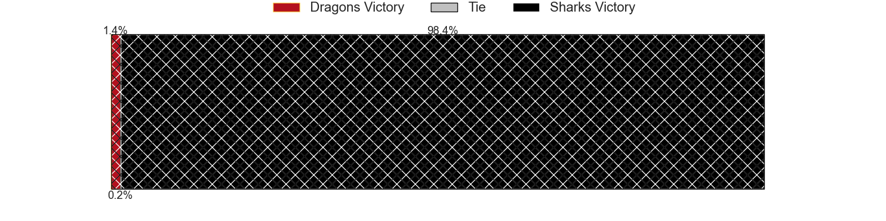
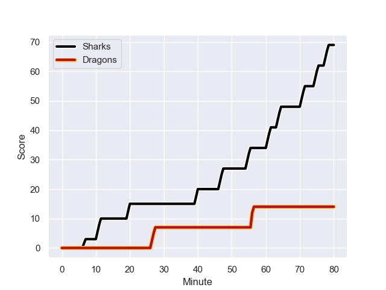
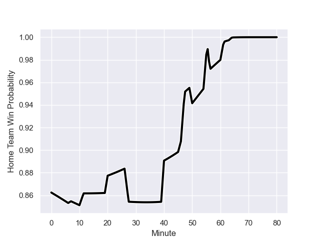

---  
layout: page  
title: Dragons at Sharks; 14-69  
date: 2023-11-25 18:00:00 -0500  
categories: "United Rugby Championship 2023" match review  
---
# Dragons at Sharks; 14-69

# Club Level Predictions

The first set of predictions treats a club as the smallest object, as the club develops its members, organizes a gameplan, and deploys its players as needed for each match. This club model has a prediction of 0.804, which translates to predicting Sharks to win by 12.6.

Each club has a rating and a rating deviation (similar to a Glicko rating), and expected performances can be generated. This allows for simulated matches and spreads like the ones below.
## Projected Performances - Club Model

## Projected Spreads - Club Model

## Projected Results - Club Model

# Player Level Predictions - Version 2

Treating teams instead as an entity made up of the currently active players, I have ratings for each player in an altogether different system. These can be combined to form team ratings once teamsheets are announced, weighting starters a bit higher than the reserves. After the match is played, players can be weighted by their minutes on the field, allowing for an accurate measure of the team's composition. With these compiled team ratings, we can make predictions, measure inaccuracy, and update the individual player ratings.
## Prediction with Player Minutes: Sharks by 20.3

Sharks by 16.5 on a neutral field
## Prediction without Player Minutes: Sharks by 19.9

Sharks by 16.1 on a neutral pitch

## Projected Performances - Player Model

## Projected Spreads - Player Model

## Projected Results - Player Model

## Scores over Time

## Win Probability over Time

There were 3 large changes in win probability in this match

|   Away Minutes | Away Player      |   Away elo |   Number |   Home elo | Home Player              |   Home Minutes |
|---------------:|:-----------------|-----------:|---------:|-----------:|:-------------------------|---------------:|
|             80 | Aki Seiuli       |      30.96 |        1 |      41.54 | Ntuthuko Mchunu          |             54 |
|             65 | Bradley Roberts  |      40.28 |        2 |      68.77 | Fez Mbatha               |             46 |
|             46 | Chris Coleman    |      38.78 |        3 |     125.46 | Coenie Oosthuizen        |             57 |
|             80 | Matthew Screech  |       0.12 |        4 |     109.14 | Eben Etzebeth            |             62 |
|             80 | George Nott      |      39.37 |        5 |      39.19 | Emile van Heerden        |             55 |
|             80 | Sean Lonsdale    |      31.46 |        6 |      51.9  | James Venter             |             80 |
|             16 | Ollie Griffiths  |      62.83 |        7 |      45.81 | Phepsi Buthelezi         |             80 |
|             80 | Aaron Wainwright |      68    |        8 |      77.84 | Sikhumbuzo Notshe        |             80 |
|             80 | Dane Blacker     |      31.42 |        9 |      67.56 | Jaden Hendrikse          |             50 |
|             30 | Will Reed        |      44.06 |       10 |      67.18 | Curwin Bosch             |             65 |
|             55 | Ewan Rosser      |      46.65 |       11 |     107.72 | Makazole Mapimpi         |             80 |
|             80 | Aneurin Owen     |      50.95 |       12 |      54.42 | Francois Venter          |             54 |
|             80 | Sio Tomkinson    |      69.36 |       13 |      57.29 | Lukhanyo Am              |             80 |
|             80 | Rio Dyer         |      28.95 |       14 |      54.29 | Werner Kok               |             80 |
|             32 | Cai Evans        |      30.17 |       15 |      78.75 | Aphelele Fassi           |             80 |
|             64 | Harrison Keddie  |      -8.64 |       16 |      44.71 | Daniel Viljoen Jooste    |             34 |
|             50 | Steffan Hughes   |      74.68 |       17 |     105.95 | Ox Nche                  |             26 |
|             48 | Rhodri Williams  |      74.05 |       18 |      45.55 | Grant Williams           |             30 |
|             34 | Luke Yendle      |      51.71 |       19 |      64.38 | Rohan Janse van Rensburg |             26 |
|             25 | Ashton Hewitt    |      65.58 |       20 |      41.76 | Jeandre Labuschagne      |             25 |
|             15 | James Benjamin   |      34.32 |       21 |      46.98 | Hanro Jacobs             |             23 |
|            nan | nan              |     nan    |       22 |      37.93 | Corne Rahl               |             18 |
|            nan | nan              |     nan    |       23 |      49.26 | Boeta Chamberlain        |             15 |

