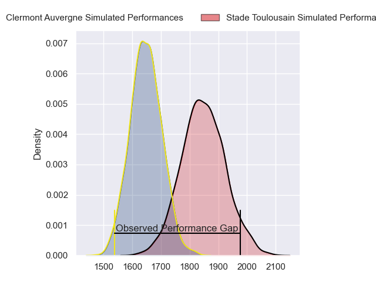
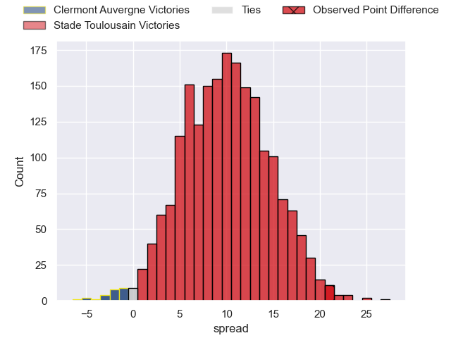
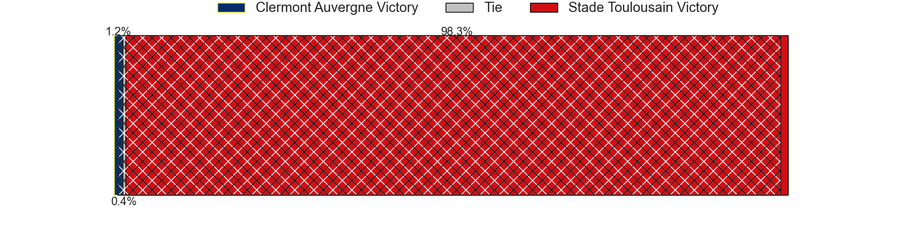
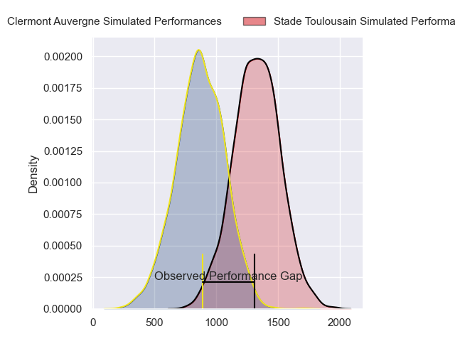
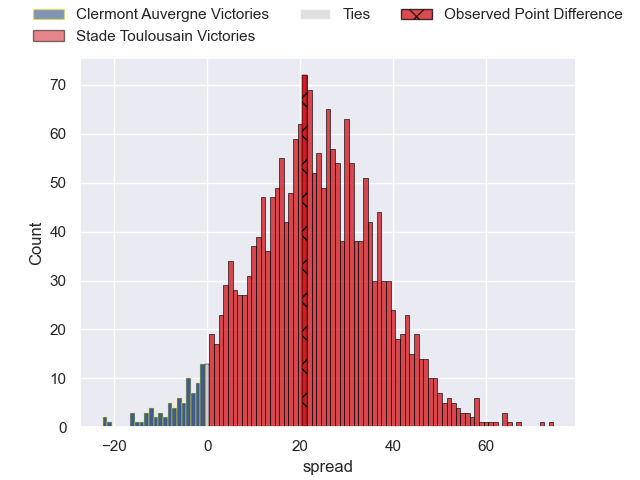
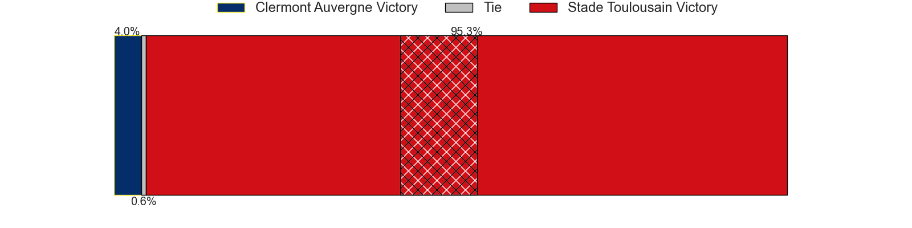
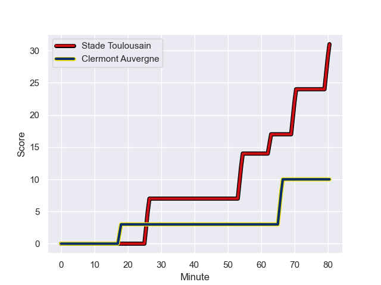
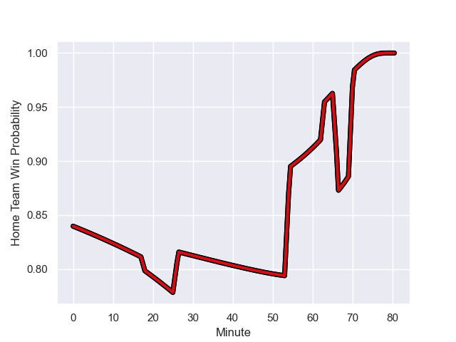

---  
layout: page  
title: Clermont Auvergne at Stade Toulousain; 10-31  
date: 2023-11-25 18:00:00 -0500  
categories: "Top 14 Orange 2023" match review  
---
# Clermont Auvergne at Stade Toulousain; 10-31

# Club Level Predictions

The first set of predictions treats a club as the smallest object, as the club develops its members, organizes a gameplan, and deploys its players as needed for each match. This club model has a prediction of 0.756, which translates to predicting Stade Toulousain to win by 10.0.

Each club has a rating and a rating deviation (similar to a Glicko rating), and expected performances can be generated. This allows for simulated matches and spreads like the ones below.
## Projected Performances - Club Model

## Projected Spreads - Club Model

## Projected Results - Club Model

# Player Level Predictions - Version 2

Treating teams instead as an entity made up of the currently active players, I have ratings for each player in an altogether different system. These can be combined to form team ratings once teamsheets are announced, weighting starters a bit higher than the reserves. After the match is played, players can be weighted by their minutes on the field, allowing for an accurate measure of the team's composition. With these compiled team ratings, we can make predictions, measure inaccuracy, and update the individual player ratings.
## Prediction with Player Minutes: Stade Toulousain by 18.7

Stade Toulousain by 13.8 on a neutral field
## Prediction without Player Minutes: Stade Toulousain by 18.7

Stade Toulousain by 13.8 on a neutral pitch

## Projected Performances - Player Model

## Projected Spreads - Player Model

## Projected Results - Player Model

## Scores over Time

## Win Probability over Time

There were 7 large changes in win probability in this match

|   Away Minutes | Away Player          |   Away elo |   Number |   Home elo | Home Player         |   Home Minutes |
|---------------:|:---------------------|-----------:|---------:|-----------:|:--------------------|---------------:|
|             80 | Daniel Bibi Biziwu   |      49.09 |        1 |      42.6  | Rodrigue Neti       |             80 |
|             80 | Robin Couly          |      44.42 |        2 |      53.47 | Guillaume Cramont   |             80 |
|             80 | Cristian Ojovan      |      56.5  |        3 |     102.87 | Dorian Aldegheri    |             80 |
|             80 | Thibaud Lanen        |      55.26 |        4 |      39.72 | Richie Arnold       |             80 |
|             80 | Peceli Yato Senibitu |      87.93 |        5 |      61.64 | Emmanuel Meafou     |             80 |
|             80 | Killian Tixeront     |      46.66 |        6 |      83.04 | Thibaud Flament     |             80 |
|             80 | Lucas Dessaigne      |      62.12 |        7 |     123.68 | Francois Cros       |             80 |
|             80 | Pita Gus Sowakula    |      85.92 |        8 |     109.14 | Anthony Jelonch     |             80 |
|             80 | Sebastien Bezy       |      81.45 |        9 |     138.54 | Antoine Dupont      |             80 |
|             80 | Anthony Belleau      |      68.43 |       10 |     124.36 | Thomas Ramos        |             80 |
|             80 | Thomas Roziere       |      31    |       11 |      80.29 | Arthur Retiere      |             80 |
|             80 | Pierre Fouyssac      |      40.46 |       12 |      39.75 | Pita Ahki           |             80 |
|             80 | Irae Simone          |      43.14 |       13 |      39.8  | Santiago Chocobares |             80 |
|             80 | Yerim Fall           |      52.22 |       14 |      62.04 | Lucas Tauzin        |             80 |
|             80 | Alex Newsome         |      68.21 |       15 |     105.33 | Matthis Lebel       |             80 |

