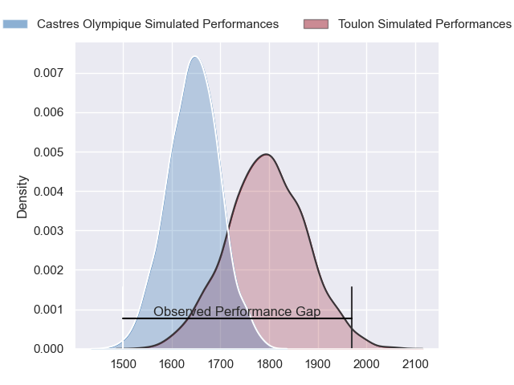
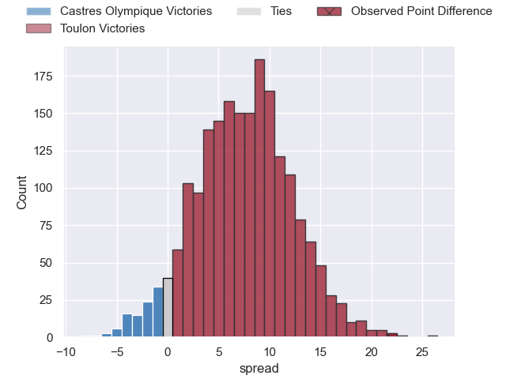
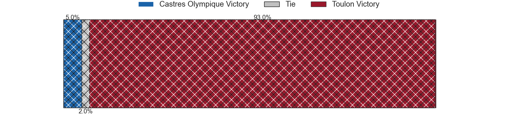
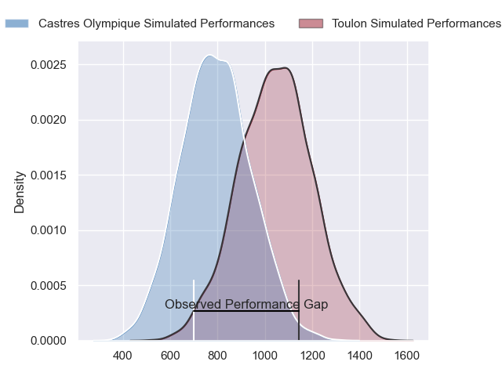
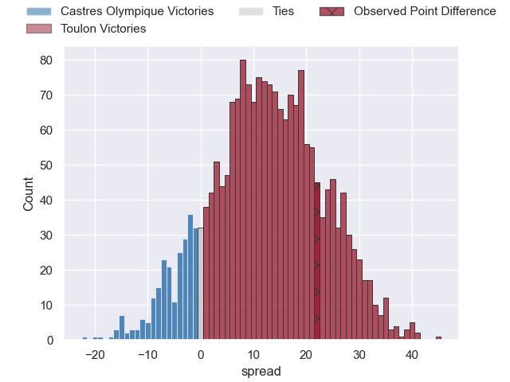
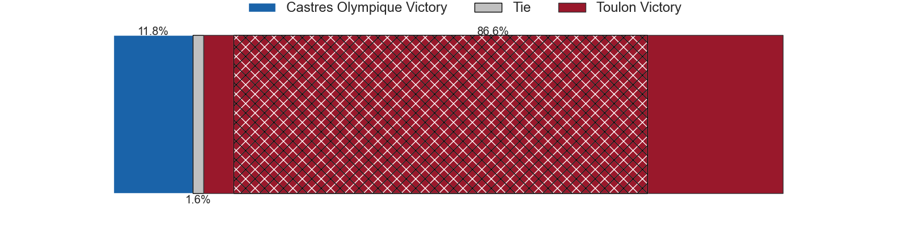
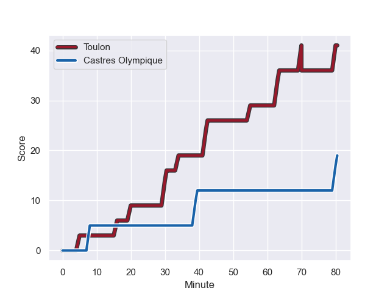
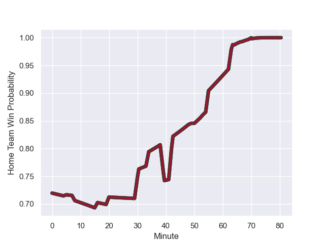

---  
layout: page  
title: Castres Olympique at Toulon; 19-41  
date: 2023-11-25 18:00:00 -0500  
categories: "Top 14 Orange 2023" match review  
---
# Castres Olympique at Toulon; 19-41

# Club Level Predictions

The first set of predictions treats a club as the smallest object, as the club develops its members, organizes a gameplan, and deploys its players as needed for each match. This club model has a prediction of 0.699, which translates to predicting Toulon to win by 7.4.

Each club has a rating and a rating deviation (similar to a Glicko rating), and expected performances can be generated. This allows for simulated matches and spreads like the ones below.
## Projected Performances - Club Model

## Projected Spreads - Club Model

## Projected Results - Club Model

# Player Level Predictions - Version 2

Treating teams instead as an entity made up of the currently active players, I have ratings for each player in an altogether different system. These can be combined to form team ratings once teamsheets are announced, weighting starters a bit higher than the reserves. After the match is played, players can be weighted by their minutes on the field, allowing for an accurate measure of the team's composition. With these compiled team ratings, we can make predictions, measure inaccuracy, and update the individual player ratings.
## Prediction with Player Minutes: Toulon by 10.3

Toulon by 5.6 on a neutral field
## Prediction without Player Minutes: Toulon by 11.0

Toulon by 6.2 on a neutral pitch

## Projected Performances - Player Model

## Projected Spreads - Player Model

## Projected Results - Player Model

## Scores over Time

## Win Probability over Time

There were 6 large changes in win probability in this match

|   Away Minutes | Away Player                |   Away elo |   Number |   Home elo | Home Player                    |   Home Minutes |
|---------------:|:---------------------------|-----------:|---------:|-----------:|:-------------------------------|---------------:|
|             53 | Loïs Guerois               |      46.41 |        1 |      85.79 | Jean-Baptiste Gros             |             50 |
|             61 | Loris Zarantonello         |      44.05 |        2 |      77.25 | Christopher Tolofua            |             67 |
|             53 | Wilfrid Hounkpatin         |      60.47 |        3 |      55.57 | Beka Gigashvili                |             61 |
|             53 | Florent Vanverberghe       |      50.24 |        4 |      66.8  | David Ribbans                  |             80 |
|             80 | Leone Nakarawa             |      79.02 |        5 |      71.18 | Brian Alainu'uese              |             64 |
|             49 | Nick Champion de Crespigny |      53.83 |        6 |      45.22 | Jules Coulon                   |             53 |
|             80 | Gauthier Maravat           |      14.6  |        7 |      43.74 | Esteban Abadie                 |             80 |
|             53 | Abraham Papali'i           |      54.67 |        8 |      69.88 | Cornell du Preez               |             67 |
|             61 | Jeremy Fernandez           |      16.83 |        9 |      91.75 | Baptiste Serin                 |             64 |
|             80 | Louis Le Brun              |      48.44 |       10 |      67.46 | Enzo Herve                     |             80 |
|             80 | Nathanael Hulleu           |      75.51 |       11 |      41.07 | Seta Tuicuvu                   |             55 |
|             80 | Vilimoni Botitu            |      60.22 |       12 |      39.99 | Jérémy Sinzelle                |             80 |
|             61 | Adrien Seguret             |      36.77 |       13 |     127.1  | Waisea Nayacalevu Vuidravuwalu |             80 |
|             80 | Josaia Raisuqe             |      53.59 |       14 |      28.42 | Gaël Dréan                     |             80 |
|             80 | Geoffrey Palis             |      90.84 |       15 |      46.4  | Aymeric Luc                    |             80 |
|             31 | Mathieu Babillot           |      60.66 |       16 |      70.45 | Dany Priso                     |             30 |
|             27 | Wayan de Benedittis        |      51.06 |       17 |      22.81 | Mathieu Smaili                 |             27 |
|             27 | Baptiste Cope              |      44.02 |       18 |      70.89 | Jiuta Wainiqolo                |             25 |
|             27 | Aurélien Azar              |      30.45 |       19 |      38.57 | Kieran Brookes                 |             19 |
|             27 | Tom Staniforth             |      70.53 |       20 |      48.47 | Matthias Halagahu              |             16 |
|             19 | Adrea Cocagi               |      63.74 |       21 |      63.87 | Ben White                      |             16 |
|             19 | Santiago Arata             |      52.82 |       22 |      42.21 | Mattéo Le Corvec               |             13 |
|             19 | Pierre Colonna             |      30.46 |       23 |      46.7  | Yanis Boulassel                |             13 |

