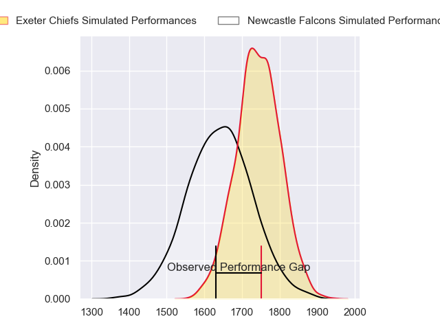
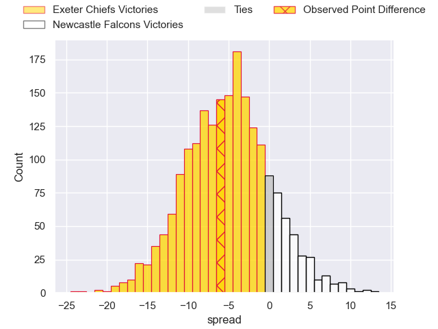
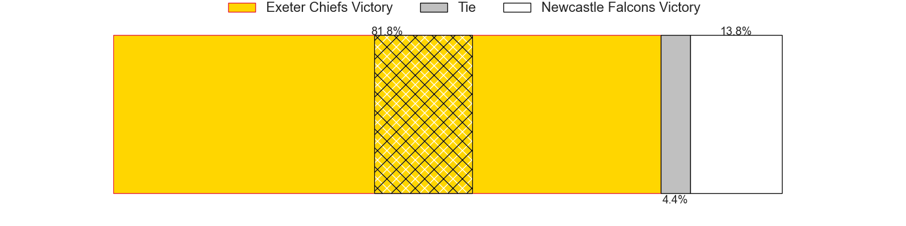
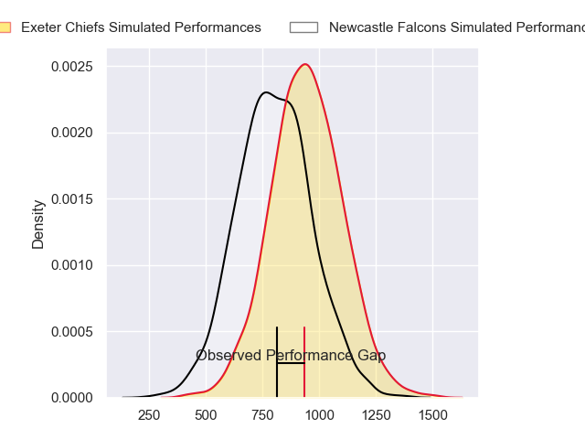
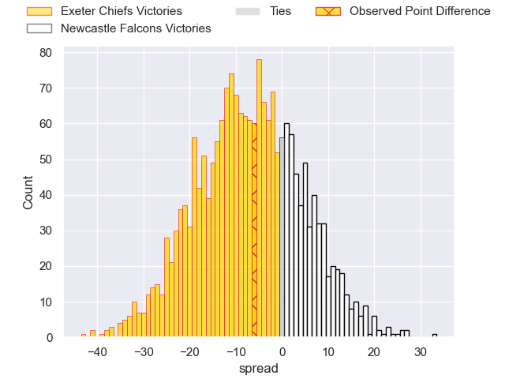
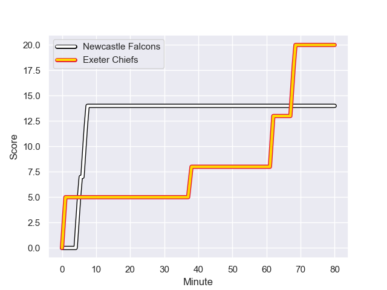
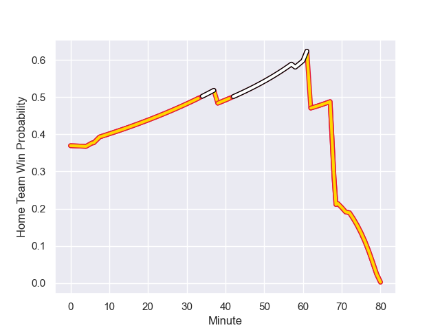

---  
layout: page  
title: Exeter Chiefs at Newcastle Falcons; 20-14  
date: 2023-11-26 18:00:00 -0500  
categories: "Gallagher Premiership 2023" match review  
---
# Exeter Chiefs at Newcastle Falcons; 20-14

# Club Level Predictions

The first set of predictions treats a club as the smallest object, as the club develops its members, organizes a gameplan, and deploys its players as needed for each match. This club model has a prediction of 0.357, which translates to predicting Exeter Chiefs to win by 5.2.

Each club has a rating and a rating deviation (similar to a Glicko rating), and expected performances can be generated. This allows for simulated matches and spreads like the ones below.
## Projected Performances - Club Model

## Projected Spreads - Club Model

## Projected Results - Club Model

# Player Level Predictions - Version 2

Treating teams instead as an entity made up of the currently active players, I have ratings for each player in an altogether different system. These can be combined to form team ratings once teamsheets are announced, weighting starters a bit higher than the reserves. After the match is played, players can be weighted by their minutes on the field, allowing for an accurate measure of the team's composition. With these compiled team ratings, we can make predictions, measure inaccuracy, and update the individual player ratings.
## Prediction with Player Minutes: Exeter Chiefs by 5.9

Exeter Chiefs by 10.5 on a neutral field
## Prediction without Player Minutes: Exeter Chiefs by 5.9

Exeter Chiefs by 10.5 on a neutral pitch

## Projected Performances - Player Model

## Projected Spreads - Player Model

## Projected Results - Player Model

## Scores over Time

## Win Probability over Time

There were 8 large changes in win probability in this match

|   Away Minutes | Away Player           |   Away elo |   Number |   Home elo | Home Player         |   Home Minutes |
|---------------:|:----------------------|-----------:|---------:|-----------:|:--------------------|---------------:|
|             48 | Scott Sio             |      85.01 |        1 |      40.13 | Phil Brantingham    |             55 |
|             48 | Jack Yeandle          |      80.96 |        2 |      32.14 | Jamie Blamire       |             69 |
|             48 | Ehren Painter         |      56.05 |        3 |      15.64 | Eduardo Bello       |             61 |
|             80 | Rusiate Tuima         |      37.76 |        4 |      28.72 | John Hawkins        |             80 |
|             80 | Dafydd Jenkins        |      72.67 |        5 |      39.02 | Kiran McDonald      |             55 |
|             80 | Jacques Vermeulen     |      69.15 |        6 |      50    | Pedro Rubiolo       |             80 |
|             80 | Ethan Roots           |      66.17 |        7 |      43.01 | Guy Pepper          |             35 |
|             53 | Aidon Davis           |      37.91 |        8 |      37.74 | Callum Chick        |             80 |
|             58 | Tom Cairns            |      61.32 |        9 |      -9.96 | James Elliott       |             72 |
|             80 | Harvey Skinner        |      41.59 |       10 |      46.65 | Louie Johnson       |             80 |
|             80 | Ben Hammersley        |      57.57 |       11 |      49.07 | Iwan Stephens       |             80 |
|             80 | Joe Hawkins           |      35.35 |       12 |      54.8  | Cameron Hutchison   |             20 |
|             80 | Henry Slade           |     107.8  |       13 |     112.9  | Matias Moroni       |             58 |
|             12 | Immanuel Feyi-Waboso  |      66.76 |       14 |      74.96 | Adam Radwan         |             80 |
|             80 | Tom Wyatt             |      82.05 |       15 |      78.11 | Tom Penny           |             80 |
|             32 | Alec Hepburn          |      59.52 |       16 |      20.81 | Adam Brocklebank    |             25 |
|             32 | Max Norey             |      46.13 |       17 |      62.58 | Bryan Byrne         |             11 |
|             32 | Josh Iosefa-Scott     |      84.49 |       18 |      55.59 | Murray McCallum     |             19 |
|             27 | Ross Micheal Vintcent |      49.64 |       19 |      28.86 | Philip van der Walt |             25 |
|             22 | Stu Townsend          |      67.36 |       20 |      48.14 | Sam Cross           |             45 |
|              8 | Will Haydon-Wood      |      37.32 |       21 |      47    | Hugh O'Sullivan     |              8 |
|             60 | Tom Hendrickson       |      62.46 |       22 |      55.53 | Rory Jennings       |             60 |
|            nan | nan                   |     nan    |       23 |      56.46 | Louis Brown         |             22 |

