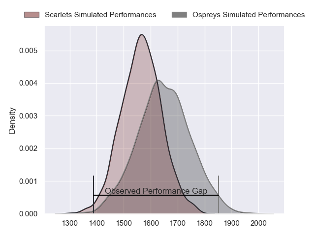
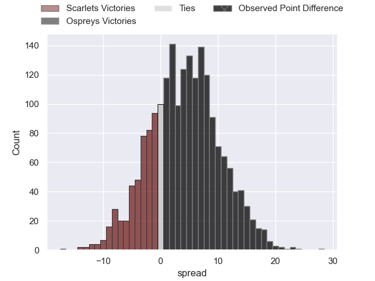
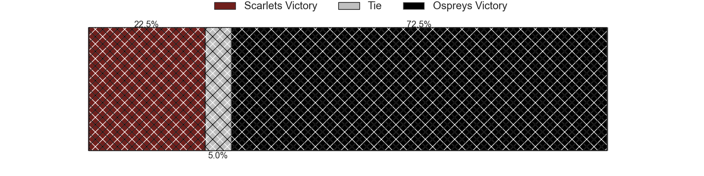
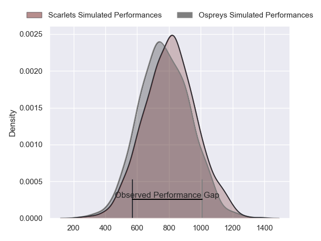
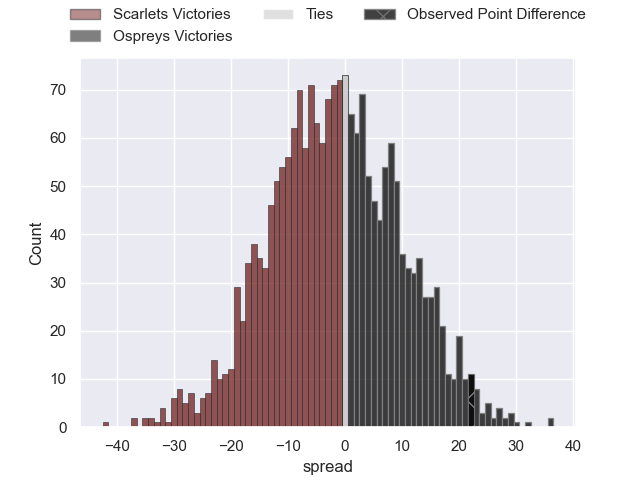
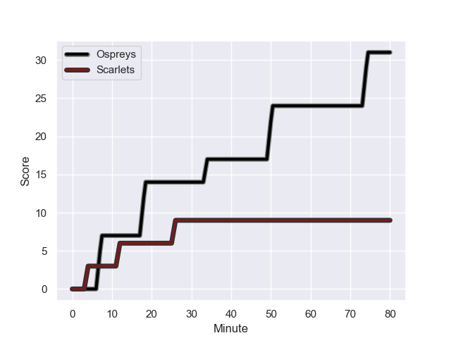
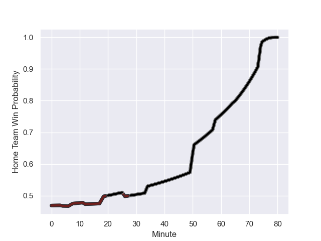

---  
layout: page  
title: Scarlets at Ospreys; 9-31  
date: 2023-11-26 18:00:00 -0500  
categories: "United Rugby Championship 2023" match review  
---
# Scarlets at Ospreys; 9-31

# Club Level Predictions

The first set of predictions treats a club as the smallest object, as the club develops its members, organizes a gameplan, and deploys its players as needed for each match. This club model has a prediction of 0.613, which translates to predicting Ospreys to win by 4.1.

Each club has a rating and a rating deviation (similar to a Glicko rating), and expected performances can be generated. This allows for simulated matches and spreads like the ones below.
## Projected Performances - Club Model

## Projected Spreads - Club Model

## Projected Results - Club Model

# Player Level Predictions - Version 2

Treating teams instead as an entity made up of the currently active players, I have ratings for each player in an altogether different system. These can be combined to form team ratings once teamsheets are announced, weighting starters a bit higher than the reserves. After the match is played, players can be weighted by their minutes on the field, allowing for an accurate measure of the team's composition. With these compiled team ratings, we can make predictions, measure inaccuracy, and update the individual player ratings.
## Prediction with Player Minutes: Scarlets by 1.4

Scarlets by 5.6 on a neutral field
## Prediction without Player Minutes: Scarlets by 0.8

Scarlets by 5.1 on a neutral pitch

## Projected Performances - Player Model

## Projected Spreads - Player Model

## Projected Results - Player Model

## Scores over Time

## Win Probability over Time

There were 4 large changes in win probability in this match

|   Away Minutes | Away Player         |   Away elo |   Number |   Home elo | Home Player            |   Home Minutes |
|---------------:|:--------------------|-----------:|---------:|-----------:|:-----------------------|---------------:|
|             52 | Wyn Jones           |      58.21 |        1 |      45.77 | Nicky Smith            |             58 |
|             65 | Ryan Elias          |      81.06 |        2 |      36.76 | Dewi Lake              |             58 |
|             58 | Harri O'Connor      |      34.58 |        3 |      31.11 | Tom Botha              |             58 |
|             80 | Alex Craig          |      39.33 |        4 |      34.86 | James Fender           |             80 |
|             65 | Jac Price           |      26.72 |        5 |      56.53 | Adam Beard             |             80 |
|             80 | Vaea Fifita         |     111.15 |        6 |      51.1  | Rhys Davies            |             78 |
|             80 | Teddy Leatherbarrow |      46.65 |        7 |      70.25 | Jac Morgan             |             80 |
|             65 | Carwyn Tuipulotu    |      45.18 |        8 |      -5.11 | Morgan Morris          |             75 |
|             52 | Gareth Davies       |      38.13 |        9 |      27.68 | Reuben Morgan-Williams |             68 |
|             80 | Ioan Lloyd          |      25.93 |       10 |      44.67 | Jack Walsh             |             58 |
|             80 | Steffan Evans       |      71.67 |       11 |      -1.95 | Luke Morgan            |             80 |
|             80 | Johnny Williams     |      74.81 |       12 |      52.81 | Keiran Williams        |             80 |
|             75 | Joe Roberts         |      56.09 |       13 |      78.9  | Owen Watkin            |             75 |
|             80 | Tom Rogers          |      43.83 |       14 |      79.05 | Daniel Kasende         |             80 |
|             78 | Johnny McNicholl    |      65.04 |       15 |      50.7  | Max Nagy               |             80 |
|             28 | Steffan Thomas      |      40.66 |       16 |      35.45 | Gareth Thomas          |             22 |
|             28 | Kieran Hardy        |      55.48 |       17 |      45.13 | Sam Parry              |             22 |
|             22 | Joe Jones           |      35.33 |       18 |      51.07 | Rhys Henry             |             22 |
|             15 | Ben Williams        |      41.57 |       19 |      46.65 | Dan Edwards            |             22 |
|             15 | Morgan Jones        |      12.17 |       20 |      41.13 | Harri Deaves           |              5 |
|             15 | Shaun Evans         |      24.95 |       21 |      77.83 | Rewan Kruger           |             12 |
|              5 | Ioan Nicholas       |      46.04 |       22 |      49.63 | Luke Scully            |              5 |
|              2 | Charlie Titcombe    |      44.62 |       23 |      47.08 | Tristan Davies         |              2 |

