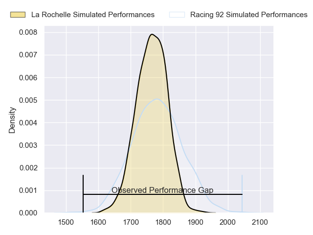
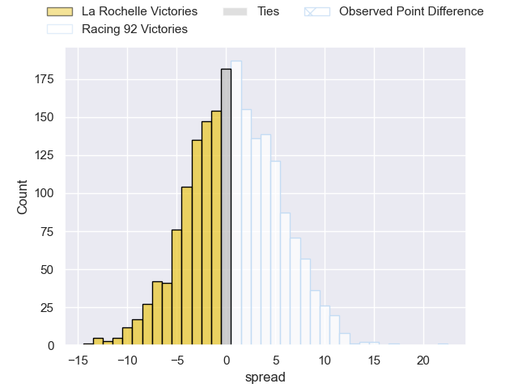
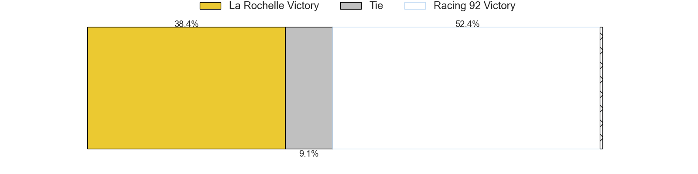
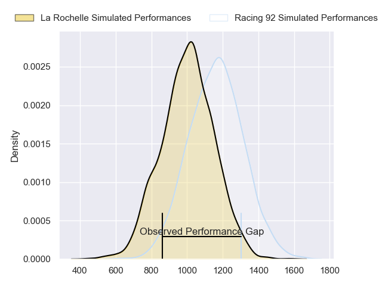
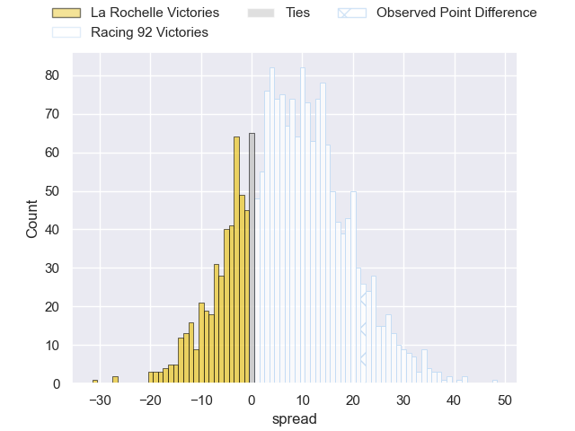
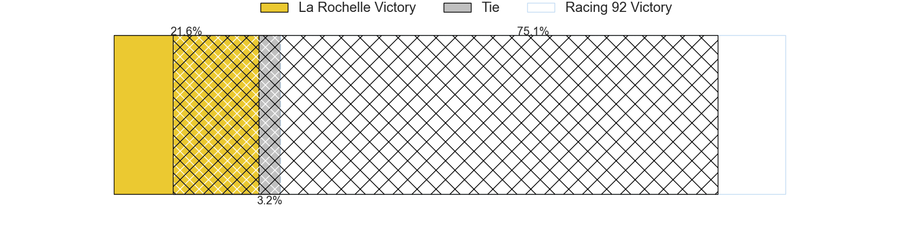
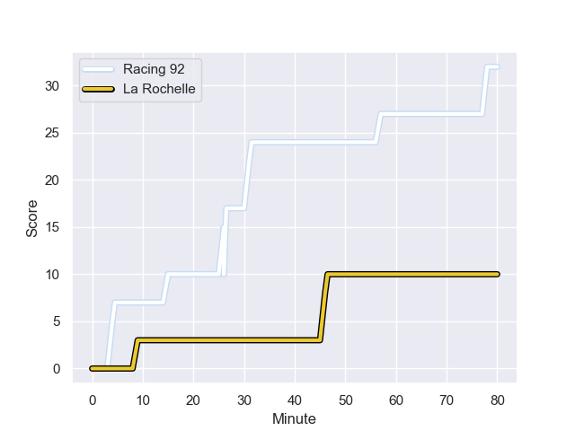
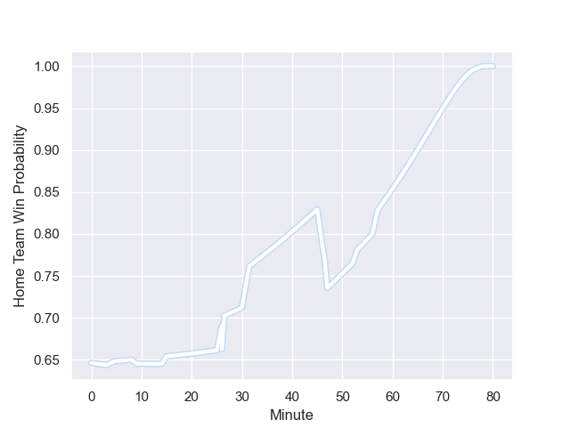

---  
layout: page  
title: La Rochelle at Racing 92; 10-32  
date: 2023-11-26 18:00:00 -0500  
categories: "Top 14 Orange 2023" match review  
---
# La Rochelle at Racing 92; 10-32

# Club Level Predictions

The first set of predictions treats a club as the smallest object, as the club develops its members, organizes a gameplan, and deploys its players as needed for each match. This club model has a prediction of 0.522, which translates to predicting Racing 92 to win by 0.8.

Each club has a rating and a rating deviation (similar to a Glicko rating), and expected performances can be generated. This allows for simulated matches and spreads like the ones below.
## Projected Performances - Club Model

## Projected Spreads - Club Model

## Projected Results - Club Model

# Player Level Predictions - Version 2

Treating teams instead as an entity made up of the currently active players, I have ratings for each player in an altogether different system. These can be combined to form team ratings once teamsheets are announced, weighting starters a bit higher than the reserves. After the match is played, players can be weighted by their minutes on the field, allowing for an accurate measure of the team's composition. With these compiled team ratings, we can make predictions, measure inaccuracy, and update the individual player ratings.
## Prediction with Player Minutes: Racing 92 by 6.6

Racing 92 by 1.9 on a neutral field
## Prediction without Player Minutes: Racing 92 by 8.0

Racing 92 by 3.2 on a neutral pitch

## Projected Performances - Player Model

## Projected Spreads - Player Model

## Projected Results - Player Model

## Scores over Time

## Win Probability over Time

There were 7 large changes in win probability in this match

|   Away Minutes | Away Player           |   Away elo |   Number |   Home elo | Home Player         |   Home Minutes |
|---------------:|:----------------------|-----------:|---------:|-----------:|:--------------------|---------------:|
|             57 | Reda Wardi            |      83.19 |        1 |      48.37 | Guram Gogichashvili |             46 |
|             69 | Pierre Bourgarit      |      78.78 |        2 |      53.86 | Janick Tarrit       |             57 |
|             47 | Georges-Henri Colombe |      21.89 |        3 |      56.96 | Cedate Gomes Sa     |             46 |
|             53 | Thomas Lavault        |      68.19 |        4 |      65.14 | Cameron Woki        |             57 |
|             80 | Ultan Dillane         |      62.97 |        5 |      67.97 | Boris Palu          |             80 |
|             53 | Judicael Cancoriet    |      33.8  |        6 |     103.42 | Wenceslas Lauret    |             80 |
|             80 | Levani Botia          |     105.46 |        7 |     110.62 | Siya Kolisi         |             55 |
|             80 | Yoan Tanga            |      60.37 |        8 |      58.94 | Jordan Joseph       |             53 |
|             53 | Teddy Iribaren        |      64.93 |        9 |      64.47 | Nolann Le Garrec    |             53 |
|             80 | Ihaia West            |      36.99 |       10 |      75.03 | Antoine Gibert      |             80 |
|             49 | Nathan Bollengier     |      41.92 |       11 |     120.3  | Juan Imhoff         |             53 |
|             57 | Jonathan Danty        |     117.85 |       12 |      41.54 | Francis Saili       |             80 |
|             80 | Ulupano Seuteni       |      54.72 |       13 |     105.35 | Gael Fickou         |             80 |
|             80 | Teddy Thomas          |      89    |       14 |      67.87 | Wame Naituvi        |             80 |
|             80 | Antoine Hastoy        |      55    |       15 |      46.92 | Henry Arundell      |             80 |
|             33 | Uini Atonio           |     127.11 |       16 |      41.38 | Hassane Kolingar    |             34 |
|             31 | Hoani Bosmorin        |      40.5  |       17 |      61.84 | Thomas Laclayat     |             34 |
|             27 | Tawera Kerr-Barlow    |     113.02 |       18 |      70.32 | Tristan Tedder      |             27 |
|             27 | Remi Picquette        |      44.53 |       19 |      53.99 | Max Spring          |             27 |
|             27 | Paul Boudehent        |      38.27 |       20 |      74.97 | Kitione Kamikamica  |             27 |
|             23 | Joel Sclavi           |      62.43 |       21 |      40.22 | Maxime Baudonne     |             25 |
|             23 | Jules Favre           |      66.39 |       22 |      98.51 | Eddy Ben Arous      |             23 |
|             11 | Sacha Idoumi          |      50.72 |       23 |      18.05 | Veikoso Poloniati   |             23 |

