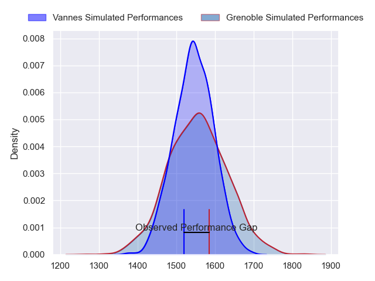
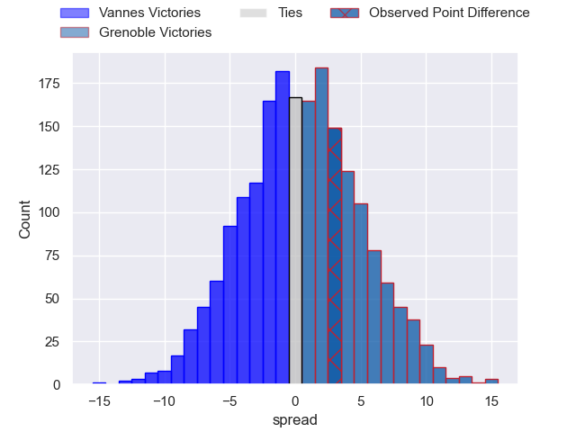
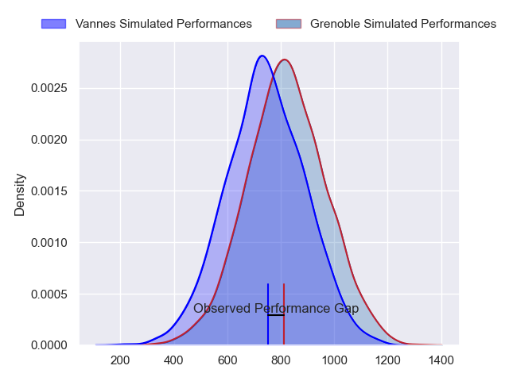
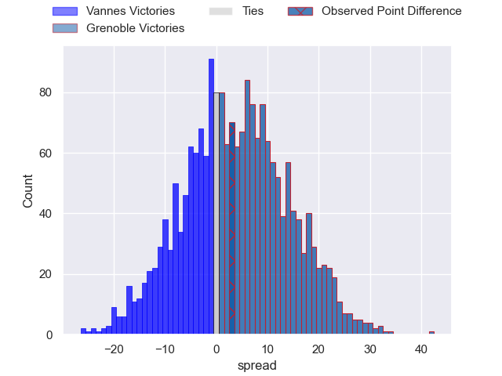
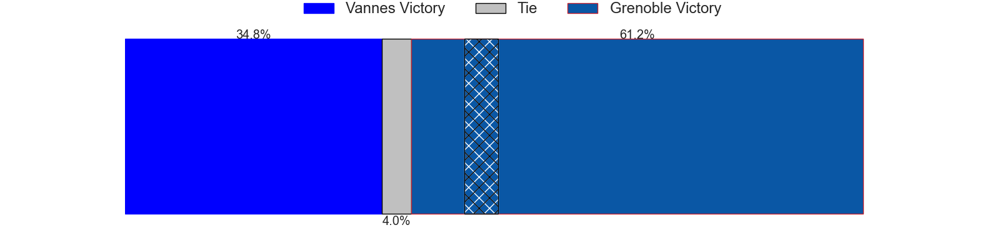
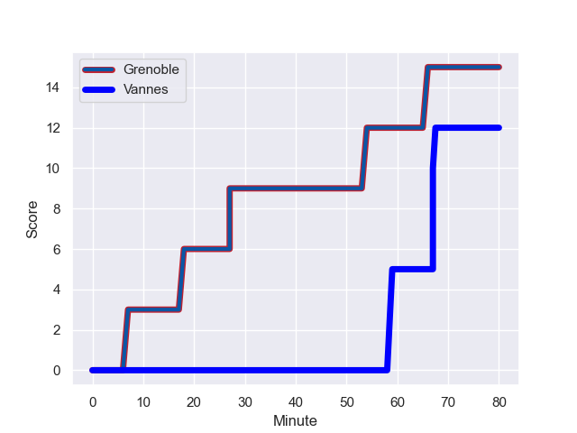
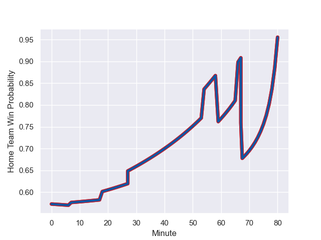

---  
layout: page  
title: Vannes at Grenoble; 12-15  
date: 2023-11-30 18:00:00 -0500  
categories: "Pro D2 2023" match review  
---
# Vannes at Grenoble; 12-15

# Club Level Predictions

The first set of predictions treats a club as the smallest object, as the club develops its members, organizes a gameplan, and deploys its players as needed for each match. This club model has a prediction of 0.518, which translates to predicting Grenoble to win by 0.6.

Each club has a rating and a rating deviation (similar to a Glicko rating), and expected performances can be generated. This allows for simulated matches and spreads like the ones below.
## Projected Performances - Club Model

## Projected Spreads - Club Model

## Projected Results - Club Model

# Player Level Predictions - Version 2

Treating teams instead as an entity made up of the currently active players, I have ratings for each player in an altogether different system. These can be combined to form team ratings once teamsheets are announced, weighting starters a bit higher than the reserves. After the match is played, players can be weighted by their minutes on the field, allowing for an accurate measure of the team's composition. With these compiled team ratings, we can make predictions, measure inaccuracy, and update the individual player ratings.
## Prediction with Player Minutes: Grenoble by 3.2

Vannes by 1.6 on a neutral field
## Prediction without Player Minutes: Grenoble by 2.9

Vannes by 1.9 on a neutral pitch

## Projected Performances - Player Model

## Projected Spreads - Player Model

## Projected Results - Player Model

## Scores over Time

## Win Probability over Time

There were 10 large changes in win probability in this match

|   Away Minutes | Away Player             |   Away elo |   Number |   Home elo | Home Player         |   Home Minutes |
|---------------:|:------------------------|-----------:|---------:|-----------:|:--------------------|---------------:|
|             55 | Charles-Henri Berguet   |      46.78 |        1 |      31.58 | Eli Eglaine         |             51 |
|             50 | Pat Leafa               |      75.18 |        2 |      48.68 | Barnabé Massa       |             51 |
|             50 | Simon Bourgeois         |      46.3  |        3 |      48.06 | Regis Montagne      |             51 |
|             50 | Darren O'Shea           |      66.17 |        4 |      78.49 | Jose Madeira        |             80 |
|             55 | Anton Bresler           |      59    |        5 |      48.41 | Pierce Phillips     |             55 |
|             80 | Juan Bautista Pedemonte |      43.28 |        6 |      28.54 | Antonin Berruyer    |             69 |
|             80 | Gregoire Bazin          |      40.52 |        7 |      34.15 | Steeve Blanc-Mappaz |             80 |
|             55 | Karl Chateau            |      28.62 |        8 |      41.37 | Pio Muarua          |             52 |
|             73 | Jules Le Bail           |      51.99 |        9 |      21.7  | Barnabe Couilloud   |             61 |
|             80 | Massimo Ortolan         |      22.77 |       10 |      59.21 | Sam Davies          |             11 |
|             65 | Romaric Camou           |      48.53 |       11 |      45.91 | Erwan Dridi         |             80 |
|             80 | Alex Arrate             |      22.68 |       12 |      47.96 | Romain Trouilloud   |             80 |
|             80 | Sacha Valleau           |      77.04 |       13 |      27.86 | Romain Fusier       |             80 |
|             80 | Théo Bastardie          |      66.37 |       14 |      54.19 | Wilfried Hulleu     |             80 |
|             80 | Paul Surano             |      53.72 |       15 |      86.3  | Julien Farnoux      |             80 |
|             30 | Cyril Blanchard         |      43.52 |       16 |      34.33 | Romain Barthelemy   |             69 |
|             30 | Phil Kite               |      70.27 |       17 |      58.05 | Irakli Aptsiauri    |             29 |
|             30 | Eric Marks              |      15.2  |       18 |      45.29 | Luka Goginava       |             29 |
|             25 | Léon Boulier            |      47.57 |       19 |      38.58 | Mathis Sarragallet  |             29 |
|             25 | Hamish Bain             |      59.22 |       20 |      51.71 | Thibaut Martel      |             28 |
|             25 | Andy Bordelai           |      68.47 |       21 |      52.54 | Georgi Javakhia     |             25 |
|             15 | Robin Taccola           |      47.12 |       22 |      53.7  | Eric Escande        |             19 |
|              7 | Erwan Nicolas           |      40.68 |       23 |      36.57 | Tala Gray           |             11 |

