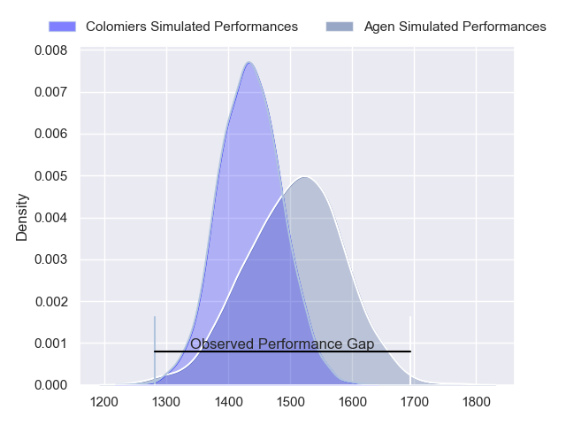
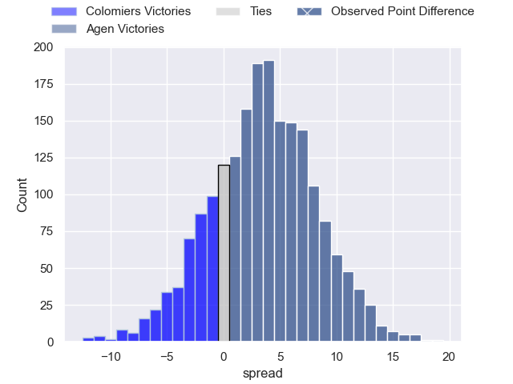
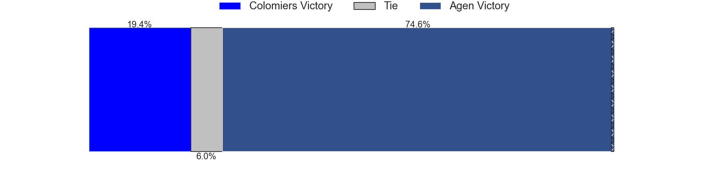
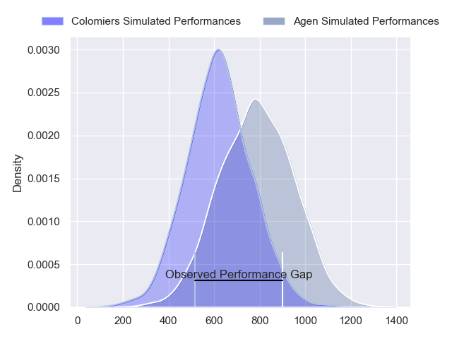
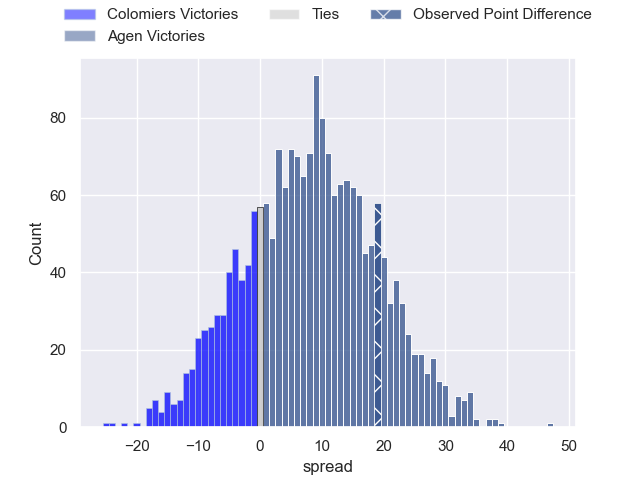
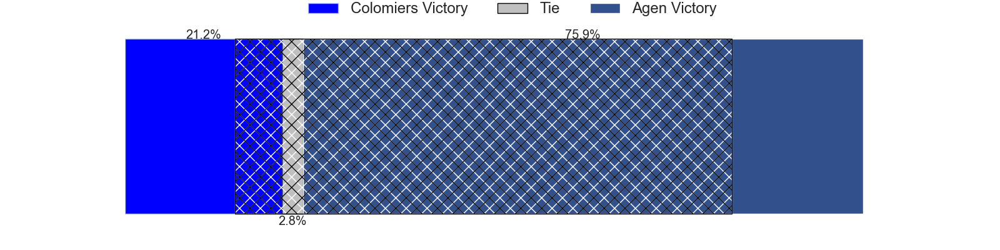
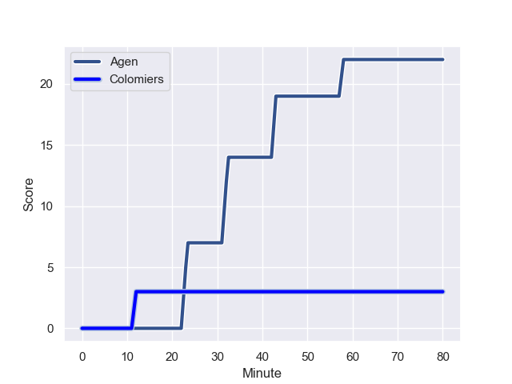
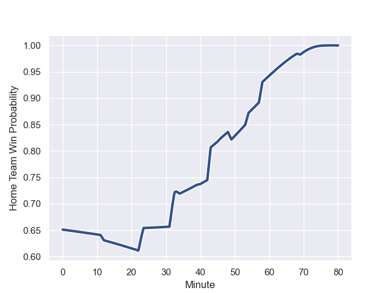

---  
layout: page  
title: Colomiers at Agen; 3-22  
date: 2023-12-01 18:00:00 -0500  
categories: "Pro D2 2023" match review  
---
# Colomiers at Agen; 3-22

# Club Level Predictions

The first set of predictions treats a club as the smallest object, as the club develops its members, organizes a gameplan, and deploys its players as needed for each match. This club model has a prediction of 0.602, which translates to predicting Agen to win by 3.6.

Each club has a rating and a rating deviation (similar to a Glicko rating), and expected performances can be generated. This allows for simulated matches and spreads like the ones below.
## Projected Performances - Club Model

## Projected Spreads - Club Model

## Projected Results - Club Model

# Player Level Predictions - Version 2

Treating teams instead as an entity made up of the currently active players, I have ratings for each player in an altogether different system. These can be combined to form team ratings once teamsheets are announced, weighting starters a bit higher than the reserves. After the match is played, players can be weighted by their minutes on the field, allowing for an accurate measure of the team's composition. With these compiled team ratings, we can make predictions, measure inaccuracy, and update the individual player ratings.
## Prediction with Player Minutes: Agen by 6.8

Agen by 2.0 on a neutral field
## Prediction without Player Minutes: Agen by 6.4

Agen by 1.5 on a neutral pitch

## Projected Performances - Player Model

## Projected Spreads - Player Model

## Projected Results - Player Model

## Scores over Time

## Win Probability over Time

There were 4 large changes in win probability in this match

|   Away Minutes | Away Player        |   Away elo |   Number |   Home elo | Home Player          |   Home Minutes |
|---------------:|:-------------------|-----------:|---------:|-----------:|:---------------------|---------------:|
|             46 | Guillaume Tartas   |      54.69 |        1 |      47.84 | Hans Lombard-Buret   |             73 |
|             49 | Thomas Larrieu     |       5.48 |        2 |       0.18 | Mike Sosene-Feagai   |             53 |
|             49 | Michael Simutoga   |      65.92 |        3 |      37.86 | Malik Hamadache      |             53 |
|             80 | Jean Thomas        |      49.28 |        4 |      -5.22 | Evan Olmstead        |             80 |
|             54 | Maxime Granouillet |      74.83 |        5 |      68.59 | William Demotte      |             80 |
|             80 | Anthony Coletta    |      32.22 |        6 |      53.21 | Arnaud Duputs        |             40 |
|             80 | Waël Ponpon        |      41.1  |        7 |      90.17 | Antoine Erbani       |             69 |
|             49 | Jorick Dastugue    |      36.54 |        8 |      47.04 | Matthieu Bonnet      |             80 |
|             54 | Arthur Diaz        |      47.43 |        9 |      13.29 | Sonatane Takulua     |             71 |
|             80 | Brett Herron       |       4.3  |       10 |      52.4  | Thomas Vincent       |             80 |
|             80 | Martin Dulon       |      16.13 |       11 |      73.59 | Henry Purdy          |             80 |
|             58 | Dorian Laborde     |      45.13 |       12 |      51.45 | Clement Garrigues    |             80 |
|             80 | Fabien Perrin      |      42.1  |       13 |      36.06 | Theo Belan           |             52 |
|             80 | Vincent Pinto      |      72.71 |       14 |      61.53 | Tevita Railevu       |             80 |
|             34 | Valentin Saurs     |      23.16 |       15 |      52.19 | Jean-Marcelin Buttin |             69 |
|             46 | Thomas Girard      |      36.21 |       16 |      48.84 | Valentin Gayraud     |             40 |
|             34 | Hugo Djehi         |      51.06 |       17 |     -14.94 | Loris Tolot          |             28 |
|             31 | Aldric Lescure     |      64.82 |       18 |      38.38 | Clement Martinez     |             27 |
|             31 | Pablo Dimcheff     |      38.74 |       19 |      43.7  | Théo Sauzaret        |             27 |
|             31 | Marco Fepulea'i    |      14.43 |       20 |      38.53 | Ben Volavola         |             11 |
|             26 | Janse Roux         |      39.05 |       21 |      39.05 | Corentin Vernet      |             11 |
|             26 | Ugo Seguela        |      42.4  |       22 |      37.91 | Theo Idjellidaine    |              9 |
|             22 | Rodrigo Marta      |      92.76 |       23 |      46.65 | Mamuka Mstoiani      |              7 |

