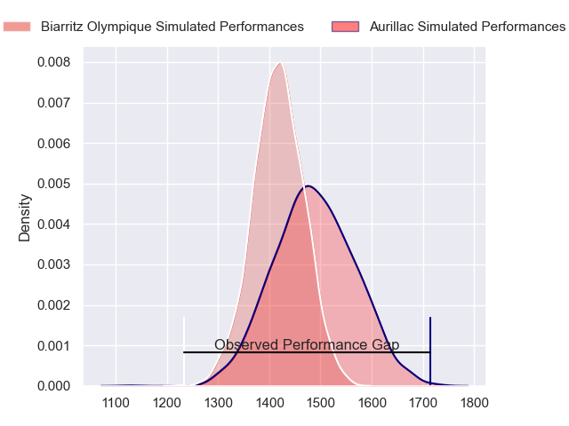
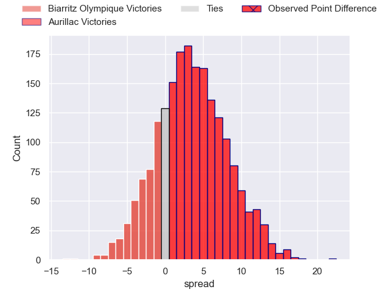
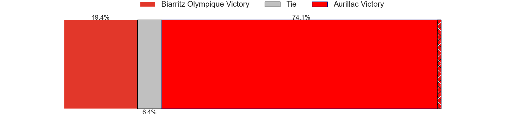
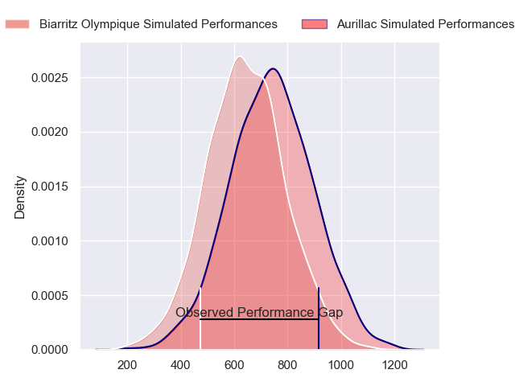
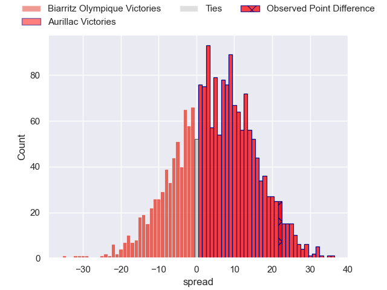
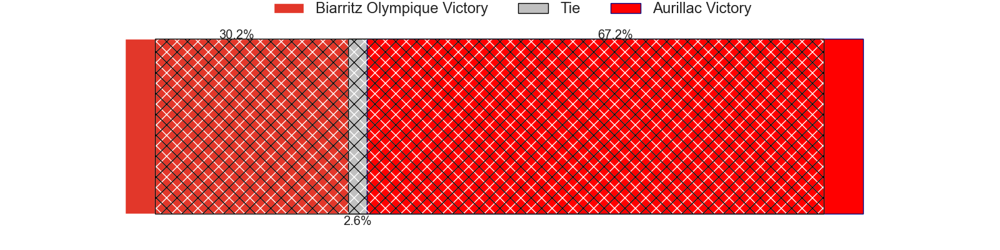
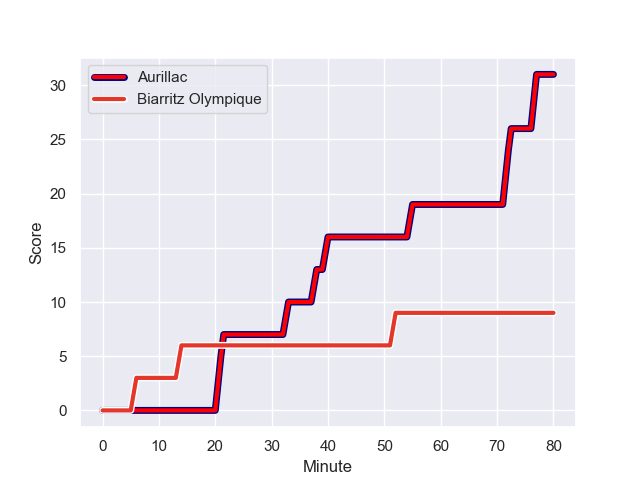
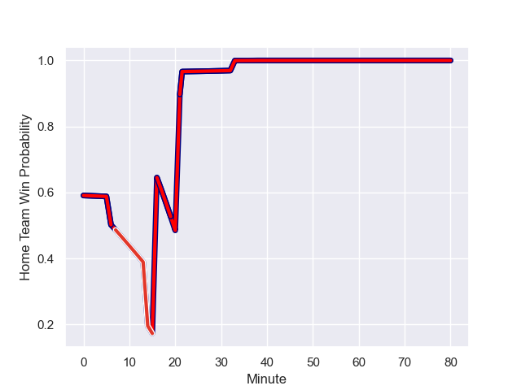

---  
layout: page  
title: Biarritz Olympique at Aurillac; 9-31  
date: 2023-12-01 18:00:00 -0500  
categories: "Pro D2 2023" match review  
---
# Biarritz Olympique at Aurillac; 9-31

# Club Level Predictions

The first set of predictions treats a club as the smallest object, as the club develops its members, organizes a gameplan, and deploys its players as needed for each match. This club model has a prediction of 0.598, which translates to predicting Aurillac to win by 3.5.

Each club has a rating and a rating deviation (similar to a Glicko rating), and expected performances can be generated. This allows for simulated matches and spreads like the ones below.
## Projected Performances - Club Model

## Projected Spreads - Club Model

## Projected Results - Club Model

# Player Level Predictions - Version 2

Treating teams instead as an entity made up of the currently active players, I have ratings for each player in an altogether different system. These can be combined to form team ratings once teamsheets are announced, weighting starters a bit higher than the reserves. After the match is played, players can be weighted by their minutes on the field, allowing for an accurate measure of the team's composition. With these compiled team ratings, we can make predictions, measure inaccuracy, and update the individual player ratings.
## Prediction with Player Minutes: Aurillac by 4.0

Biarritz Olympique by 0.7 on a neutral field
## Prediction without Player Minutes: Aurillac by 1.8

Biarritz Olympique by 2.9 on a neutral pitch

## Projected Performances - Player Model

## Projected Spreads - Player Model

## Projected Results - Player Model

## Scores over Time

## Win Probability over Time

There were 10 large changes in win probability in this match

|   Away Minutes | Away Player              |   Away elo |   Number |   Home elo | Home Player           |   Home Minutes |
|---------------:|:-------------------------|-----------:|---------:|-----------:|:----------------------|---------------:|
|             47 | Giorgi Nutsubidze        |      34.72 |        1 |      51.59 | Alexandre Plantier    |             65 |
|             52 | Thomas Sauveterre        |      53.36 |        2 |      28.95 | Luka Nioradze         |             65 |
|             47 | Mohamed Haouas           |      52.3  |        3 |      37.38 | Tim Daniel-Meissen    |             41 |
|             16 | Johan Aliouat            |      41.85 |        4 |      38.93 | Martial Rolland       |             80 |
|             80 | Charlie Matthews         |      67.8  |        5 |      52.83 | Cam Dodson            |             80 |
|             80 | Tornike Jalagonia        |      31.57 |        6 |      64.36 | Eoghan Masterson      |             52 |
|             80 | Charlie Francoz          |      26.75 |        7 |      53.59 | Hugo Huurman          |             65 |
|             59 | Temo Matiu               |      46.75 |        8 |      -6.2  | Latuka Maituku        |             48 |
|             45 | Kerman Aurrekoetxea      |      46.83 |        9 |      35.44 | Mikheil Alania        |             59 |
|             53 | Ilian Perraux            |      54.4  |       10 |      34.76 | Antoine Aucagne       |             80 |
|             80 | Yohann Artru             |       8.78 |       11 |      60.55 | AJ Coertzen           |             80 |
|             80 | Yann David               |      81.76 |       12 |      21.19 | Christa Powell        |             67 |
|             59 | Tyler Morgan             |      68.79 |       13 |      50.87 | Juun Pieters          |             80 |
|             80 | Gervais Cordin           |      33.87 |       14 |      38.9  | Dachi Papunashvili    |             80 |
|             80 | Joe Jonas                |      57.26 |       15 |      35.67 | Marc Palmier          |             80 |
|             64 | Adrian Motoc             |       1.3  |       16 |      47.01 | Giorgi Kartvelishvili |             39 |
|             35 | Antoine Domercq          |      46.37 |       17 |      49.63 | Didier Tison          |             32 |
|             33 | Lasha Tabidze            |      50.07 |       18 |      54.87 | Beka Shvangiradze     |             28 |
|             33 | Killian Taofifenua       |      40.28 |       19 |      49.38 | Boris Hadinegoro      |             21 |
|             28 | Luteru Tolai             |      45.2  |       20 |      28.05 | Robert Rodgers        |             15 |
|             27 | Billy Searle             |      18.64 |       21 |      42.37 | Ronan Loughnane       |             15 |
|             21 | Pieter Jansen van Vuuren |      28.88 |       22 |      44.98 | Mehdi Slamani         |             15 |
|             21 | Francois Vergnaud        |       9.19 |       23 |      27.33 | Simeli Yabaki         |             13 |

