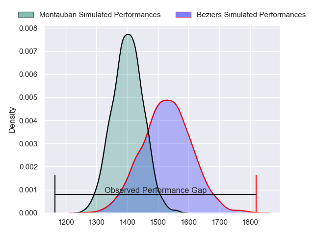
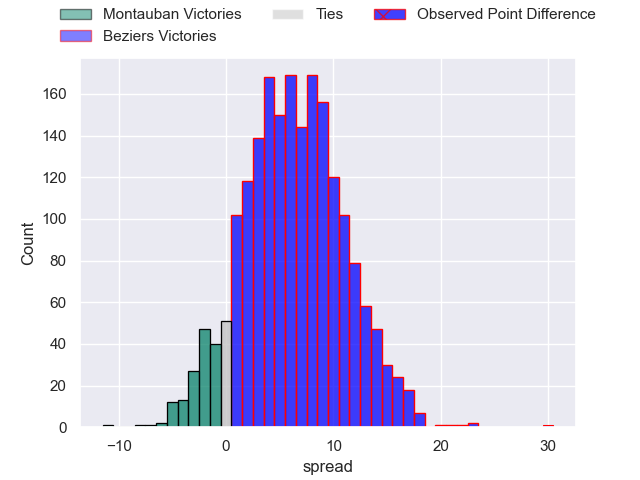
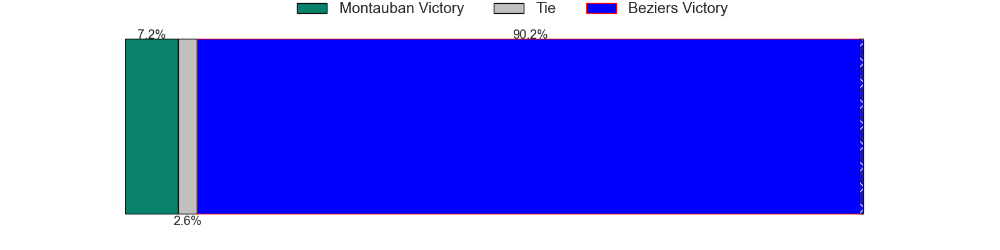
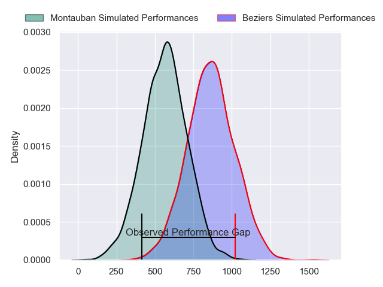
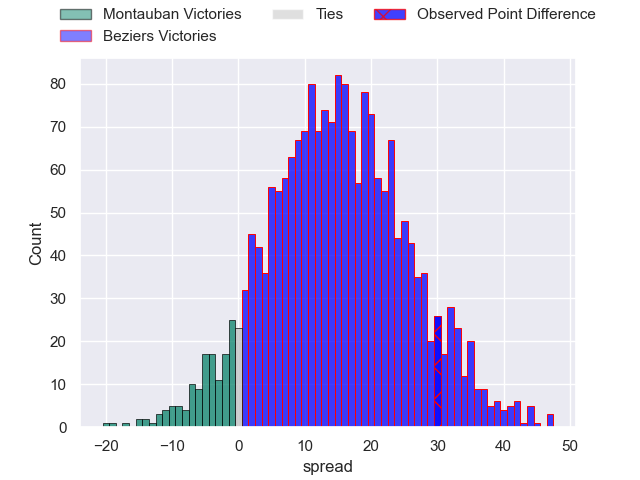
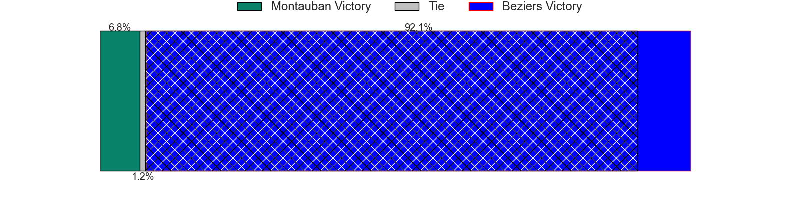
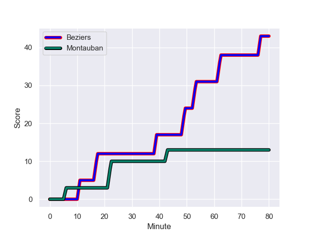
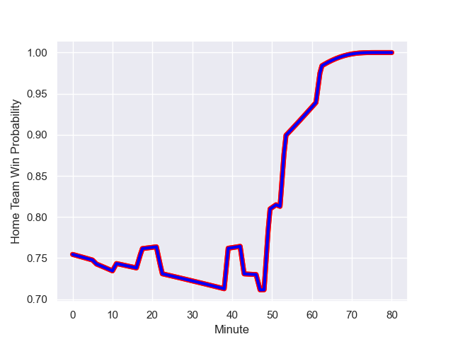

---  
layout: page  
title: Montauban at Beziers; 13-43  
date: 2023-12-01 18:00:00 -0500  
categories: "Pro D2 2023" match review  
---
# Montauban at Beziers; 13-43

# Club Level Predictions

The first set of predictions treats a club as the smallest object, as the club develops its members, organizes a gameplan, and deploys its players as needed for each match. This club model has a prediction of 0.675, which translates to predicting Beziers to win by 6.4.

Each club has a rating and a rating deviation (similar to a Glicko rating), and expected performances can be generated. This allows for simulated matches and spreads like the ones below.
## Projected Performances - Club Model

## Projected Spreads - Club Model

## Projected Results - Club Model

# Player Level Predictions - Version 2

Treating teams instead as an entity made up of the currently active players, I have ratings for each player in an altogether different system. These can be combined to form team ratings once teamsheets are announced, weighting starters a bit higher than the reserves. After the match is played, players can be weighted by their minutes on the field, allowing for an accurate measure of the team's composition. With these compiled team ratings, we can make predictions, measure inaccuracy, and update the individual player ratings.
## Prediction with Player Minutes: Beziers by 12.3

Beziers by 7.6 on a neutral field
## Prediction without Player Minutes: Beziers by 12.9

Beziers by 8.2 on a neutral pitch

## Projected Performances - Player Model

## Projected Spreads - Player Model

## Projected Results - Player Model

## Scores over Time

## Win Probability over Time

There were 6 large changes in win probability in this match

|   Away Minutes | Away Player      |   Away elo |   Number |   Home elo | Home Player         |   Home Minutes |
|---------------:|:-----------------|-----------:|---------:|-----------:|:--------------------|---------------:|
|             55 | Thomas Bue       |      48.32 |        1 |      39.78 | Giorgi Akhaladze    |             59 |
|             63 | Kevin Firmin     |      23.51 |        2 |      56.4  | Yvann Lalevee       |             66 |
|             55 | Mirian Burduli   |       8.81 |        3 |      50.66 | Yannick Arroyo      |             49 |
|             80 | Tjuee Uanivi     |      27.57 |        4 |       6    | Hans N'kinsi        |             80 |
|             47 | Kevin Gimeno     |      11.4  |        5 |      21.71 | John Madigan        |             59 |
|             49 | Kyllian Ringuet  |      42.6  |        6 |      43.14 | William van Bost    |             80 |
|             52 | Frédéric Quercy  |      30.47 |        7 |      34.57 | Clement Ancely      |             80 |
|             80 | Quentin Witt     |      38.88 |        8 |      56.94 | Sias Koen           |             59 |
|             80 | Alexis Bernadet  |      60.21 |        9 |      66.87 | Samuel Marques      |             69 |
|             52 | Thomas Fortunel  |      49.57 |       10 |      54.73 | Charly Malie        |             66 |
|             80 | Josua Vici       |      11.88 |       11 |      61.78 | Nicolas Plazy       |             80 |
|             55 | Maxime Mathy     |      36.1  |       12 |      53.84 | Taleta Tupuola      |             80 |
|             80 | Yvan Reilhac     |      54.48 |       13 |      58.63 | Paul Recor          |             56 |
|             80 | Raphael Sanchez  |      43.12 |       14 |      80.83 | Raffaele Storti     |             80 |
|             80 | Segundo Tuculet  |      26.95 |       15 |      73.58 | Gabin Lorre         |             80 |
|             33 | Dimitri Vaotoa   |      55.5  |       16 |      61.49 | Jon Zabala Arrieta  |             31 |
|             31 | Karl Wilkins     |      52.59 |       17 |      78.13 | Watisoni Votu       |             24 |
|             28 | Jérôme Bosviel   |      76.73 |       18 |      33.08 | Francisco Fernandes |             21 |
|             28 | Tyrone Viiga     |      21.17 |       19 |      55.22 | Otonuku Jr Pauta    |             21 |
|             25 | Leo Aouf         |      33.83 |       20 |     -11.33 | Pierrick Gunther    |             21 |
|             25 | Sevanaia Galala  |      74.22 |       21 |      36.97 | Victor Dreuille     |             14 |
|             25 | WillGriff John   |      52.08 |       22 |      49.71 | Wilmar Arnoldi      |             14 |
|             17 | Ru-Hann Greyling |      42.99 |       23 |      38.81 | Jean Victor Goillot |             11 |

