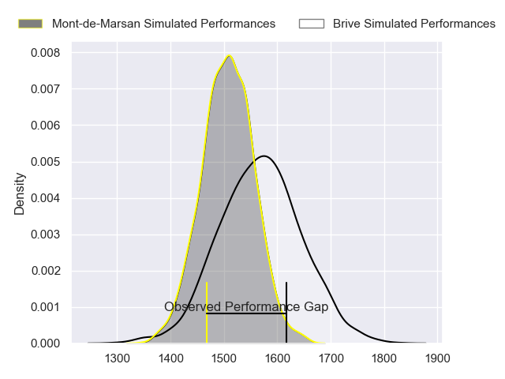
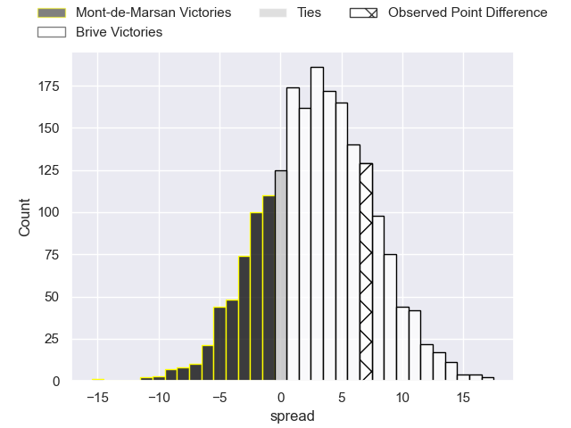
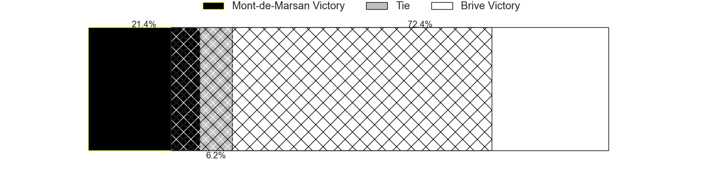
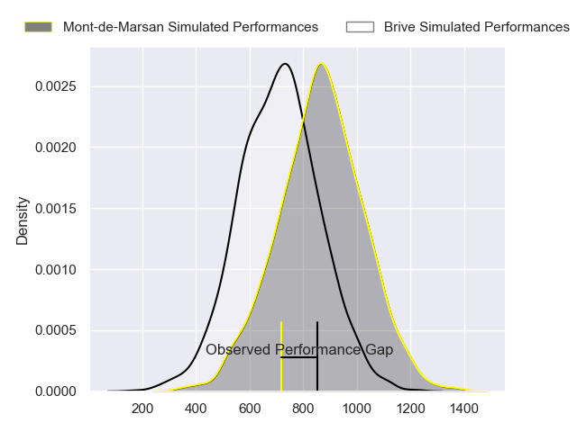
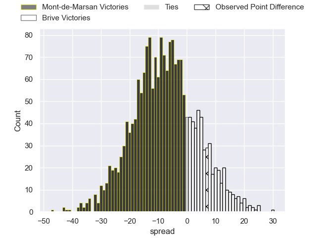
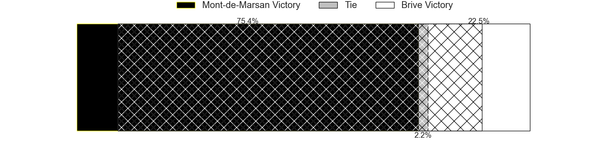
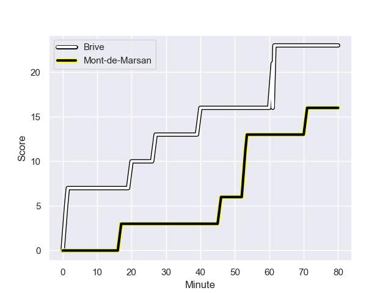
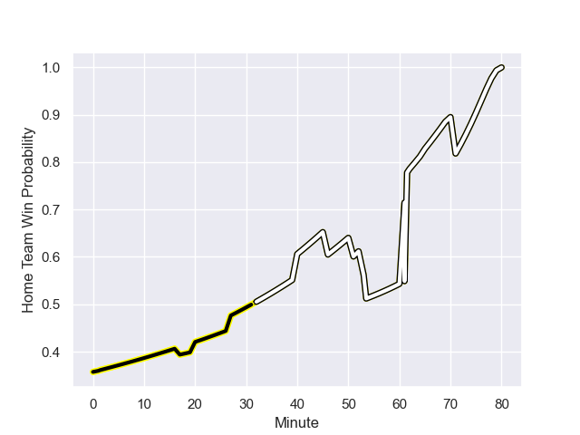

---  
layout: page  
title: Mont-de-Marsan at Brive; 16-23  
date: 2023-12-01 18:00:00 -0500  
categories: "Pro D2 2023" match review  
---
# Mont-de-Marsan at Brive; 16-23

# Club Level Predictions

The first set of predictions treats a club as the smallest object, as the club develops its members, organizes a gameplan, and deploys its players as needed for each match. This club model has a prediction of 0.588, which translates to predicting Brive to win by 3.1.

Each club has a rating and a rating deviation (similar to a Glicko rating), and expected performances can be generated. This allows for simulated matches and spreads like the ones below.
## Projected Performances - Club Model

## Projected Spreads - Club Model

## Projected Results - Club Model

# Player Level Predictions - Version 2

Treating teams instead as an entity made up of the currently active players, I have ratings for each player in an altogether different system. These can be combined to form team ratings once teamsheets are announced, weighting starters a bit higher than the reserves. After the match is played, players can be weighted by their minutes on the field, allowing for an accurate measure of the team's composition. With these compiled team ratings, we can make predictions, measure inaccuracy, and update the individual player ratings.
## Prediction with Player Minutes: Mont-de-Marsan by 6.5

Mont-de-Marsan by 11.3 on a neutral field
## Prediction without Player Minutes: Mont-de-Marsan by 6.2

Mont-de-Marsan by 11.1 on a neutral pitch

## Projected Performances - Player Model

## Projected Spreads - Player Model

## Projected Results - Player Model

## Scores over Time

## Win Probability over Time

There were 10 large changes in win probability in this match

|   Away Minutes | Away Player           |   Away elo |   Number |   Home elo | Home Player               |   Home Minutes |
|---------------:|:----------------------|-----------:|---------:|-----------:|:--------------------------|---------------:|
|             53 | Thomas Bultel         |      45.17 |        1 |      39.43 | Wesley Tapueluelu         |             51 |
|             53 | Torsten van Jaarsveld |     101.65 |        2 |      53.49 | Adrien Pelissie           |             51 |
|             53 | Anthony Alves         |      33.22 |        3 |      22.69 | Marcel van der Merwe      |             51 |
|             80 | Nicolas Garrault      |      50.56 |        4 |      36.68 | Retief Marais             |             80 |
|             65 | Romain Durand         |      58.1  |        5 |      36.44 | Tevita Ratuva             |             51 |
|             80 | Yann Brethous         |      47.25 |        6 |      41.57 | Rahboni Warren-Vosayaco   |             80 |
|             80 | Léo Banos             |      73.42 |        7 |      74.15 | Ross Moriarty             |             70 |
|             48 | Mike Faleafa          |      45.33 |        8 |      41.14 | Taniela Sadrugu           |             51 |
|             62 | Kevin Viallard        |      48.96 |        9 |       2.09 | Leo Carbonneau            |             70 |
|             80 | Willie du Plessis     |      81.73 |       10 |      60.05 | Stuart Olding             |             80 |
|             80 | Pierre Sayerse        |      57.95 |       11 |      37.5  | Arthur Bonneval           |             80 |
|             80 | Gatien Masse          |      47.59 |       12 |      31.98 | Guillaume Galletier       |             80 |
|             80 | Nacani Wakaya         |      83.53 |       13 |      64.97 | Sam Johnson               |             80 |
|             62 | Harrison Obatoyinbo   |      52.79 |       14 |      38.31 | Benjamin Lefranc          |             70 |
|             80 | Simao Broeiro Bento   |      46.09 |       15 |      24.63 | Mathis Ferté              |             80 |
|             32 | Raphaël Robic         |      53.57 |       16 |      25.72 | Lucas da Silva            |             29 |
|             27 | Cherif Traore         |      42.93 |       17 |      43.27 | Nathan Fraissenon         |             29 |
|             27 | Simon Labouyrie       |      41.53 |       18 |      32.11 | Julien Delannoy           |             29 |
|             27 | Gheorghe Gajion       |      66.27 |       19 |      30.73 | Francisco Coria Marchetti |             29 |
|             18 | Christophe Loustalot  |      38.11 |       20 |      22.9  | Sasha Gue                 |             29 |
|             18 | Jules Even            |      58.66 |       21 |      33.64 | Renger Van Eerten         |             10 |
|             15 | Jules Dussutour       |      47    |       22 |      46.11 | Julien Blanc              |             10 |
|            nan | nan                   |     nan    |       23 |      22.87 | Tom Raffy                 |             10 |

