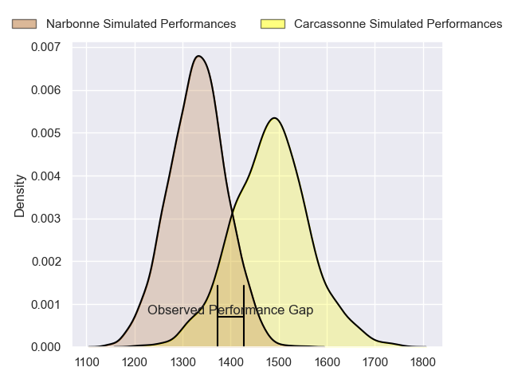
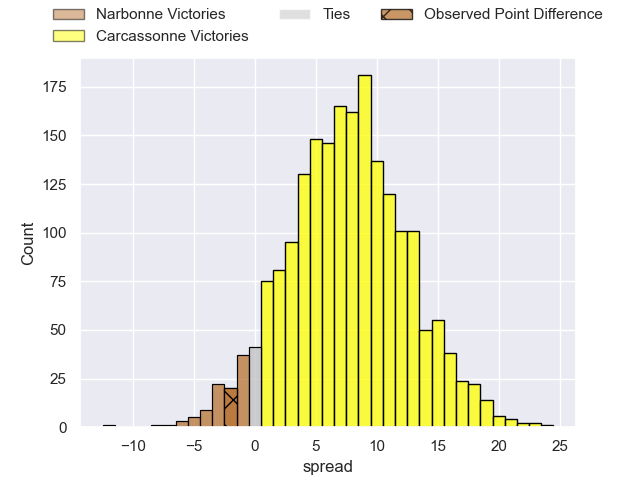
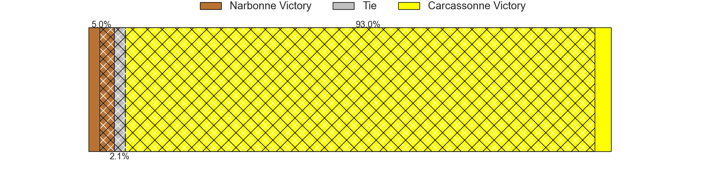
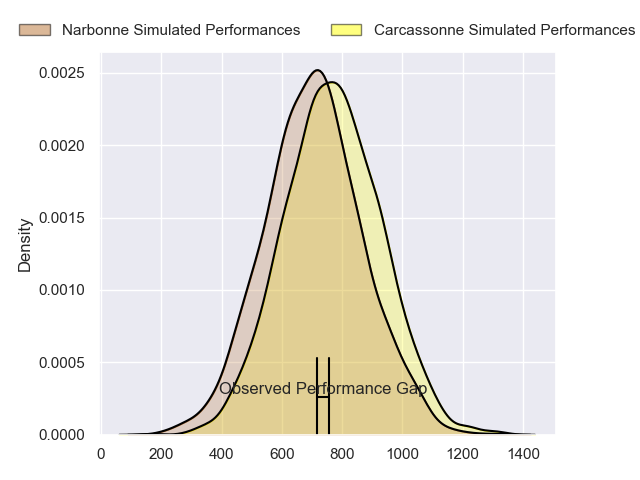
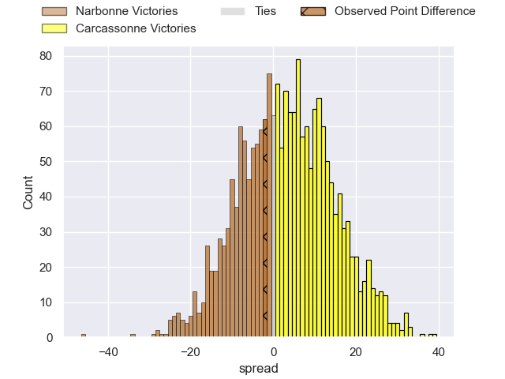
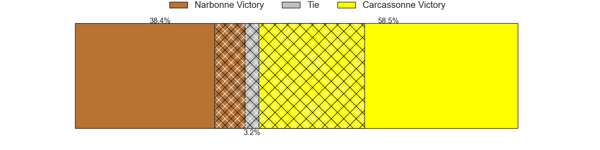
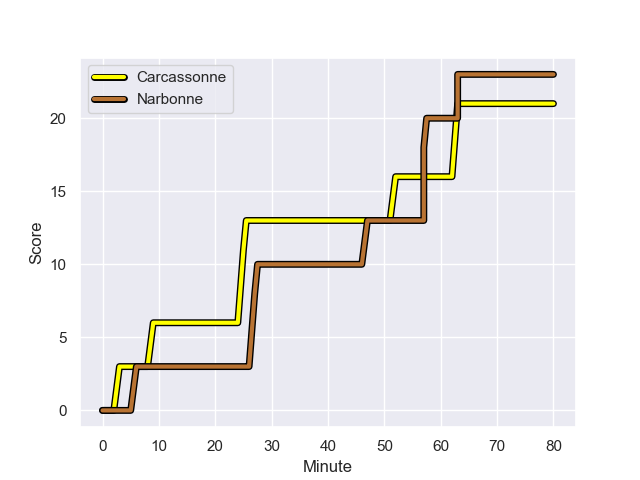
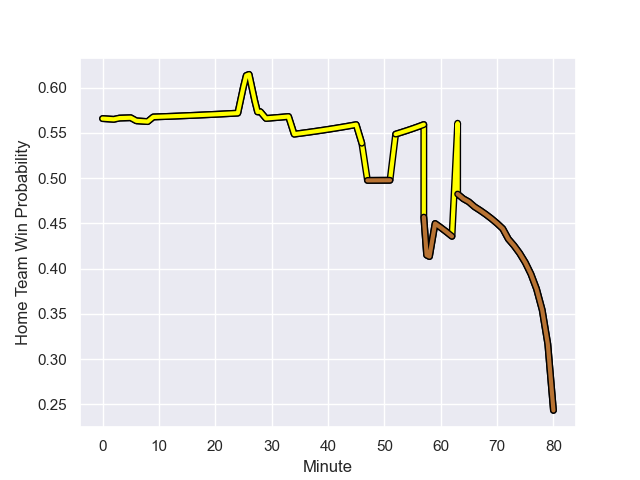

---  
layout: page  
title: Narbonne at Carcassonne; 23-21  
date: 2023-12-01 18:00:00 -0500  
categories: "Nationale 2023" match review  
---
# Narbonne at Carcassonne; 23-21

# Club Level Predictions

The first set of predictions treats a club as the smallest object, as the club develops its members, organizes a gameplan, and deploys its players as needed for each match. This club model has a prediction of 0.701, which translates to predicting Carcassonne to win by 7.5.

Each club has a rating and a rating deviation (similar to a Glicko rating), and expected performances can be generated. This allows for simulated matches and spreads like the ones below.
## Projected Performances - Club Model

## Projected Spreads - Club Model

## Projected Results - Club Model

# Player Level Predictions - Version 2

Treating teams instead as an entity made up of the currently active players, I have ratings for each player in an altogether different system. These can be combined to form team ratings once teamsheets are announced, weighting starters a bit higher than the reserves. After the match is played, players can be weighted by their minutes on the field, allowing for an accurate measure of the team's composition. With these compiled team ratings, we can make predictions, measure inaccuracy, and update the individual player ratings.
## Prediction with Player Minutes: Carcassonne by 2.9

Narbonne by 1.3 on a neutral field
## Prediction without Player Minutes: Carcassonne by 3.8

Narbonne by 0.5 on a neutral pitch

## Projected Performances - Player Model

## Projected Spreads - Player Model

## Projected Results - Player Model

## Scores over Time

## Win Probability over Time

There were 11 large changes in win probability in this match

|   Away Minutes | Away Player            |   Away elo |   Number |   Home elo | Home Player           |   Home Minutes |
|---------------:|:-----------------------|-----------:|---------:|-----------:|:----------------------|---------------:|
|             59 | Théo Castinel          |      49.97 |        1 |      57.66 | Andrei Ursache        |             66 |
|             64 | Mehdi Boundjema        |      52.62 |        2 |      55.13 | Raphael Carbou        |             66 |
|             59 | John Roy Jenkinson     |      61.1  |        3 |      62.85 | Fabien Lorenzon       |             34 |
|             79 | Marius Antonescu       |      46.99 |        4 |      28.59 | Romain Manchia        |             80 |
|             80 | Dennis Visser          |      32.18 |        5 |      37.97 | Clément Fontaine      |             59 |
|             80 | Thibault Clauzade      |      52.51 |        6 |      49.88 | Valentin Sese         |             64 |
|             80 | Baptiste Abescat-Leroy |      37.7  |        7 |      47.72 | Etienne Herjean       |             80 |
|             46 | Charles Malet          |      15.47 |        8 |      57.03 | Carl Fearns           |             79 |
|             59 | Josh Valentine         |      78.64 |        9 |      -2.18 | Martin Landajo        |             59 |
|             80 | Gilles Bosch           |       5.43 |       10 |      32.81 | Gaetan Pichon         |             80 |
|             80 | Ambrose Curtis         |      28.59 |       11 |      83.31 | Léo Darrelatour       |             80 |
|             80 | Peter Betham           |     110.43 |       12 |      27    | Jordan Puletua        |             80 |
|             80 | Sébastien Giorgis      |      31.04 |       13 |      48.71 | Tutuila Vaea          |             80 |
|             29 | Pierre-Hugo Ducom      |      34.84 |       14 |      35.82 | Sakiusa Bureitakiyaca |             80 |
|             80 | Paul Auradou           |      53.56 |       15 |      66.84 | Maxime Gianet         |             72 |
|             21 | Sylvain Abadie         |      31.85 |       16 |      44.22 | Florent Lorenzon      |             14 |
|             16 | Christophe David       |      55.14 |       17 |      51.83 | Luka Petriashvili     |             14 |
|             21 | Levi Tikoipau          |      45.72 |       18 |      22.21 | Vakhtangi Akhobadze   |             46 |
|              1 | Morgan Maga            |      47.92 |       19 |      24.81 | Marius Iftimiciuc     |             21 |
|             34 | Luke Nakobukobua       |      66.3  |       20 |      46.39 | Romain Guyot          |             16 |
|             21 | Pierrick Nova          |      45.03 |       21 |      51.16 | Bilal Fadli           |              1 |
|             51 | James Kane             |      49.95 |       22 |      62.28 | Gabin Michet          |             21 |
|            nan | nan                    |     nan    |       23 |      43.42 | Damien Añon           |              8 |

